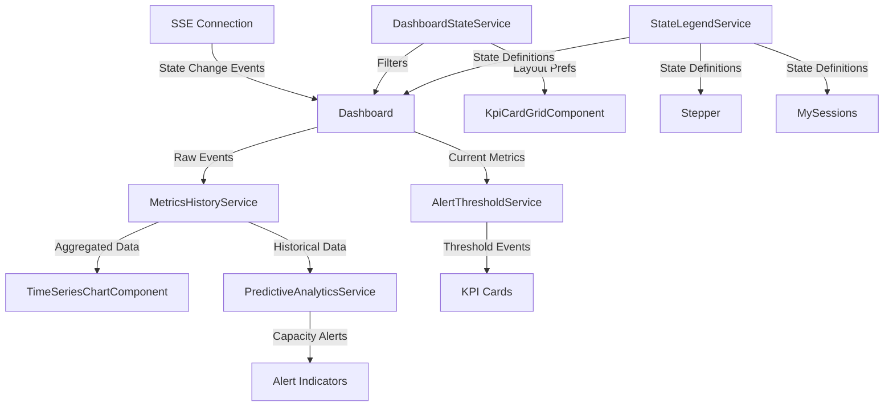

# Design Document: Dashboard Professional Enhancement

## Overview

This design transforms the Exensio Reload Dashboard into an enterprise-grade monitoring and analytics platform while preserving its existing glass morphism aesthetic and real-time SSE architecture. The enhancement builds upon the current 9-state pipeline monitoring foundation (STAGED → QUEUED_FOR_CP → ELASTICSEARCH_MONITORING/CP_TIMEOUT → EXENSIO_MONITORING → COMPLETED/CP_FAILED/CANCELLED) and extends it with advanced visualizations, predictive analytics, and comprehensive cross-component consistency.

### Key Design Principles

1. **Incremental Enhancement**: Build on existing `dashboard.component.ts` (1160 lines) and `StateLegendService` without disrupting current functionality
2. **Performance First**: Maintain sub-16ms render cycles even with thousands of records through batching, virtual scrolling, and memoization
3. **Accessibility by Default**: WCAG 2.1 AA compliance with full keyboard navigation and screen reader support
4. **Real-Time Fidelity**: Leverage existing SSE infrastructure for <300ms update latency
5. **State Consistency**: Use `StateLegendService` as single source of truth across Dashboard, Stepper, and My Sessions components

### Technology Stack

- **Frontend Framework**: Angular 17+ (current stack)
- **Charting Library**: Chart.js 4.x with streaming plugin for time-series visualizations
- **State Management**: Existing RxJS-based `StagingSessionService` + new `DashboardStateService`
- **Styling**: Existing SCSS with glass morphism + CSS Grid for responsive layouts
- **Testing**: Jasmine/Karma for unit tests, fast-check for property-based tests
- **Performance**: Virtual scrolling via Angular CDK, Web Workers for predictive calculations

## Architecture

### Component Hierarchy

```
DashboardComponent (existing - enhanced)
├── DashboardHeaderComponent (new)
│   ├── FilterBarComponent (new)
│   ├── ExportMenuComponent (new)
│   └── LayoutCustomizerComponent (new)
├── KpiCardGridComponent (enhanced)
│   ├── KpiCardComponent (existing - enhanced with time-series)
│   ├── HealthScoreCardComponent (enhanced with drill-down)
│   └── IntegrationStatusCardComponent (new)
├── TimeSeriesChartComponent (new)
│   └── ChartTooltipComponent (new)
├── SenderPerformanceGridComponent (enhanced)
│   ├── SenderCardComponent (existing - enhanced with sparklines)
│   └── SenderDetailPanelComponent (new)
├── PipelineFlowVisualizationComponent (new)
├── LiveActivityFeedComponent (new)
├── MetricCardDetailSidebarComponent (existing - enhanced)
├── SiteDetailModalComponent (existing)
└── BulkActionsComponent (existing)
```

### Service Architecture

```
DashboardStateService (new)
├── Manages dashboard-specific state (filters, layout, preferences)
├── Provides observables for reactive updates
└── Persists to localStorage

MetricsHistoryService (new)
├── Aggregates historical metrics from SSE events
├── Provides time-series data for charts
└── Implements sliding window cache (configurable: 1h/6h/24h/7d)

PredictiveAnalyticsService (new)
├── Linear regression for backlog projections
├── Web Worker for non-blocking calculations
└── Emits capacity alerts based on threshold configuration

StateLegendService (existing - enhanced)
├── Single source of truth for 9 pipeline states
├── Extended with integration status mappings
└── Provides consistent color/icon/tooltip definitions

AlertThresholdService (new)
├── Manages per-sender threshold configurations
├── Evaluates metrics against thresholds
└── Emits alert events for visual indicators

ExportService (new)
├── Generates CSV, Excel, JSON, PDF exports
├── Uses jsPDF for PDF generation with charts
└── XLSX library for Excel with multiple sheets
```

### Data Flow



## Components and Interfaces

### 1. TimeSeriesChartComponent (New)

**Purpose**: Render interactive time-series charts for pipeline metrics with smooth SSE updates

**Inputs**:

```typescript
@Input() metricKey: 'backlog' | 'ready' | 'enqueued' | 'completed' | 'failed';
@Input() timeWindow: '1h' | '6h' | '24h' | '7d' = '6h';
@Input() colorScheme: string = '#10b981'; // Matches KPI card colors
@Input() showTooltip: boolean = true;
@Input() animationDuration: number = 300; // Max 300ms per requirement
```

**Outputs**:

```typescript
@Output() dataPointClick = new EventEmitter<{timestamp: Date, value: number}>();
@Output() timeWindowChange = new EventEmitter<string>();
```

**Public Methods**:

```typescript
updateData(dataPoint: {timestamp: Date, value: number}): void
  // Appends new data point and triggers smooth animation
  // Debounced to max 1 update per 500ms (Req 6.4)

setTimeWindow(window: string): void
  // Changes time window and re-fetches historical data
  // Maintains zoom level and scroll position
```

**Internal State**:

- Chart.js instance with streaming plugin
- Data buffer (sliding window based on timeWindow)
- Debounce timer for batched updates

### 2. SenderCardComponent (Enhanced)

**Purpose**: Display sender performance with embedded sparkline and threshold alerts

**Additions to Existing Component**:

```typescript
// New Inputs
@Input() showSparkline: boolean = true;
@Input() backlogHistory: number[] = []; // Last 24 hours
@Input() thresholds: {warning: number, critical: number};

// New Outputs
@Output() thresholdExceeded = new EventEmitter<{
  senderId: string,
  level: 'warning' | 'critical',
  value: number
}>();

// New Methods
getCardBorderClass(): string
  // Returns 'border-warning' if backlog > 75% capacity
  // Returns 'border-critical pulse-animation' if backlog > 100%
  // (Req 2.2, 2.3)

getThroughput(): number
  // Calculates files/hour from last 60 minutes
  // Uses completions from MetricsHistoryService
```

**Sparkline Visualization**:

- Embedded mini chart (height: 40px, width: 100%)
- Uses Chart.js line chart with minimal config
- Rendered inside existing sender card template
- No axes, no labels (pure visual trend indicator)

### 3. LiveActivityFeedComponent (New)

**Purpose**: Real-time scrolling feed of state transition events

**Template Structure**:

```html
<div class="activity-feed glass-panel">
  <div class="feed-header">
    <h3>Live Activity</h3>
    <button (click)="togglePause()">{{paused ? 'Resume' : 'Pause'}}</button>
  </div>
  <div class="feed-items" #feedContainer>
    <div
      *ngFor="let event of events; trackBy: trackByEventId"
      class="feed-item slide-in"
      [ngClass]="getEventColorClass(event.newState)"
    >
      <span class="timestamp">{{event.timestamp | date:'HH:mm:ss'}}</span>
      <span class="separator">•</span>
      <span class="sender">{{event.sender}}</span>
      <span class="separator">•</span>
      <span class="lot-wafer">{{event.lot}}/{{event.wafer}}</span>
      <span class="separator">•</span>
      <span class="transition"> {{event.oldState}} → {{event.newState}} </span>
    </div>
  </div>
</div>
```

**Event Processing**:

```typescript
private processSSE(event: StateChangeEvent): void {
  const activityItem: ActivityFeedItem = {
    id: `${event.timestamp}-${event.recordId}`,
    timestamp: new Date(event.timestamp),
    sender: event.senderName,
    lot: event.lotId,
    wafer: event.waferId,
    oldState: event.previousState,
    newState: event.currentState
  };

  // Prepend with max 20 items (Req 11.1, 11.3)
  this.events = [activityItem, ...this.events.slice(0, 19)];
}

getEventColorClass(state: string): string {
  switch(state) {
    case 'COMPLETED': return 'event-success'; // green
    case 'CP_FAILED': return 'event-danger'; // red
    case 'CP_TIMEOUT':
    case 'COMPLETED_MANUAL_VERIFICATION_REQUIRED':
      return 'event-warning'; // amber
    default: return 'event-info'; // blue
  }
}
```

### 4. PipelineFlowVisualizationComponent (New)

**Purpose**: Interactive flow diagram showing all 9 pipeline states and transitions

**SVG Structure**:

```
[STAGED] ──→ [QUEUED_FOR_CP] ──→ [ELASTICSEARCH_MONITORING] ──→ [EXENSIO_MONITORING] ──→ [COMPLETED]
                                           ↓                              ↓
                                    [CP_TIMEOUT]            [COMPLETED_MANUAL_VERIFICATION_REQUIRED]
                                           ↓
                                     [CP_FAILED]

                                    [CANCELLED] (manual action from any state)
```

**Implementation**:

- D3.js for SVG manipulation (lighter than full graph library)
- State nodes rendered as rounded rectangles with current counts
- Transition arrows with animated dashed lines on state changes
- Hover tooltips showing average transition time (Req 19.4)
- Click handlers to highlight corresponding KPI card (Req 19.2)

**State Node Interface**:

```typescript
interface FlowStateNode {
  state: PipelineState;
  position: { x: number; y: number };
  count: number;
  isHighlighted: boolean;
  transitions: FlowTransition[];
}

interface FlowTransition {
  toState: PipelineState;
  avgDuration: number; // milliseconds
  count24h: number;
  type: 'normal' | 'timeout' | 'failure';
}
```

### 5. DashboardHeaderComponent (New)

**Purpose**: Unified header with filtering, export, and layout customization

**Sub-components**:

**FilterBarComponent**:

```typescript
interface FilterState {
  deviceFilter: string[];
  siteIds: string[];
  senderSearch: string;
  pipelineStates: PipelineState[];
}

// Methods
applyFilters(filters: FilterState): void
  // Updates DashboardStateService
  // Triggers URL parameter update (?state=STAGED&device=ABC)
  // Persists to sessionStorage

clearAllFilters(): void
  // Resets all filters and removes URL params
```

**ExportMenuComponent**:

```typescript
exportFormat: 'csv' | 'excel' | 'json' | 'pdf';

export(format: string): void {
  const data = this.gatherDashboardData();
  const filename = this.generateFilename(format); // Req 8.5

  switch(format) {
    case 'csv':
      this.exportService.toCSV(data, filename);
      break;
    case 'excel':
      this.exportService.toExcel(data, filename);
      break;
    case 'json':
      this.exportService.toJSON(data, filename);
      break;
    case 'pdf':
      this.exportService.toPDF(data, filename);
      break;
  }
}

private generateFilename(format: string): string {
  const date = new Date().toISOString().split('T')[0];
  const filters = this.getActiveFilterString();
  return `dashboard-export-${date}-${filters}.${format}`;
}
```

**LayoutCustomizerComponent**:

```typescript
interface LayoutSection {
  id: string;
  title: string;
  visible: boolean;
  order: number;
}

// Methods
hideSection(sectionId: string): void
showSection(sectionId: string): void
moveSection(sectionId: string, direction: 'up' | 'down'): void
resetLayout(): void
  // Restores default order and visibility
  // Clears localStorage key 'exensioreload.dashboard.layout'
```

### 6. AlertThresholdService (New)

**Purpose**: Manage and evaluate custom alert thresholds per sender

**Interface**:

```typescript
interface SenderThresholds {
  senderId: string;
  backlogWarning: number; // Default: 500
  backlogCritical: number; // Default: 5000
  errorRateWarning: number; // Default: 10 (%)
  errorRateCritical: number; // Default: 25 (%)
  throughputMin: number; // Files per hour minimum
}

interface AlertEvent {
  senderId: string;
  metric: 'backlog' | 'errorRate' | 'throughput';
  level: 'warning' | 'critical';
  currentValue: number;
  threshold: number;
  timestamp: Date;
}
```

**Public API**:

```typescript
getThresholds(senderId: string): Observable<SenderThresholds>
  // Retrieves from localStorage or returns defaults

updateThresholds(senderId: string, thresholds: Partial<SenderThresholds>): void
  // Persists to localStorage with key pattern:
  // 'exensioreload.alerts.sender.{senderId}'

evaluateMetrics(senderId: string, metrics: SenderMetrics): AlertEvent[]
  // Compares current metrics against thresholds
  // Returns array of triggered alerts
  // Re-evaluates immediately on threshold changes (Req 3.4)

alerts$: Observable<AlertEvent>
  // Stream of alert events for UI subscription
```

### 7. PredictiveAnalyticsService (New)

**Purpose**: Calculate backlog projections and emit capacity warnings

**Implementation Strategy**:

- Web Worker for non-blocking linear regression calculations
- Sliding window of last 2 hours of backlog data
- Recalculation triggered every 5 minutes or on 10%+ backlog change

**Public API**:

```typescript
interface CapacityProjection {
  senderId: string;
  currentBacklog: number;
  projectedBacklog: number;
  timeToCapacity: number; // minutes, -1 if not reaching capacity
  growthRate: number;     // records per minute
  confidence: number;     // 0-1 based on R² of regression
}

getProjection(senderId: string): Observable<CapacityProjection>
  // Returns latest projection for sender

capacityWarnings$: Observable<CapacityWarning>
  // Emits when projection crosses thresholds:
  // - Warning: 80% capacity within 60 minutes
  // - Critical: 100% capacity within 30 minutes
```

**Linear Regression Algorithm**:

```typescript
// Web Worker: predictive-analytics.worker.ts
function calculateLinearRegression(dataPoints: { x: number; y: number }[]): {
  slope: number;
  intercept: number;
  rSquared: number;
} {
  const n = dataPoints.length;
  const sumX = dataPoints.reduce((sum, p) => sum + p.x, 0);
  const sumY = dataPoints.reduce((sum, p) => sum + p.y, 0);
  const sumXY = dataPoints.reduce((sum, p) => sum + p.x * p.y, 0);
  const sumX2 = dataPoints.reduce((sum, p) => sum + p.x * p.x, 0);

  const slope = (n * sumXY - sumX * sumY) / (n * sumX2 - sumX * sumX);
  const intercept = (sumY - slope * sumX) / n;

  // Calculate R² for confidence metric
  const meanY = sumY / n;
  const ssRes = dataPoints.reduce((sum, p) => {
    const predicted = slope * p.x + intercept;
    return sum + Math.pow(p.y - predicted, 2);
  }, 0);
  const ssTot = dataPoints.reduce((sum, p) => sum + Math.pow(p.y - meanY, 2), 0);
  const rSquared = 1 - ssRes / ssTot;

  return { slope, intercept, rSquared };
}
```

### 8. MetricsHistoryService (New)

**Purpose**: Aggregate and cache historical metrics for time-series charts

**Data Structure**:

```typescript
interface MetricDataPoint {
  timestamp: Date;
  value: number;
  metricKey: string;
}

interface MetricWindow {
  duration: '1h' | '6h' | '24h' | '7d';
  dataPoints: MetricDataPoint[];
  startTime: Date;
  endTime: Date;
}
```

**Caching Strategy**:

```typescript
private cache = new Map<string, MetricWindow>();
private readonly MAX_CACHE_SIZE = 10; // LRU eviction

getHistoricalData(
  metricKey: string,
  window: '1h' | '6h' | '24h' | '7d'
): Observable<MetricDataPoint[]> {
  const cacheKey = `${metricKey}-${window}`;

  // Return cached if available and fresh
  if (this.cache.has(cacheKey)) {
    const cached = this.cache.get(cacheKey);
    if (this.isFresh(cached)) {
      return of(cached.dataPoints);
    }
  }

  // Fetch from backend or rebuild from SSE event log
  return this.fetchHistoricalData(metricKey, window).pipe(
    tap(data => this.updateCache(cacheKey, data))
  );
}

appendRealTimeData(metricKey: string, dataPoint: MetricDataPoint): void {
  // Updates all cached windows containing this metric
  // Evicts oldest data points exceeding window duration
  this.cache.forEach((window, key) => {
    if (key.startsWith(metricKey)) {
      window.dataPoints.push(dataPoint);
      this.trimWindow(window);
    }
  });
}
```

## Data Models

### Extended Dashboard State

```typescript
interface DashboardState {
  // Existing fields (from current implementation)
  metrics: PipelineMetrics;
  senders: SenderInfo[];
  sites: SiteInfo[];
  healthScore: number;

  // New fields for enhanced functionality
  activeFilters: FilterState;
  layoutConfig: LayoutConfiguration;
  alertThresholds: Map<string, SenderThresholds>;
  comparisonMode: ComparisonConfig | null;
  exportInProgress: boolean;
}

interface FilterState {
  devices: string[];
  sites: string[];
  senderSearch: string;
  pipelineStates: PipelineState[];
  dateRange: { start: Date; end: Date } | null;
}

interface LayoutConfiguration {
  sections: LayoutSection[];
  customOrder: string[]; // Section IDs in display order
  hiddenSections: string[];
}

interface ComparisonConfig {
  currentPeriod: { start: Date; end: Date };
  comparisonPeriod: { start: Date; end: Date };
  enabled: boolean;
}
```

### Integration Status Model

```typescript
type IntegrationStatus = 'success' | 'pending' | 'failure' | 'timeout' | 'not_found' | 'error' | 'not_configured';

interface IntegrationHealth {
  service: 'elasticsearch' | 'exensio';
  status: IntegrationStatus;
  lastSuccessfulQuery: Date | null;
  responseTime: number | null; // milliseconds
  errorMessage: string | null;
  retryCount: number;
  nextRetryAt: Date | null;
}

interface IntegrationStatusCard {
  elasticsearch: IntegrationHealth;
  exensio: IntegrationHealth;
  lastUpdated: Date;
}
```

### Enhanced Sender Model

```typescript
interface EnhancedSenderInfo extends SenderInfo {
  // Existing fields: id, name, backlog, ready, enqueued, completed, failed

  // New fields
  backlogHistory: number[]; // Last 24 hours, 1 point per hour
  throughput: number; // Files per hour (last 60 min)
  errorRate: number; // Failed / (completed + failed) * 100
  capacityProjection: CapacityProjection | null;
  activeAlerts: AlertEvent[];
  thresholds: SenderThresholds;
}
```

### Activity Feed Event Model

```typescript
interface ActivityFeedItem {
  id: string; // Unique identifier for trackBy
  timestamp: Date;
  sender: string;
  lot: string;
  wafer: string;
  oldState: PipelineState;
  newState: PipelineState;
  recordId: string; // For drill-down linking
}
```

## Error Handling

### Error Classification

```typescript
enum DashboardErrorCode {
  NO_CONNECTION = 'NO_CONNECTION',
  TIMEOUT = 'TIMEOUT',
  SERVER_ERROR = 'SERVER_ERROR',
  INVALID_DATA = 'INVALID_DATA',
  EXPORT_FAILED = 'EXPORT_FAILED',
  CHART_RENDER_ERROR = 'CHART_RENDER_ERROR',
}

interface DashboardError {
  code: DashboardErrorCode;
  message: string;
  details: any;
  timestamp: Date;
  recoverable: boolean;
}
```

### Retry Strategy

```typescript
class ExponentialBackoffRetry {
  private attempts = 0;
  private readonly maxAttempts = 5;
  private readonly delays = [5000, 10000, 20000, 40000, 80000]; // Req 10.3

  async executeWithRetry<T>(
    operation: () => Promise<T>,
    errorHandler: (error: Error, attempt: number) => void,
  ): Promise<T> {
    try {
      return await operation();
    } catch (error) {
      this.attempts++;

      if (this.attempts >= this.maxAttempts) {
        throw new MaxRetriesExceededError(error);
      }

      errorHandler(error, this.attempts);

      const delay = this.delays[this.attempts - 1];
      await this.sleep(delay);

      return this.executeWithRetry(operation, errorHandler);
    }
  }

  private sleep(ms: number): Promise<void> {
    return new Promise((resolve) => setTimeout(resolve, ms));
  }
}
```

### Error Display Component

```typescript
@Component({
  selector: 'app-error-display',
  template: `
    <div class="error-banner" *ngIf="error" [ngClass]="error.code">
      <mat-icon>{{ getErrorIcon(error.code) }}</mat-icon>
      <div class="error-content">
        <strong>{{ error.message }}</strong>
        <p *ngIf="error.details">{{ error.details }}</p>
        <div class="error-actions" *ngIf="error.recoverable">
          <button *ngIf="retryInProgress" disabled>Retrying in {{ countdown }}s...</button>
          <button *ngIf="!retryInProgress" (click)="retryNow()">Try Now</button>
          <button (click)="contactSupport()">Contact Support</button>
        </div>
      </div>
    </div>
  `,
})
export class ErrorDisplayComponent {
  @Input() error: DashboardError | null;
  countdown: number = 0;
  retryInProgress: boolean = false;

  getErrorIcon(code: DashboardErrorCode): string {
    switch (code) {
      case DashboardErrorCode.NO_CONNECTION:
        return 'wifi_off';
      case DashboardErrorCode.TIMEOUT:
        return 'hourglass_empty';
      case DashboardErrorCode.SERVER_ERROR:
        return 'error';
      default:
        return 'warning';
    }
  }

  contactSupport(): void {
    const subject = encodeURIComponent(`Dashboard Error: ${this.error?.code}`);
    const body = encodeURIComponent(
      `Error Code: ${this.error?.code}\n` +
        `Message: ${this.error?.message}\n` +
        `Timestamp: ${this.error?.timestamp}\n` +
        `Details: ${JSON.stringify(this.error?.details)}`,
    );
    window.location.href = `mailto:support@exensio.com?subject=${subject}&body=${body}`;
  }
}
```

### SSE Connection Recovery

```typescript
class ResilientSSEConnection {
  private eventSource: EventSource | null = null;
  private reconnectAttempts = 0;
  private readonly maxReconnectAttempts = Infinity; // Never give up on SSE

  connect(url: string): Observable<MessageEvent> {
    return new Observable((subscriber) => {
      this.eventSource = new EventSource(url);

      this.eventSource.onmessage = (event) => {
        this.reconnectAttempts = 0; // Reset on successful message
        subscriber.next(event);
      };

      this.eventSource.onerror = (error) => {
        console.error('SSE connection error:', error);
        this.eventSource?.close();

        const delay = Math.min(1000 * Math.pow(2, this.reconnectAttempts), 30000);
        this.reconnectAttempts++;

        setTimeout(() => {
          console.log(`Reconnecting SSE (attempt ${this.reconnectAttempts})...`);
          this.connect(url).subscribe(subscriber);
        }, delay);
      };

      return () => {
        this.eventSource?.close();
      };
    });
  }
}
```

## Testing Strategy

### Unit Testing Approach

Unit tests will verify specific behaviors, edge cases, and component integration points using Jasmine/Karma. Focus areas:

1. **Component Behavior**: User interactions, input/output bindings, lifecycle hooks
2. **Service Logic**: State management, data transformations, caching strategies
3. **Error Handling**: Specific error scenarios, retry logic, recovery paths
4. **Edge Cases**: Empty data, null values, boundary conditions

Example unit test structure:

```typescript
describe('SenderCardComponent', () => {
  it('should display warning border when backlog exceeds 75% capacity', () => {
    component.backlog = 4000;
    component.thresholds = { warning: 3750, critical: 5000 };
    fixture.detectChanges();

    const card = fixture.nativeElement.querySelector('.sender-card');
    expect(card.classList.contains('border-warning')).toBe(true);
  });

  it('should calculate throughput as files per hour from last 60 minutes', () => {
    const mockHistory = generateMockHistory(60, 120); // 60 minutes, 120 files
    component.backlogHistory = mockHistory;

    expect(component.getThroughput()).toBe(120);
  });
});
```

### Property-Based Testing Configuration

We will use **fast-check** library for property-based testing in TypeScript/Angular. Each test will run **minimum 100 iterations** as specified in requirements.

**Installation**:

```bash
npm install --save-dev fast-check
```

**Test Configuration** (karma.conf.js):

```javascript
module.exports = function (config) {
  config.set({
    frameworks: ['jasmine', 'fast-check'],
    // ... other config
  });
};
```

**Property Test Template**:

```typescript
import * as fc from 'fast-check';

describe('PropertyTests: Feature dashboard-enhancement', () => {
  it('Property X: [property description]', () => {
    fc.assert(
      fc.property(
        // Arbitraries (generators)
        fc.integer({ min: 0, max: 10000 }),
        fc.array(fc.record({ timestamp: fc.date(), value: fc.integer() })),

        // Property function
        (backlog, history) => {
          // Test logic
          return expectedCondition === actualCondition;
        },
      ),
      { numRuns: 100 }, // Minimum iterations per Req
    );
  });
});
```

**Tagging Convention**:
Each property-based test must include a comment linking to the design property:

```typescript
/**
 * Feature: dashboard-enhancement, Property 1: State consistency across components
 * Validates: Requirements 16.1, 16.2
 */
```

## Correctness Properties

_A property is a characteristic or behavior that should hold true across all valid executions of a system—essentially, a formal statement about what the system should do. Properties serve as the bridge between human-readable specifications and machine-verifiable correctness guarantees._

### Property 1: Chart Tooltip Completeness

_For any_ chart data point hovered by the user, the displayed tooltip SHALL contain all three required fields: exact timestamp, numeric value, and rate of change calculation.

**Validates: Requirements 1.3**

### Property 2: Metric-to-Color Consistency

_For any_ metric displayed in both KPI cards and time-series charts, the color used SHALL be identical across both visualizations (success: #10b981, warning: #f59e0b, danger: #ef4444, primary: #818cf8).

**Validates: Requirements 1.4, 16.2**

### Property 3: Time Window Data Alignment

_For any_ selected time window (1h, 6h, 24h, 7d), the time-series chart data range SHALL match the window duration exactly, with the most recent data point being within 1 minute of current time.

**Validates: Requirements 1.5**

### Property 4: Sender Backlog Warning Threshold

_For any_ sender where backlog exceeds 75% of capacity but is less than or equal to 100% capacity, the sender card SHALL display an amber warning border without pulse animation.

**Validates: Requirements 2.2**

### Property 5: Sender Backlog Critical Threshold

_For any_ sender where backlog exceeds 100% of capacity, the sender card SHALL display a red critical border with pulse animation.

**Validates: Requirements 2.3**

### Property 6: Throughput Calculation Accuracy

_For any_ sender with completion history, the displayed throughput SHALL equal the count of completed files in the last 60 minutes, expressed as files per hour.

**Validates: Requirements 2.4**

### Property 7: Sender Detail Panel Content

_For any_ sender card clicked by the user, the opened detail panel SHALL contain all three required data visualizations: throughput trends chart, error rate percentage, and processing latency histogram.

**Validates: Requirements 2.5**

### Property 8: Threshold Breach Visual Indicators

_For any_ sender metric (backlog, error rate, throughput) that exceeds its configured threshold, the corresponding UI element SHALL display a visual indicator (badge, border color, or icon) matching the severity level (warning or critical).

**Validates: Requirements 3.2**

### Property 9: Threshold Persistence Round-Trip

_For any_ sender with threshold configurations saved, retrieving the configuration from localStorage using key pattern `exensioreload.alerts.sender.{senderId}` SHALL return the exact same threshold values that were stored.

**Validates: Requirements 3.3**

### Property 10: Threshold Modification Reactivity

_For any_ threshold modification that causes a currently monitored metric to cross the new threshold value, the visual indicators SHALL update within one render cycle (< 16ms).

**Validates: Requirements 3.4**

### Property 11: Health Score Color Mapping

_For any_ health score value between 0-100, the health indicator color SHALL be: red (#ef4444) if score < 70, amber (#f59e0b) if 70 ≤ score < 85, blue (#3b82f6) if 85 ≤ score < 95, or green (#10b981) if score ≥ 95.

**Validates: Requirements 4.2, 4.3, 4.4, 4.5**

### Property 12: Device Filter Data Consistency

_For any_ applied device filter, all displayed dashboard data (metrics, charts, sender cards, activity feed) SHALL contain only records matching the selected device types, with zero records from non-selected devices.

**Validates: Requirements 5.2**

### Property 13: Sender Search Highlighting

_For any_ sender search query, all sender cards with names or IDs containing the query string SHALL have highlighted styling, while all non-matching sender cards SHALL have dimmed styling.

**Validates: Requirements 5.3**

### Property 14: Filter Persistence Round-Trip

_For any_ active filter state, after a page refresh, the restored filters from sessionStorage SHALL be identical to the filters that were active before the refresh.

**Validates: Requirements 5.4**

### Property 15: Active Filter Count Accuracy

_For any_ dashboard state with active filters, the displayed filter count badge SHALL equal the total number of non-empty filters (devices + sites + search + states).

**Validates: Requirements 5.5**

### Property 16: Chart Update Debouncing

_For any_ sequence of rapid metric changes occurring within a 500ms window, the time-series charts SHALL re-render exactly once after the final change, not once per change.

**Validates: Requirements 6.4**

### Property 17: Metrics Cache Hit Efficiency

_For any_ historical metric data requested that was previously fetched in the current session, the second request SHALL complete without making a backend API call (cache hit).

**Validates: Requirements 6.5**

### Property 18: Keyboard Focus Progression

_For any_ interactive element receiving keyboard focus via Tab navigation, the element SHALL display a visible focus indicator (2px solid #6366f1 outline with 3px offset) and Tab SHALL move focus to the next logical element.

**Validates: Requirements 7.1**

### Property 19: KPI Card Keyboard Interaction

_For any_ focused KPI card, pressing Enter or Space SHALL open the metric detail sidebar and focus SHALL move to the first interactive element in the sidebar.

**Validates: Requirements 7.2**

### Property 20: Sender Card Keyboard Selection

_For any_ focused sender card, pressing Enter or Space SHALL toggle the card's selection state and update the bulk actions bar accordingly.

**Validates: Requirements 7.3**

### Property 21: Modal Escape Key Closure

_For any_ open modal dialog or sidebar, pressing the Escape key SHALL close the dialog/sidebar and return focus to the element that triggered it.

**Validates: Requirements 7.4**

### Property 22: Bulk Action Arrow Navigation

_For any_ focused action button in the bulk actions bar, pressing arrow keys (Left/Right) SHALL move focus to the adjacent button in the navigation direction.

**Validates: Requirements 7.5**

### Property 23: CSV Export Data Completeness

_For any_ dashboard state exported to CSV format, the CSV file SHALL contain all currently visible metrics with timestamps formatted in ISO 8601 (YYYY-MM-DDTHH:mm:ss.sssZ).

**Validates: Requirements 8.2**

### Property 24: Excel Export Sheet Structure

_For any_ dashboard state exported to Excel format, the Excel file SHALL contain exactly four sheets named: "Summary", "Senders", "Sites", and "History", with each sheet containing the corresponding data.

**Validates: Requirements 8.3**

### Property 25: PDF Export Content Inclusion

_For any_ dashboard state exported to PDF format, the PDF SHALL contain rendered images of all time-series charts, KPI cards, and the top senders table in a print-optimized layout.

**Validates: Requirements 8.4**

### Property 26: Export Filename Pattern Compliance

_For any_ export operation with active filters, the generated filename SHALL match the pattern `dashboard-export-{YYYY-MM-DD}-{filter-summary}.{ext}` where filter-summary encodes the active filters.

**Validates: Requirements 8.5**

### Property 27: Mobile Single-Column Layout

_For any_ viewport width less than 768px, all KPI cards SHALL be arranged in a single-column layout with each card spanning full viewport width minus padding.

**Validates: Requirements 9.1**

### Property 28: Mobile Header Collapse

_For any_ viewport width less than 768px, the dashboard header actions SHALL be hidden and a hamburger menu icon SHALL be visible and functional.

**Validates: Requirements 9.2**

### Property 29: Mobile Touch Target Sizing

_For any_ interactive element (button, link, card) displayed on viewports less than 768px wide, the element's clickable area SHALL be at least 44x44 pixels.

**Validates: Requirements 9.3**

### Property 30: Mobile Sender Card Layout

_For any_ sender card displayed on viewports less than 768px wide, the card's internal metrics SHALL be stacked vertically instead of using horizontal grid layout.

**Validates: Requirements 9.4**

### Property 31: Mobile Bulk Actions Presentation

_For any_ bulk action bar displayed on viewports less than 768px wide, the actions SHALL appear as a bottom sheet component instead of an inline toolbar.

**Validates: Requirements 9.5**

### Property 32: Timeout Error Retry Behavior

_For any_ API call that fails with HTTP status 408 or 504, the system SHALL automatically retry the request with exponential backoff delays (5s, 10s, 20s, 40s, 80s) up to 5 attempts total.

**Validates: Requirements 10.2, 10.3**

### Property 33: Retry Countdown Display

_For any_ ongoing automatic retry attempt, the UI SHALL display a countdown timer showing the seconds remaining until the next retry attempt.

**Validates: Requirements 10.4**

### Property 34: Activity Feed Size Limit

_For any_ state of the activity feed, the feed SHALL contain at most 20 event items, with the most recent event at the top position.

**Validates: Requirements 11.1, 11.3**

### Property 35: Activity Feed Event Prepending

_For any_ new state transition event received via SSE, the event SHALL be prepended to the activity feed (position 0) and if the feed length exceeds 20, the item at position 20 SHALL be removed.

**Validates: Requirements 11.2**

### Property 36: Activity Entry Format Compliance

_For any_ activity feed entry, the formatted string SHALL match the pattern "{timestamp} • {sender} • {lot}/{wafer} • {old_state} → {new_state}" exactly.

**Validates: Requirements 11.4**

### Property 37: Activity Entry State-Based Coloring

_For any_ activity feed entry, the entry color SHALL be: green if newState is COMPLETED, red if newState is CP_FAILED, amber if newState is CP_TIMEOUT or COMPLETED_MANUAL_VERIFICATION_REQUIRED, blue otherwise.

**Validates: Requirements 11.5**

### Property 38: Section Hide/Show Persistence

_For any_ dashboard section that is hidden via the context menu, the section SHALL be removed from the visible layout AND added to the "Hidden sections" dropdown AND the layout configuration SHALL be persisted to localStorage with key `exensioreload.dashboard.layout`.

**Validates: Requirements 12.2, 12.4**

### Property 39: Section Drag-Reorder Persistence

_For any_ dashboard section reordered via drag-and-drop, the new section order SHALL persist across page refreshes through localStorage retrieval.

**Validates: Requirements 12.3, 12.4**

### Property 40: Comparison Mode Delta Calculation

_For any_ two time periods selected in comparison mode, the displayed delta value for each metric SHALL equal `((currentValue - comparisonValue) / comparisonValue) * 100` formatted as a percentage.

**Validates: Requirements 13.3**

### Property 41: Significant Change Highlighting

_For any_ metric in comparison mode where the delta exceeds ±20%, the metric SHALL display a trend indicator icon (up arrow for positive, down arrow for negative) with highlight styling.

**Validates: Requirements 13.4**

### Property 42: Comparison Chart Tooltip Dual Values

_For any_ data point hovered on a comparison chart, the tooltip SHALL display both the current period value and the comparison period value along with the calculated delta.

**Validates: Requirements 13.5**

### Property 43: Linear Regression Projection Accuracy

_For any_ sender with at least 2 hours of backlog history data, the projected backlog SHALL be calculated using linear regression (least squares method) over the most recent 2-hour window.

**Validates: Requirements 14.1**

### Property 44: Capacity Warning Threshold Triggering

_For any_ sender where the linear regression projection indicates backlog will reach 80% capacity within the next 60 minutes, a "Capacity Warning" badge SHALL be displayed on the sender card.

**Validates: Requirements 14.2**

### Property 45: Capacity Critical Threshold Triggering

_For any_ sender where the linear regression projection indicates backlog will reach 100% capacity within the next 30 minutes, a "Capacity Critical" badge with pulse animation SHALL be displayed on the sender card.

**Validates: Requirements 14.3**

### Property 46: Capacity Projection Tooltip Content

_For any_ sender with a capacity projection (warning or critical), hovering over the projection badge SHALL display a tooltip containing the projected time to reach capacity limit in minutes.

**Validates: Requirements 14.4**

### Property 47: Projection Recalculation Triggers

_For any_ sender being monitored, capacity projections SHALL be recalculated when either (a) 5 minutes have elapsed since the last calculation, OR (b) the current backlog has changed by more than 10% since the last calculation.

**Validates: Requirements 14.5**

### Property 48: Integration Status Badge Mapping - Success

_For any_ integration (Elasticsearch or Exensio) with status "success", the status badge SHALL be green (#10b981) with a checkmark icon and display the last successful query timestamp.

**Validates: Requirements 15.2, 18.2**

### Property 49: Integration Status Badge Mapping - Failure

_For any_ integration with status "failure" or "error", the status badge SHALL be red (#ef4444) with an error icon and display the error message along with a "Retry" button.

**Validates: Requirements 15.3, 18.5**

### Property 50: Integration Status Badge Mapping - Pending/Timeout

_For any_ integration with status "pending", "timeout", or "not_found", the status badge SHALL be blue (#3b82f6) for pending or amber (#f59e0b) for timeout/not_found, with appropriate icons and messages.

**Validates: Requirements 18.3, 18.4**

### Property 51: Integration Status Badge Mapping - Not Configured

_For any_ integration with status "not_configured", the status badge SHALL be gray with a settings icon and display "Not configured" message.

**Validates: Requirements 18.6**

### Property 52: Exensio API Response Time Display

_For any_ Exensio integration in healthy/reachable state, the status badge SHALL display the API response time in milliseconds alongside the green status indicator.

**Validates: Requirements 15.4**

### Property 53: Integration Health Polling Interval

_For any_ time window of exactly 5 minutes, the system SHALL perform integration health checks (poll Elasticsearch and Exensio) exactly 10 times (every 30 seconds).

**Validates: Requirements 15.5**

### Property 54: State Legend Service Consistency Across Components

_For any_ pipeline state (STAGED, QUEUED_FOR_CP, ELASTICSEARCH_MONITORING, CP_TIMEOUT, EXENSIO_MONITORING, COMPLETED_MANUAL_VERIFICATION_REQUIRED, COMPLETED, CP_FAILED, CANCELLED) displayed in Dashboard, Stepper, or My Sessions components, the state definition (color, icon, tooltip) SHALL be retrieved from State_Legend_Service and SHALL be identical across all three components.

**Validates: Requirements 16.1, 16.2, 16.3, 18.7**

### Property 55: Backend Status Mapping Consistency

_For any_ backend status value received in API responses, the mapping to pipeline state SHALL be consistent: "FAILED" → CP_FAILED, "DONE" → COMPLETED, "READY" → STAGED, "ENQUEUED" → QUEUED_FOR_CP across all components.

**Validates: Requirements 16.4**

### Property 56: Terminal State Action Button Disablement

_For any_ pipeline state that is marked as terminal (no further transitions possible) in State_Legend_Service, all action buttons that would attempt to modify the record SHALL be disabled with appropriate visual indication.

**Validates: Requirements 16.5**

### Property 57: Session Status Value Constraint

_For any_ session status displayed in the dashboard, the status value SHALL be one of exactly four valid values: PENDING, IN_PROGRESS, COMPLETED, PARTIALLY_FAILED, or CANCELLED.

**Validates: Requirements 17.1**

### Property 58: Terminal Session Cleanup

_For any_ monitoring session that reaches a terminal status (COMPLETED, PARTIALLY_FAILED, or CANCELLED), the persisted session data SHALL be removed from localStorage within one render cycle.

**Validates: Requirements 17.2**

### Property 59: Session Status Badge Color Mapping

_For any_ session status, the status badge color SHALL be: green (#10b981) for COMPLETED, amber (#f59e0b) for PARTIALLY_FAILED, red (#ef4444) for CANCELLED, blue (#3b82f6) for IN_PROGRESS, gray (#6b7280) for PENDING.

**Validates: Requirements 17.3**

### Property 60: Monitoring Button Text State

_For any_ dashboard state where no active monitoring session exists (session is null or status is terminal), the monitoring button text SHALL be "Start Monitoring", otherwise it SHALL be "Resume Monitoring".

**Validates: Requirements 17.4**

### Property 61: Session Status Service Synchronization

_For any_ session status change in the StagingSessionService, both the Dashboard header and the Stepper monitor step SHALL reflect the updated status within one render cycle (< 16ms).

**Validates: Requirements 17.5**

### Property 62: Pipeline Flow State Click Highlighting

_For any_ state node clicked in the Pipeline Flow visualization, the corresponding KPI card in the dashboard grid SHALL be highlighted and scrolled into view if necessary.

**Validates: Requirements 19.2**

### Property 63: Pipeline Flow Transition Animation

_For any_ state transition event received via SSE, if the transition is represented in the Pipeline Flow diagram, the corresponding transition arrow SHALL display an animation (traveling dash effect) from source state to destination state.

**Validates: Requirements 19.3**

### Property 64: Pipeline Flow Transition Tooltip Content

_For any_ transition arrow in the Pipeline Flow diagram, hovering SHALL display a tooltip containing two values: (1) average transition time in seconds, and (2) count of records that took this transition in the last 24 hours.

**Validates: Requirements 19.4**

### Property 65: Pipeline Flow Transition Arrow Coloring

_For any_ transition arrow in the Pipeline Flow diagram, the arrow color SHALL be: green (#10b981) for normal flow transitions, amber (#f59e0b) for timeout path transitions, red (#ef4444) for failure path transitions.

**Validates: Requirements 19.5**

### Property 66: State Filter URL Persistence

_For any_ state filter applied in the Dashboard, the URL query parameter SHALL be updated to include `?state={STATE_NAME}` and this parameter SHALL persist across browser refresh.

**Validates: Requirements 20.1**

### Property 67: Cross-Component State Filter Propagation - Stepper

_For any_ active state filter in the Dashboard (present in URL query parameter), when navigating to the Stepper monitor view, the file list SHALL be automatically filtered to show only records in the specified state.

**Validates: Requirements 20.2**

### Property 68: Cross-Component State Filter Propagation - My Sessions

_For any_ active state filter in the Dashboard, when navigating to the My Sessions view, the status dropdown SHALL be pre-selected to the matching status value.

**Validates: Requirements 20.3**

### Property 69: Global Filter Bar Active Filter Display

_For any_ dashboard state with active filters, the global filter bar SHALL display individual removable chips for each active filter (device, site, search term, state) with correct labels.

**Validates: Requirements 20.4**

### Property 70: Filter Clear URL Cleanup

_For any_ "Clear all filters" action, all URL query parameters related to filters SHALL be removed and all component filter states SHALL be reset to empty/default values.

**Validates: Requirements 20.5**

## Implementation Notes

### Performance Optimization Strategies

**1. Virtual Scrolling for Large Lists**

```typescript
// Using Angular CDK Virtual Scroll
<cdk-virtual-scroll-viewport itemSize="72" class="sender-list">
  <div *cdkVirtualFor="let sender of filteredSenders; trackBy: trackBySenderId"
       class="sender-card">
    <app-sender-card [sender]="sender"></app-sender-card>
  </div>
</cdk-virtual-scroll-viewport>
```

**2. SSE Update Batching**

```typescript
private sseBuffer: StateChangeEvent[] = [];
private batchTimeout: any;

private handleSSEEvent(event: StateChangeEvent): void {
  this.sseBuffer.push(event);

  if (!this.batchTimeout) {
    this.batchTimeout = setTimeout(() => {
      this.processBatchedEvents(this.sseBuffer);
      this.sseBuffer = [];
      this.batchTimeout = null;
    }, 16); // Single render cycle
  }
}
```

**3. Memoization for Expensive Calculations**

```typescript
@Memoize()
calculateHealthScore(completed: number, failed: number): number {
  if (completed + failed === 0) return 100;
  return (completed / (completed + failed)) * 100;
}

@Memoize()
getFilteredSenders(senders: SenderInfo[], filters: FilterState): SenderInfo[] {
  return senders.filter(s => this.matchesFilters(s, filters));
}
```

**4. Web Worker for Predictive Analytics**

```typescript
// Main thread
const worker = new Worker(new URL('./predictive-analytics.worker', import.meta.url));
worker.postMessage({ backlogHistory, capacity });
worker.onmessage = ({ data }) => {
  this.updateCapacityProjection(data);
};

// Worker thread (predictive-analytics.worker.ts)
self.onmessage = ({ data: { backlogHistory, capacity } }) => {
  const projection = calculateProjection(backlogHistory, capacity);
  self.postMessage(projection);
};
```

### Accessibility Implementation

**1. ARIA Labels for Dynamic Content**

```html
<div
  class="kpi-card"
  role="button"
  tabindex="0"
  [attr.aria-label]="'Pipeline metric: ' + metric.name + 
                        ', Current value: ' + metric.value +
                        ', Status: ' + metric.status"
  (keydown.enter)="openDetail()"
  (keydown.space)="openDetail()"
>
  <!-- Card content -->
</div>
```

**2. Live Region for Real-Time Updates**

```html
<div aria-live="polite" aria-atomic="true" class="sr-only">{{liveRegionMessage}}</div>

// Component private updateLiveRegion(event: StateChangeEvent): void { this.liveRegionMessage = `Pipeline update:
${event.lot} wafer ${event.wafer} transitioned from ${event.oldState} to ${event.newState}`; }
```

**3. Focus Management for Modals**

```typescript
export class MetricDetailSidebarComponent implements AfterViewInit {
  @ViewChild('firstFocusable') firstFocusable!: ElementRef;
  private previouslyFocusedElement: HTMLElement | null = null;

  ngAfterViewInit(): void {
    this.previouslyFocusedElement = document.activeElement as HTMLElement;
    this.firstFocusable.nativeElement.focus();
  }

  close(): void {
    this.previouslyFocusedElement?.focus();
    // ... close logic
  }
}
```

### Chart.js Configuration

**Time-Series Chart Setup**

```typescript
const chartConfig: ChartConfiguration = {
  type: 'line',
  data: {
    datasets: [
      {
        label: metricKey,
        data: dataPoints,
        borderColor: colorScheme,
        backgroundColor: `${colorScheme}20`, // 20% opacity
        tension: 0.4,
        pointRadius: 0,
        pointHoverRadius: 6,
      },
    ],
  },
  options: {
    responsive: true,
    maintainAspectRatio: false,
    animation: {
      duration: 300,
      easing: 'easeInOutQuart',
    },
    interaction: {
      intersect: false,
      mode: 'index',
    },
    plugins: {
      tooltip: {
        callbacks: {
          label: (context) => {
            const value = context.parsed.y;
            const prevValue = this.getPreviousValue(context.dataIndex);
            const rateOfChange = (((value - prevValue) / prevValue) * 100).toFixed(1);
            return [`Value: ${value}`, `Change: ${rateOfChange}%`, `Time: ${context.parsed.x}`];
          },
        },
      },
      streaming: {
        duration: 6 * 60 * 60 * 1000, // 6 hours default
        refresh: 5000, // Update every 5 seconds
        delay: 1000,
      },
    },
    scales: {
      x: {
        type: 'realtime',
        realtime: {
          onRefresh: (chart) => {
            chart.data.datasets[0].data.push({
              x: Date.now(),
              y: this.getCurrentMetricValue(),
            });
          },
        },
      },
      y: {
        beginAtZero: true,
      },
    },
  },
};
```

### Export Service Implementation

**Excel Export with Multiple Sheets**

```typescript
import * as XLSX from 'xlsx';

exportToExcel(dashboardData: DashboardData, filename: string): void {
  const workbook = XLSX.utils.book_new();

  // Summary sheet
  const summaryData = [
    ['Metric', 'Current Value', 'Change (24h)'],
    ['Backlog', dashboardData.backlog, dashboardData.backlogChange],
    ['Completed', dashboardData.completed, dashboardData.completedChange],
    ['Health Score', `${dashboardData.healthScore}%`, '']
  ];
  const summarySheet = XLSX.utils.aoa_to_sheet(summaryData);
  XLSX.utils.book_append_sheet(workbook, summarySheet, 'Summary');

  // Senders sheet
  const sendersData = [
    ['Sender ID', 'Name', 'Backlog', 'Completed', 'Failed', 'Throughput'],
    ...dashboardData.senders.map(s => [
      s.id, s.name, s.backlog, s.completed, s.failed, s.throughput
    ])
  ];
  const sendersSheet = XLSX.utils.aoa_to_sheet(sendersData);
  XLSX.utils.book_append_sheet(workbook, sendersSheet, 'Senders');

  // Sites sheet
  const sitesData = [
    ['Site ID', 'Name', 'Sender Count', 'Total Backlog', 'Health Score'],
    ...dashboardData.sites.map(s => [
      s.id, s.name, s.senderCount, s.totalBacklog, `${s.healthScore}%`
    ])
  ];
  const sitesSheet = XLSX.utils.aoa_to_sheet(sitesData);
  XLSX.utils.book_append_sheet(workbook, sitesSheet, 'Sites');

  // History sheet
  const historyData = [
    ['Timestamp', 'Metric', 'Value'],
    ...dashboardData.history.flatMap(h =>
      Object.entries(h.metrics).map(([metric, value]) => [
        h.timestamp.toISOString(), metric, value
      ])
    )
  ];
  const historySheet = XLSX.utils.aoa_to_sheet(historyData);
  XLSX.utils.book_append_sheet(workbook, historySheet, 'History');

  XLSX.writeFile(workbook, filename);
}
```

**PDF Export with Charts**

```typescript
import jsPDF from 'jspdf';
import html2canvas from 'html2canvas';

async exportToPDF(filename: string): Promise<void> {
  const pdf = new jsPDF('p', 'mm', 'a4');
  const pageWidth = pdf.internal.pageSize.getWidth();
  const pageHeight = pdf.internal.pageSize.getHeight();

  // Add title
  pdf.setFontSize(20);
  pdf.text('Dashboard Export', 15, 20);
  pdf.setFontSize(10);
  pdf.text(new Date().toISOString(), 15, 27);

  let yPosition = 35;

  // Capture KPI cards
  const kpiGrid = document.querySelector('.kpi-grid') as HTMLElement;
  const kpiCanvas = await html2canvas(kpiGrid, {scale: 2});
  const kpiImgData = kpiCanvas.toDataURL('image/png');
  const kpiHeight = (kpiCanvas.height * pageWidth) / kpiCanvas.width;
  pdf.addImage(kpiImgData, 'PNG', 10, yPosition, pageWidth - 20, kpiHeight);
  yPosition += kpiHeight + 10;

  // Capture charts (if they fit on page)
  if (yPosition + 80 < pageHeight) {
    const chartsContainer = document.querySelector('.charts-container') as HTMLElement;
    const chartsCanvas = await html2canvas(chartsContainer, {scale: 2});
    const chartsImgData = chartsCanvas.toDataURL('image/png');
    const chartsHeight = (chartsCanvas.height * pageWidth) / chartsCanvas.width;

    if (yPosition + chartsHeight > pageHeight - 10) {
      pdf.addPage();
      yPosition = 15;
    }

    pdf.addImage(chartsImgData, 'PNG', 10, yPosition, pageWidth - 20, chartsHeight);
    yPosition += chartsHeight + 10;
  }

  // Add top senders table
  pdf.addPage();
  yPosition = 20;
  pdf.setFontSize(14);
  pdf.text('Top Senders', 15, yPosition);
  yPosition += 10;

  const sendersTable = document.querySelector('.senders-table') as HTMLElement;
  const sendersCanvas = await html2canvas(sendersTable, {scale: 2});
  const sendersImgData = sendersCanvas.toDataURL('image/png');
  const sendersHeight = (sendersCanvas.height * pageWidth) / sendersCanvas.width;
  pdf.addImage(sendersImgData, 'PNG', 10, yPosition, pageWidth - 20, sendersHeight);

  pdf.save(filename);
}
```

### State Legend Service Enhancement

**Extended Integration Status Support**

```typescript
@Injectable({ providedIn: 'root' })
export class StateLegendService {
  // Existing pipeline state definitions
  private pipelineStates = new Map<PipelineState, StateDefinition>([
    // ... existing 9 states
  ]);

  // New integration status definitions
  private integrationStatuses = new Map<IntegrationStatus, StatusDefinition>([
    [
      'success',
      {
        color: '#10b981',
        icon: 'check_circle',
        label: 'Connected',
        description: 'Integration is healthy and responding',
      },
    ],
    [
      'pending',
      {
        color: '#3b82f6',
        icon: 'hourglass_empty',
        label: 'Monitoring...',
        description: 'Checking integration health',
      },
    ],
    [
      'failure',
      {
        color: '#ef4444',
        icon: 'error',
        label: 'Failed',
        description: 'Integration connection failed',
      },
    ],
    [
      'timeout',
      {
        color: '#f59e0b',
        icon: 'warning',
        label: 'Timeout',
        description: 'Integration did not respond in time',
      },
    ],
    [
      'not_found',
      {
        color: '#f59e0b',
        icon: 'warning',
        label: 'Not Found',
        description: 'Integration endpoint not reachable',
      },
    ],
    [
      'error',
      {
        color: '#ef4444',
        icon: 'error',
        label: 'Error',
        description: 'Integration returned an error',
      },
    ],
    [
      'not_configured',
      {
        color: '#6b7280',
        icon: 'settings',
        label: 'Not Configured',
        description: 'Integration has not been set up',
      },
    ],
  ]);

  getIntegrationStatus(status: IntegrationStatus): StatusDefinition {
    return this.integrationStatuses.get(status)!;
  }

  getTooltipContent(type: 'pipeline' | 'integration', key: string): string {
    if (type === 'pipeline') {
      const state = this.pipelineStates.get(key as PipelineState);
      return state ? state.description : '';
    } else {
      const status = this.integrationStatuses.get(key as IntegrationStatus);
      return status ? status.description : '';
    }
  }
}
```

### Responsive Design Breakpoints

**SCSS Mixins for Responsive Layouts**

```scss
// _breakpoints.scss
$mobile: 768px;
$tablet: 1024px;
$desktop: 1280px;

@mixin mobile {
  @media (max-width: $mobile - 1px) {
    @content;
  }
}

@mixin tablet {
  @media (min-width: $mobile) and (max-width: $tablet - 1px) {
    @content;
  }
}

@mixin desktop {
  @media (min-width: $desktop) {
    @content;
  }
}

// Usage in dashboard.component.scss
.kpi-grid {
  display: grid;
  grid-template-columns: repeat(auto-fit, minmax(250px, 1fr));
  gap: 1.5rem;

  @include mobile {
    grid-template-columns: 1fr; // Single column
    gap: 1rem;
  }
}

.dashboard-header {
  display: flex;
  align-items: center;
  gap: 1rem;

  .header-actions {
    display: flex;
    gap: 0.5rem;

    @include mobile {
      display: none; // Hidden on mobile
    }
  }

  .hamburger-menu {
    display: none;

    @include mobile {
      display: block;
    }
  }
}

.sender-card {
  .metrics-grid {
    display: grid;
    grid-template-columns: repeat(3, 1fr);
    gap: 1rem;

    @include mobile {
      grid-template-columns: 1fr; // Vertical stack
      gap: 0.75rem;
    }
  }
}

// Touch target sizing for mobile
@include mobile {
  button,
  a,
  .clickable {
    min-width: 44px;
    min-height: 44px;
    display: inline-flex;
    align-items: center;
    justify-content: center;
  }
}
```

## Migration and Deployment Strategy

### Phase 1: Foundation (Week 1-2)

- Create new service classes (DashboardStateService, MetricsHistoryService, AlertThresholdService)
- Enhance StateLegendService with integration status support
- Set up Chart.js infrastructure and TimeSeriesChartComponent
- Configure fast-check for property-based testing

### Phase 2: Core Enhancements (Week 3-4)

- Enhance SenderCardComponent with sparklines and threshold alerts
- Implement LiveActivityFeedComponent
- Build FilterBarComponent and filter state management
- Add keyboard navigation support across existing components

### Phase 3: Advanced Features (Week 5-6)

- Implement PipelineFlowVisualizationComponent
- Build PredictiveAnalyticsService with Web Worker
- Create ExportService with all format support
- Implement LayoutCustomizerComponent

### Phase 4: Polish and Testing (Week 7-8)

- Responsive design refinements
- Comprehensive property-based test implementation (all 70 properties)
- Performance optimization and profiling
- Accessibility audit and fixes
- User acceptance testing

### Backward Compatibility

- All existing APIs remain unchanged
- New features are additive only
- Existing components enhanced in-place (no breaking changes)
- Feature flags for gradual rollout:
  ```typescript
  export const DASHBOARD_FEATURES = {
    timeSeriesCharts: true,
    predictiveAlerts: false, // Can enable gradually
    exportFeatures: true,
    layoutCustomization: false,
  };
  ```

### Database/API Impact

- **No backend changes required** for most features (client-side enhancements)
- **Optional backend additions** for:
  - Historical metrics API endpoint (if not rebuilding from SSE logs)
  - Export API endpoint for server-side PDF generation (alternative to client-side)
  - Threshold configuration sync endpoint (alternative to localStorage)

### Testing Deployment

1. Deploy to staging environment with feature flags disabled
2. Enable one feature at a time, run property-based tests
3. Monitor performance metrics (render time, memory usage, SSE throughput)
4. Gradual production rollout: 10% → 25% → 50% → 100% of users
5. Rollback plan: feature flags can instantly disable new functionality
