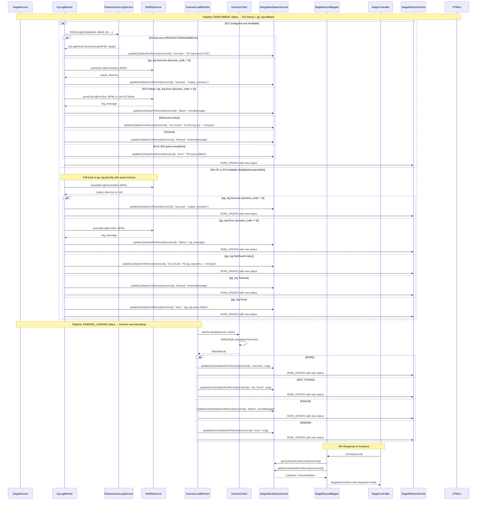

# Design Document: Per-File Integration Status

## Overview

The current system tracks integration status (Elasticsearch/CP and Exensio) at the session level using a single entry per `requestId` in `IntegrationStatusService`. This means all files in a session share one status entry, making it impossible for users to see which individual file is stuck, succeeded, or failed at each integration step.

This design adds per-file tracking keyed by `StageRecord.id()` (the numeric primary key) throughout the backend pipeline, surfaces those statuses in the `StageRecordView` DTO, propagates them over existing SSE `ROW_UPDATE` events, and renders them as two new badge columns in the monitoring UI file table.

### Enrichment Process Context

**CP Enrichment Flow Decision Tree:**

```
1. Query Elasticsearch for CP logs
   ├─ Found PRODUCTION log? ──YES──→ Enrichment completed in PROD (direct DB)
   │                                     No ES output path needed
   ├─ Found SANDBOX log? ──YES──→ Enrichment completed in SANDBOX (direct DB)
   │                                     No ES output path needed
   └─ Not found? ──YES──→ Query refdb.pp_log table
                               ├─ process_code = 0? ──YES──→ Enrichment completed (output_directory)
                               ├─ process_code != 0? ──YES──→ Enrichment failed (log_message)
                               └─ No pp_log entry? ──YES──→ Still waiting, retry next cycle

2. No CP or ES available (configuration disabled or unreachable):
   └─ Query refdb.pp_log table directly with same timeout as with CP/ES
                               ├─ process_code = 0? ──YES──→ Enrichment completed (output_directory)
                               ├─ process_code != 0? ──YES──→ Enrichment failed (log_message)
                               └─ No pp_log entry? ──YES──→ Still waiting, retry next cycle

3. After enrichment confirmed → Transition to EXENSIO_LOADING → Exensio API check
```

**Key Insights:**

- When ES finds PRODUCTION/SANDBOX, enrichment is confirmed directly - no pp_log needed
- When ES doesn't find CP log, fall back to pp_log to check if enrichment happened outside CP
- When CP/ES is unavailable (disabled or unreachable), fall back to pp_log with the same timeout logic
- pp_log serves as the primary fallback when CP logs aren't available in ES, or when CP/ES is completely unavailable

## Architecture

### Data Model Changes

```
Current State (per-requestId):
IntegrationStatusService {
  esStatusByRequest: Map<requestId, IntegrationStatus>
  exensioStatusByRequest: Map<requestId, IntegrationStatus>
}

New State (per-recordId + per-requestId):
IntegrationStatusService {
  esStatusByRequest: Map<requestId, IntegrationStatus>      // existing
  exensioStatusByRequest: Map<requestId, IntegrationStatus> // existing
  cpStatusByRecord: Map<stageRecordId, CpStatus>             // NEW
  exensioStatusByRecord: Map<stageRecordId, ExensioStatus>   // NEW
}

Status Values:
- cpStatusByRecord: "pending" | "not_found" | "success" | "failure" | "timeout" | "error" | "not_configured"
- exensioStatusByRecord: "pending" | "not_found" | "success" | "failure" | "error" | "not_configured"
```

### Component Flow



## Components and Interfaces

### IntegrationStatusService (Extended)

**Existing Methods:**

```java
void updateElasticsearch(String requestId, String status, String message)
void updateExensio(String requestId, String status, String message)
Map<String, Object> snapshot(String requestId, boolean esConfigured, boolean exensioConfigured)
```

**New Methods:**

```java
void updateCpStatusForRecord(long stageRecordId, String status, String message)
void updateExensioStatusForRecord(long stageRecordId, String status, String message)
CpStatus getCpStatusForRecord(long stageRecordId)
ExensioStatus getExensioStatusForRecord(long stageRecordId)
```

**Internal Data Structures:**

```java
private final ConcurrentHashMap<Long, CpStatus> cpStatusByRecord = new ConcurrentHashMap<>();
private final ConcurrentHashMap<Long, ExensioStatus> exensioStatusByRecord = new ConcurrentHashMap<>();
```

**Eviction Policy:**

- TTL: Configurable via `integration.status.record-ttl-minutes` (default: 120 minutes)
- Max entries: Configurable (default: 50,000)
- Eviction triggers:
  1. TTL expiration for terminal-state records (DONE/FAILED/COMPLETED/ERROR)
  2. Max entries reached (LRU eviction of oldest entries)

### CpLogMonitor (Updated)

**Changes:**

- Each `processRecord` call now updates per-record status:
  - ES Available + ES Success (PRODUCTION/SANDBOX): `updateCpStatusForRecord(record.id(), "success", "CP log found in ES")`
  - ES Available + pp_log Success (process_code = 0): `updateCpStatusForRecord(record.id(), "success", "output_directory from pp_log")`
  - ES Available + pp_log Error (process_code != 0): `updateCpStatusForRecord(record.id(), "failure", log_message from pp_log)`
  - ES Available + ES Failure: `updateCpStatusForRecord(record.id(), "failure", errorMessage)`
  - ES Available + NotFound (timeout): `updateCpStatusForRecord(record.id(), "timeout", timeoutMessage)`
  - ES Available + NotFound (retry): `updateCpStatusForRecord(record.id(), "not_found", "No ES log yet — retrying")`
  - ES Available + Exception: `updateCpStatusForRecord(record.id(), "error", "ES query failed: ...")`
  - **No CP/ES Available**: Fall back to pp_log directly with same timeout logic:
    - pp_log Success: `updateCpStatusForRecord(record.id(), "success", "output_directory")`
    - pp_log Error: `updateCpStatusForRecord(record.id(), "failure", "log_message")`
    - pp_log NotFound: `updateCpStatusForRecord(record.id(), "not_found", "No pp_log entry — retrying")`
    - pp_log Timeout: `updateCpStatusForRecord(record.id(), "timeout", timeoutMessage)`
    - pp_log Error: `updateCpStatusForRecord(record.id(), "error", "pp_log query failed")`

**Trigger SSE:** After updating per-record status, emit `ROW_UPDATE` SSE event for that record ID.

### ExensioLoadMonitor (Updated)

**Changes:**

- `recordBatchIntegrationStatus` now calls per-record status updates:
  - DONE: `updateExensioStatusForRecord(record.id(), "success", msg)`
  - NOT_FOUND: `updateExensioStatusForRecord(record.id(), "not_found", msg)`
  - FAILED: `updateExensioStatusForRecord(record.id(), "failure", errorMessage)`
  - ERROR: `updateExensioStatusForRecord(record.id(), "error", errorMessage)`

**Trigger SSE:** After updating per-record status, emit `ROW_UPDATE` SSE event for that record ID.

### StageRecordView (Extended)

**New Fields:**

```java
public record StageRecordView(
    // ... existing 21 fields ...
    String cpIntegrationStatus,     // NEW
    String cpIntegrationMessage,    // NEW
    String exensioIntegrationStatus,// NEW
    String exensioIntegrationMessage // NEW
) {}
```

### StageRecordMapper (Updated)

**Changes:**

- Inject `IntegrationStatusService`, `CpElasticsearchProperties`, `ExensioProperties`
- In `toView(record)`:
  1. Look up `cpStatus = getCpStatusForRecord(record.id())`
  2. Look up `exensioStatus = getExensioStatusForRecord(record.id())`
  3. Determine defaults based on record status and config flags
  4. Populate the 4 new fields

**Default Logic:**

```java
// CP Status Defaults
if (record.status() == "ENRICHMENT") {
    cpIntegrationStatus = esConfigured ? "pending" : "not_configured";
} else {
    cpIntegrationStatus = "not_configured";
}

// Exensio Status Defaults
if (record.status() == "EXENSIO_LOADING") {
    exensioIntegrationStatus = exensioConfigured ? "pending" : "not_configured";
} else {
    exensioIntegrationStatus = "not_configured";
}
```

### SSE ROW_UPDATE Event (Extended)

**Current Event Format (existing):**

```json
{
  "type": "ROW_UPDATE",
  "sessionId": "...",
  "recordId": 123,
  "status": "DONE",
  "errorMessage": "...",
  "processedAt": "2026-06-04T..."
}
```

**New Event Format:**

```json
{
  "type": "ROW_UPDATE",
  "sessionId": "...",
  "recordId": 123,
  "status": "DONE",
  "errorMessage": "...",
  "processedAt": "2026-06-04T...",
  "cpIntegrationStatus": "success",
  "cpIntegrationMessage": "CP log found in ES",
  "exensioIntegrationStatus": "success",
  "exensioIntegrationMessage": "Wafer confirmed in Exensio"
}
```

**Trigger Points:**

- After `CpLogMonitor` updates per-record ES status
- After `ExensioLoadMonitor` updates per-record Exensio status

### Frontend Integration (TypeScript)

**MonitoringFileItem Interface:**

```typescript
interface MonitoringFileItem {
  id: number;
  site: string;
  senderId: number;
  senderName: string;
  metadataId: string;
  dataId: string;
  lot: string;
  wafer: string;
  filename: string;
  endTime: string | null;
  status: string;
  errorMessage: string | null;
  createdAt: string | null;
  updatedAt: string | null;
  processedAt: string | null;
  stagedBy: string;
  lastRequestedBy: string;
  lastRequestedAt: string | null;
  cpOutputPath: string | null;
  cpOutputTarget: string | null;
  exensioWaferKey: number | null;
  exensioPgKey: number | null;

  // NEW fields
  cpIntegrationStatus: string | null;
  cpIntegrationMessage: string | null;
  exensioIntegrationStatus: string | null;
  exensioIntegrationMessage: string | null;
}
```

**Badge Component:** `<integration-badge status="success" type="cp" />` or `<integration-badge status="success" type="exensio" />`

### Configuration

**New Config Property:**

```yaml
app:
  integration:
    status:
      record-ttl-minutes: 120 # Default: 2 hours
      max-entries: 50000 # Default: 50,000 entries
```

## Data Models

### CpStatus (Record Type)

```java
public record CpStatus(String status, String message, Instant at) {}
```

### ExensioStatus (Record Type)

```java
public record ExensioStatus(String status, String message, Instant at) {}
```

## Correctness Properties

### Property 1: Per-record CP status isolation

_For any_ two distinct stage record IDs (r1 ≠ r2), updating the CP status for r1 shall not affect the CP status for r2.
**Validates: Requirements 1.1**

### Property 2: CP status matches enrichment outcome (ES or pp_log)

_For any_ record processed by CpLogMonitor, the CP status stored for that record's ID shall match the enrichment outcome (from ES PRODUCTION/SANDBOX, pp_log success, or pp_log error) and contain the corresponding message (including output directory for pp_log success).
**Validates: Requirements 1.2-1.4**

### Property 2a: pp_log success reported with output directory

_For any_ record where enrichment succeeds via pp_log fallback (process_code = 0), the CP status message shall include the output_directory from pp_log to allow users to verify the enrichment result location.
**Validates: Requirements 1.8**

### Property 2b: No CP or ES available falls back to pp_log

_For any_ record when ES is disabled or unreachable, the System shall fall back to querying `refdb.pp_log` directly with the same timeout behavior as with CP/ES, and record the enrichment status accordingly.
**Validates: Requirements 1.8**

### Property 3: Per-record Exensio status isolation

_For any_ two distinct stage record IDs (r1 ≠ r2), updating the Exensio status for r1 shall not affect the Exensio status for r2.
**Validates: Requirements 2.1**

### Property 4: Exensio status matches batch lookup outcome

_For any_ record processed by ExensioLoadMonitor, the Exensio status stored for that record's ID shall match the batch lookup result (success/not_found/failed/error) and contain the corresponding message.
**Validates: Requirements 2.2-2.5**

### Property 5: StageRecordView includes integration status

_For any_ StageRecord converted to StageRecordView, the resulting view shall include cpIntegrationStatus, cpIntegrationMessage, exensioIntegrationStatus, and exensioIntegrationMessage fields populated from IntegrationStatusService lookups or appropriate defaults.
**Validates: Requirements 3.1-3.2**

### Property 6: Status defaults based on record state and config

_For any_ StageRecord with no recorded integration status, the StageRecordMapper shall set defaults based on the record's status field and the configured flags (esConfigured, exensioConfigured).
**Validates: Requirements 3.3-3.7**

### Property 7: SSE events propagate integration status

_For any_ ROW_UPDATE SSE event emitted by StageMonitorService, the event payload shall include cpIntegrationStatus, cpIntegrationMessage, exensioIntegrationStatus, and exensioIntegrationMessage fields reflecting the current status for that record.
**Validates: Requirements 4.1**

### Property 8: Status update triggers SSE event

_For any_ per-record status update via IntegrationStatusService, a ROW_UPDATE SSE event shall be emitted for the affected record ID (best-effort, no error if no subscribers).
**Validates: Requirements 4.2-4.3**

### Property 9: Eviction removes terminal-state entries after TTL

_For any_ per-record status entry whose corresponding StageRecord has reached a terminal state (DONE/FAILED/COMPLETED/ERROR), the entry shall be evicted from IntegrationStatusService after the TTL duration.
**Validates: Requirements 8.1-8.2**

### Property 10: Eviction respects max entries limit

_For any_ IntegrationStatusService instance that has reached the max entries limit, the oldest entries shall be evicted when new entries are added.
**Validates: Requirements 8.4**

## Error Handling

### Elasticsearch Query Failure

- Log warning with record details
- Set CP status to "error" with error message
- Emit ROW_UPDATE SSE event
- Continue processing other records (do not fail entire batch)

### Exensio API Failure

- Log warning with record details
- Set Exensio status to "error" with error message
- Emit ROW_UPDATE SSE event
- Continue processing other records (do not fail entire batch)

### Missing SSE Subscriber

- ROW_UPDATE events are best-effort
- If no active subscriber exists for the session/record, silently skip (no exception)

### Memory Exhaustion Protection

- Max entries limit (default: 50,000) prevents unbounded memory growth
- LRU eviction of oldest entries when limit reached
- TTL-based cleanup for terminal-state records

## Testing Strategy

### Unit Tests (Backend)

**IntegrationStatusServiceTest:**

- Test `updateCpStatusForRecord` and `getCpStatusForRecord`
- Test `updateExensioStatusForRecord` and `getExensioStatusForRecord`
- Test status isolation (r1 ≠ r2 ⇒ status(r1) ≠ status(r2))
- Test TTL-based eviction for terminal states
- Test max entries eviction (LRU behavior)

**CpLogMonitorTest:**

- Test success case: ES lookup (PRODUCTION/SANDBOX) → status "success"
- Test success case: pp_log fallback (process_code = 0) → status "success" with output directory in message
- Test failure case: ES lookup failure → status "failure"
- Test failure case: pp_log error (process_code != 0) → status "failure" with log message
- Test timeout case: ES lookup timeout → status "timeout"
- Test not_found case: ES lookup not found → status "not_found"
- Test exception case: ES query exception → status "error"

**ExensioLoadMonitorTest:**

- Test success case: Exensio batch lookup DONE → status "success"
- Test not_found case: Exensio batch lookup NOT_FOUND → status "not_found"
- Test failed case: Exensio batch lookup FAILED → status "failure"
- Test error case: Exensio batch lookup ERROR → status "error"

**StageRecordMapperTest:**

- Test toView populates integration status fields from IntegrationStatusService
- Test default "pending" for ENRICHMENT records when ES configured
- Test default "pending" for EXENSIO_LOADING records when Exensio configured
- Test default "not_configured" when ES not configured
- Test default "not_configured" when Exensio not configured

### Property-Based Tests (Backend)

**Test Configuration:**

- Use JQWik (existing test framework)
- Minimum 100 iterations per property
- Tag format: `**Feature: per-file-integration-status, Property N: ...**`

**Property Tests:**

1. **Property 1 (Isolation):** Generate two random record IDs, update status for one, verify the other is unchanged.
2. **Property 2 (Enrichment outcome match):** Generate random record with mock ES or pp_log result, process through CpLogMonitor, verify stored status matches result.
3. **Property 2a (pp_log success with output directory):** Generate random record where pp_log has process_code = 0, verify status "success" and message contains output_directory.
4. **Property 3 (Exensio isolation):** Generate two random record IDs, update Exensio status for one, verify the other is unchanged.
5. **Property 4 (Exensio outcome match):** Generate random record with mock batch result, process through ExensioLoadMonitor, verify stored status matches result.
6. **Property 5 (View includes status):** Generate random record with known statuses in IntegrationStatusService, convert to view, verify all 4 new fields are present.
7. **Property 9 (TTL eviction):** Generate terminal-state records, wait for TTL, verify entries are evicted.
8. **Property 10 (Max entries):** Generate 50,001 records, verify oldest entries are evicted when max reached.

### Backend Testing Commands

Note: Maven/Java cannot be executed in this environment. Tests must be run manually in the developer's environment.

```bash
# Run unit tests (developer must run manually)
mvn test -Dtest=IntegrationStatusServiceTest,CpLogMonitorTest,ExensioLoadMonitorTest,StageRecordMapperTest

# Run property-based tests (developer must run manually)
mvn test -Dtest=*Test
```

### Frontend Tests

**Component Tests (RealtimeMonitoringFileListComponent):**

- Verify CP Status badge column renders for each file row
- Verify Exensio Status badge column renders for each file row
- Verify badge color/icon matches status value (green=success, red=failure, etc.)
- Verify detail panel shows integration messages when expanded
- Verify ROW_UPDATE SSE event updates file row in place

**Unit Tests:**

- Test MonitoringFileItem interface includes 4 new fields
- Test service mapping includes integration status fields
- Test SSE event handler updates file row correctly

## Implementation Checklist

### Backend Tasks

- [ ] Extend IntegrationStatusService with cpStatusByRecord and exensioStatusByRecord maps
- [ ] Add updateCpStatusForRecord() and getCpStatusForRecord() methods
- [ ] Add updateExensioStatusForRecord() and getExensioStatusForRecord() methods
- [ ] Add TTL eviction logic for terminal-state records
- [ ] Add max entries eviction logic (LRU)
- [ ] Update CpLogMonitor to call per-record status updates for all cases:
  - ES Success (PRODUCTION/SANDBOX)
  - pp_log Success (process_code = 0, include output_directory in message)
  - pp_log Error (process_code != 0, include log_message)
  - ES Failure, NotFound, Timeout, Exception
- [ ] Update ExensioLoadMonitor to call per-record status updates
- [ ] Update StageRecordView with 4 new fields
- [ ] Update StageRecordMapper to look up and populate integration status
- [ ] Update StageMonitorService to include integration status in ROW_UPDATE events
- [ ] Add configuration properties for TTL and max entries
- [ ] Write unit tests for new functionality
- [ ] Write property-based tests for correctness properties including pp_log fallback

### Frontend Tasks

- [ ] Update MonitoringFileItem interface with 4 new fields
- [ ] Update service mapping to include integration status
- [ ] Create IntegrationBadge component (CP + Exensio variants)
- [ ] Update RealtimeMonitoringFileListComponent to display new columns
- [ ] Update ROW_UPDATE SSE handler to update new fields
- [ ] Update detail panel to show integration messages
- [ ] Add badge status icons and colors (CSS classes)

### Deployment Considerations

- Deploy backend first (no breaking changes, new fields are optional)
- Frontend can gracefully handle missing integration status fields
- Monitor memory usage of IntegrationStatusService after deployment
- Adjust TTL and max entries based on observed usage patterns
