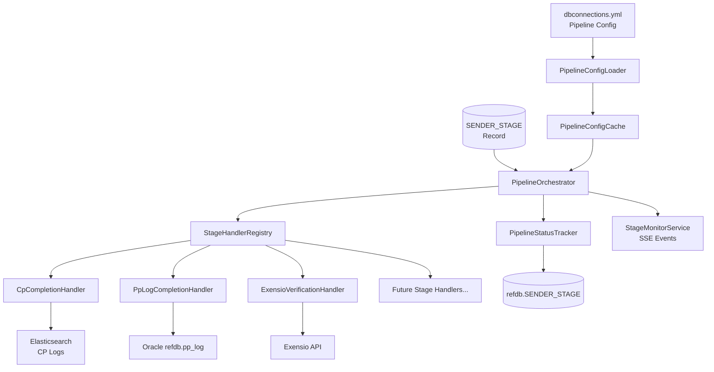
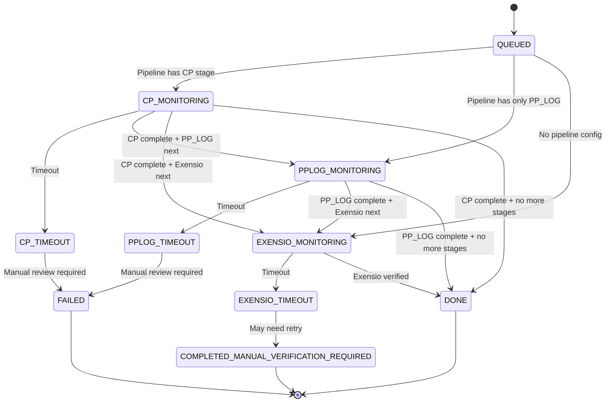

# Design Document: Pipeline Dependency Orchestration

## Overview

This design implements a configuration-driven pipeline orchestration system for ExensioReload that eliminates race conditions in multi-stage data processing. The system reads pipeline definitions from `dbconnections.yml`, manages stage dependencies, and coordinates completion detection across Elasticsearch (CP logs) and Oracle database (PP_LOG table).

The design enables declarative pipeline configuration where stages like CP, PP_LOG, Exensio verification, and future enrichments (Scribe, ShipScribe, Lot Genealogy, Reftable) can be defined with explicit dependencies, eliminating hard-coded orchestration logic.

## Architecture

### High-Level Component Diagram



### Component Responsibilities

| Component                    | Responsibility                                                                       |
| ---------------------------- | ------------------------------------------------------------------------------------ |
| `PipelineConfigLoader`       | Parse `dbconnections.yml`, validate pipeline definitions, build dependency graph     |
| `PipelineConfigCache`        | Cache parsed configurations per site, invalidate on configuration changes            |
| `PipelineOrchestrator`       | Main orchestration logic - determine next stage, check dependencies, invoke handlers |
| `StageHandlerRegistry`       | Registry pattern for stage handlers - maps stage type to handler implementation      |
| `CpCompletionHandler`        | Check CP completion via Elasticsearch query, return success/not_found/error          |
| `PpLogCompletionHandler`     | Check PP_LOG completion via Oracle refdb.pp_log query                                |
| `ExensioVerificationHandler` | Delegate to existing ExensioLoadMonitor for Exensio API verification                 |
| `PipelineStatusTracker`      | Track stage progress per record, persist state, expose status via API                |

## Components and Interfaces

### 1. PipelineConfigLoader

```java
package com.onsemi.cim.apps.exensio.exensioreload.pipeline;

public class PipelineConfigLoader {

    public record PipelineConfig(
        String site,
        List<StageDefinition> stages,
        Map<String, StageDefinition> stagesByName
    ) {
        public StageDefinition findStage(String name) {
            return stagesByName.get(name);
        }

        public boolean hasDependencies() {
            return stages.stream().anyMatch(s -> !s.dependsOn().isEmpty());
        }
    }

    public record StageDefinition(
        String name,
        StageType type,
        List<String> dependsOn,
        Map<String, Object> config
    ) {}

    public enum StageType {
        CP,
        PPLOG,
        EXENSIO,
        SCRIBE,
        SHIP_SCRIBE,
        LOT_GENEALOGY,
        REFTABLE
    }

    /**
     * Load and parse pipeline configuration for a site from dbconnections.yml
     */
    public Optional<PipelineConfig> loadPipelineConfig(String site) throws PipelineConfigException;

    /**
     * Validate pipeline configuration: check circular dependencies, verify stage references
     */
    public void validatePipelineConfig(PipelineConfig config) throws PipelineConfigException;
}
```

### 2. PipelineOrchestrator

```java
package com.onsemi.cim.apps.exensio.exensioreload.pipeline;

public class PipelineOrchestrator {

    private final PipelineConfigCache configCache;
    private final StageHandlerRegistry handlerRegistry;
    private final PipelineStatusTracker statusTracker;

    /**
     * Determine the next action for a record based on its current stage and pipeline configuration
     */
    public PipelineAction determineNextAction(StageRecord record) {
        Optional<PipelineConfig> config = configCache.getConfig(record.site());

        // No pipeline config = legacy behavior
        if (config.isEmpty()) {
            return PipelineAction.useLegacyPath();
        }

        PipelineState state = statusTracker.getState(record.id());
        StageDefinition currentStage = getCurrentStage(config.get(), state);

        // Check if dependencies are satisfied
        if (!areDependenciesSatisfied(currentStage, state)) {
            return PipelineAction.waitForDependencies(currentStage.dependsOn());
        }

        // Get handler for current stage
        StageHandler handler = handlerRegistry.getHandler(currentStage.type());

        return PipelineAction.executeStage(currentStage, handler);
    }

    /**
     * Execute a stage and update record status based on result
     */
    public void executeStage(StageRecord record, StageDefinition stage, StageHandler handler) {
        StageResult result = handler.checkCompletion(record, stage.config());

        switch (result.status()) {
            case COMPLETED -> progressToNextStage(record, stage);
            case NOT_FOUND -> keepInCurrentStage(record, stage);
            case ERROR -> handleStageError(record, stage, result.errorMessage());
            case TIMEOUT -> handleStageTimeout(record, stage);
        }
    }

    private boolean areDependenciesSatisfied(StageDefinition stage, PipelineState state) {
        return stage.dependsOn().stream()
            .allMatch(depName -> state.isStageComplete(depName));
    }
}
```

### 3. StageHandler Interface

```java
package com.onsemi.cim.apps.exensio.exensioreload.pipeline;

public interface StageHandler {

    /**
     * Check if the stage has completed for the given record
     */
    StageResult checkCompletion(StageRecord record, Map<String, Object> stageConfig);

    /**
     * Get the stage type this handler supports
     */
    StageType getStageType();
}

public record StageResult(
    StageStatus status,
    String traceId,
    String errorMessage,
    Map<String, Object> metadata
) {
    public static StageResult completed(String traceId) {
        return new StageResult(StageStatus.COMPLETED, traceId, null, Map.of());
    }

    public static StageResult notFound(String traceId) {
        return new StageResult(StageStatus.NOT_FOUND, traceId, null, Map.of());
    }

    public static StageResult error(String traceId, String message) {
        return new StageResult(StageStatus.ERROR, traceId, message, Map.of());
    }

    public static StageResult timeout(String traceId) {
        return new StageResult(StageStatus.TIMEOUT, traceId, null, Map.of());
    }
}

public enum StageStatus {
    COMPLETED,
    NOT_FOUND,
    ERROR,
    TIMEOUT
}
```

### 4. CpCompletionHandler

```java
package com.onsemi.cim.apps.exensio.exensioreload.pipeline.handlers;

@Component
public class CpCompletionHandler implements StageHandler {

    private final ElasticsearchLogService elasticsearchLogService;
    private final CpElasticsearchProperties cpProperties;

    @Override
    public StageResult checkCompletion(StageRecord record, Map<String, Object> stageConfig) {
        String traceId = UUID.randomUUID().toString();

        // Extract CP-specific configuration
        String indexPattern = (String) stageConfig.getOrDefault("indexPattern",
            cpProperties.getIndexPattern());
        Integer lookbackSeconds = (Integer) stageConfig.getOrDefault("lookbackBufferSeconds",
            cpProperties.getLookbackBufferSeconds());

        Instant searchStart = record.endTime() != null
            ? record.endTime().minusSeconds(lookbackSeconds)
            : record.createdAt().minusSeconds(lookbackSeconds);

        CpLogResult result = elasticsearchLogService.findCpLog(
            record.lot(),
            record.wafer(),
            record.metadataId(),
            searchStart,
            record.site(),
            traceId
        );

        return switch (result) {
            case CpLogResult.Success s -> StageResult.completed(traceId)
                .withMetadata("cpOutputTarget", s.outputTarget())
                .withMetadata("cpLogPath", s.logPath());
            case CpLogResult.NotFound nf -> StageResult.notFound(traceId);
            case CpLogResult.Failure f -> StageResult.error(traceId, f.errorMessage());
        };
    }

    @Override
    public StageType getStageType() {
        return StageType.CP;
    }
}
```

### 5. PpLogCompletionHandler

```java
package com.onsemi.cim.apps.exensio.exensioreload.pipeline.handlers;

@Component
public class PpLogCompletionHandler implements StageHandler {

    private final RefDbService refDbService;
    private final PpLogDbProperties ppLogProperties;

    @Override
    public StageResult checkCompletion(StageRecord record, Map<String, Object> stageConfig) {
        String traceId = UUID.randomUUID().toString();

        if (!ppLogProperties.isPpLogAvailable()) {
            return StageResult.error(traceId, "PP_LOG database not configured");
        }

        // Query refdb.pp_log table for matching record
        Integer lookbackSeconds = (Integer) stageConfig.getOrDefault("lookbackBufferSeconds", 900);
        Instant searchStart = record.endTime() != null
            ? record.endTime().minusSeconds(lookbackSeconds)
            : record.createdAt().minusSeconds(lookbackSeconds);

        try {
            String ppLogEntry = refDbService.queryPpLog(
                record.lot(),
                searchStart,
                record.site()
            );

            if (ppLogEntry != null && !ppLogEntry.isBlank()) {
                return StageResult.completed(traceId)
                    .withMetadata("ppLogEntry", ppLogEntry);
            } else {
                return StageResult.notFound(traceId);
            }
        } catch (Exception e) {
            log.error("PP_LOG query failed for record {}: {}", record.id(), e.getMessage(), e);
            return StageResult.error(traceId, "PP_LOG query error: " + e.getMessage());
        }
    }

    @Override
    public StageType getStageType() {
        return StageType.PPLOG;
    }
}
```

### 6. PipelineStatusTracker

```java
package com.onsemi.cim.apps.exensio.exensioreload.pipeline;

@Component
public class PipelineStatusTracker {

    private final RefDbService refDbService;

    public record PipelineState(
        long recordId,
        String currentStage,
        Set<String> completedStages,
        Map<String, Instant> stageCompletionTimes,
        Map<String, String> stageMetadata
    ) {
        public boolean isStageComplete(String stageName) {
            return completedStages.contains(stageName);
        }

        public Duration getStageAge(String stageName) {
            Instant completionTime = stageCompletionTimes.get(stageName);
            return completionTime != null
                ? Duration.between(completionTime, Instant.now())
                : Duration.ZERO;
        }
    }

    /**
     * Get current pipeline state for a record
     */
    public PipelineState getState(long recordId);

    /**
     * Mark a stage as complete and store metadata
     */
    public void markStageComplete(long recordId, String stageName, Map<String, Object> metadata);

    /**
     * Update current stage without completing previous stage
     */
    public void updateCurrentStage(long recordId, String stageName);

    /**
     * Check if a stage has timed out
     */
    public boolean isStageTimedOut(long recordId, String stageName, Duration timeout);
}
```

## Data Models

### Pipeline Configuration in dbconnections.yml

```yaml
CEBU-PROD:
  dbType: oracle
  schema: DATAPORT_OWNER
  host: cpyqsp-db.onsemi.com:1529:CPYQSP
  user: DATAPORT_OWNER
  password: dpownerp321

  # Pipeline configuration (optional)
  pipeline:
    stages:
      - name: cp
        type: CP
        config:
          indexPattern: 'logs*dataport*'
          lookbackBufferSeconds: 900
          timeoutMinutes: 15

      - name: pplog
        type: PPLOG
        dependsOn: [cp]
        config:
          lookbackBufferSeconds: 300
          timeoutMinutes: 10

      - name: exensio
        type: EXENSIO
        dependsOn: [pplog]
        config:
          timeoutMinutes: 60

# Site without pipeline config - uses legacy behavior
JND-AIZU-PROD:
  dbType: oracle
  schema: DATAPORT_OWNER
  host: jnd-proddb-scan:1540/JNDMFGP.onsemi.com
  user: DATAPORT_OWNER
  password: Aizu1234
```

### Database Schema Updates

```sql
-- Add pipeline state tracking to SENDER_STAGE table
ALTER TABLE SENDER_STAGE ADD (
    current_pipeline_stage VARCHAR2(50),
    completed_pipeline_stages VARCHAR2(500),  -- JSON array of completed stage names
    stage_metadata CLOB,                      -- JSON object with stage metadata
    pipeline_started_at TIMESTAMP,
    last_stage_check_at TIMESTAMP
);

-- Add index for pipeline state queries
CREATE INDEX idx_sender_stage_pipeline ON SENDER_STAGE(site, current_pipeline_stage, pipeline_started_at);
```

### Record Status Flow with Pipeline



## Correctness Properties

A property is a characteristic or behavior that should hold true across all valid executions of a system—essentially, a formal statement about what the system should do. Properties serve as the bridge between human-readable specifications and machine-verifiable correctness guarantees.

### Property 1: Dependency Order Enforcement

_For any_ pipeline configuration with stage dependencies, executing the pipeline should ensure that no stage begins before all its dependencies complete.

**Validates: Requirements 1.3, 2.3**

### Property 2: Configuration Parsing Idempotence

_For any_ valid pipeline configuration in dbconnections.yml, parsing it multiple times should produce equivalent PipelineConfig objects.

**Validates: Requirements 1.1, 1.2**

### Property 3: Circular Dependency Detection

_For any_ pipeline configuration, if it contains a circular dependency (stage A depends on B, B depends on A), then validation should reject the configuration.

**Validates: Requirements 1.5**

### Property 4: Legacy Path Preservation

_For any_ site without a pipeline configuration section, the system should use the legacy execution path (direct processing without orchestrator).

**Validates: Requirements 11.1, 11.2, 11.5**

### Property 5: Stage Completion Persistence

_For any_ record progressing through a pipeline, once a stage is marked complete, subsequent checks should not revert it to incomplete.

**Validates: Requirements 2.4, 6.1**

### Property 6: CP Completion Detection Correctness

_For any_ record with CP dependency, if Elasticsearch returns a matching CP log entry, then the CP stage should be marked complete.

**Validates: Requirements 3.1, 3.3**

### Property 7: PP_LOG Completion Detection Correctness

_For any_ record with PP_LOG dependency, if refdb.pp_log contains a matching entry, then the PP_LOG stage should be marked complete.

**Validates: Requirements 4.1, 4.2**

### Property 8: Timeout Detection Accuracy

_For any_ stage with a configured timeout, if a record remains in that stage longer than the timeout duration, then the system should transition it to a timeout status.

**Validates: Requirements 5.3, 9.2**

### Property 9: Handler Registry Completeness

_For any_ stage type defined in a pipeline configuration, there must exist a registered handler for that type, otherwise the system should fail fast with a clear error message.

**Validates: Requirements 8.1, 8.2**

### Property 10: State Transition Atomicity

_For any_ record status update, either all related state changes (status, stage metadata, timestamps) are persisted together, or none are persisted.

**Validates: Requirements 6.2, 10.2**

### Property 11: Parallel Stage Independence

_For any_ two records with no shared dependencies, processing them concurrently should not cause race conditions or data corruption.

**Validates: Requirements 12.3**

### Property 12: Configuration Cache Consistency

_For any_ site, the cached pipeline configuration should match the configuration in dbconnections.yml until the cache is explicitly invalidated.

**Validates: Requirements 12.2**

### Property 13: ES Query Lookback Sufficiency

_For any_ CP completion check, the Elasticsearch query lookback window should be large enough to account for clock skew and indexing delays (searchStart = record.endTime - lookbackBufferSeconds).

**Validates: Requirements 7.4**

### Property 14: SSE Event Ordering

_For any_ record progressing through stages, SSE events should be emitted in the same order as stage transitions occur.

**Validates: Requirements 10.4**

### Property 15: Error Recovery Without Data Loss

_For any_ transient error during stage checking, the system should retry on the next poll cycle without losing record state.

**Validates: Requirements 9.1**

## Error Handling

### Error Classification

| Error Type                     | Handling Strategy                     | Status Transition                           |
| ------------------------------ | ------------------------------------- | ------------------------------------------- |
| Configuration Parse Error      | Log error, use legacy path for site   | No status change                            |
| Missing Handler                | Fail fast at startup, log clear error | Application fails to start                  |
| Elasticsearch Transient Error  | Retry next poll, log warning          | No status change (stay in \*\_MONITORING)   |
| Elasticsearch Persistent Error | After N failures, mark FAILED         | Transition to FAILED                        |
| PP_LOG Query Error             | Retry next poll if transient          | No status change (stay in PPLOG_MONITORING) |
| Timeout Exceeded               | Mark timeout status, log diagnostic   | Transition to \*\_TIMEOUT                   |
| Circular Dependency            | Reject configuration at load time     | Configuration rejected                      |
| Invalid Stage Reference        | Reject configuration at load time     | Configuration rejected                      |

### Diagnostic Information on Timeout

When a stage times out, the system logs:

- Stage name and type
- Record identifiers (lot, wafer, site)
- Time in stage
- Last check result (success/not_found/error)
- Dependency status for each required dependency

Example timeout diagnostic:

```
Stage 'cp' timed out for record 12345 (lot=LOT001, wafer=06, site=CEBU-PROD):
  - Time in stage: 16 minutes (timeout threshold: 15 minutes)
  - Last check result: NotFound (Elasticsearch returned 0 results)
  - Dependencies: none (first stage)
  - Search window: 2024-01-15T10:00:00Z to 2024-01-15T10:30:00Z
  - Diagnostic: ES query returned empty, pp_log returned NotFound
```

## Testing Strategy

### Unit Testing

Unit tests verify specific behaviors and edge cases:

1. **Configuration Parsing**: Valid/invalid YAML, missing fields, incorrect types
2. **Dependency Graph**: Circular dependencies, invalid references, disconnected stages
3. **Handler Logic**: CP log matching, PP_LOG query construction, Exensio delegation
4. **State Transitions**: Status flow, stage completion marking, metadata persistence
5. **Timeout Detection**: Accurate duration calculation, threshold comparison
6. **Cache Behavior**: Hit/miss rates, invalidation triggers, expiration

### Property-Based Testing

Property tests verify universal properties across all inputs (minimum 100 iterations each):

**Property Test 1: Dependency Order Enforcement**

```java
@Property
void dependencyOrderIsEnforced(@ForAll("validPipelineWithDependencies") PipelineConfig config) {
    // Feature: pipeline-dependency-orchestration, Property 1: Dependency Order Enforcement
    // For any pipeline with dependencies, stages execute in dependency order

    PipelineOrchestrator orchestrator = new PipelineOrchestrator(config);
    StageRecord record = generateRandomRecord();

    List<String> executionOrder = new ArrayList<>();
    while (!orchestrator.isComplete(record)) {
        StageDefinition nextStage = orchestrator.determineNextStage(record);
        executionOrder.add(nextStage.name());

        // Verify all dependencies were completed before this stage
        for (String dep : nextStage.dependsOn()) {
            assertTrue(executionOrder.contains(dep),
                "Dependency " + dep + " should execute before " + nextStage.name());
        }

        // Simulate stage completion
        orchestrator.markStageComplete(record, nextStage.name());
    }
}
```

**Property Test 2: Configuration Parsing Idempotence**

```java
@Property
void configurationParsingIsIdempotent(@ForAll("validYamlConfig") String yamlConfig) {
    // Feature: pipeline-dependency-orchestration, Property 2: Configuration Parsing Idempotence
    // Parsing same config multiple times produces equivalent results

    PipelineConfigLoader loader = new PipelineConfigLoader();

    PipelineConfig config1 = loader.parseYaml(yamlConfig);
    PipelineConfig config2 = loader.parseYaml(yamlConfig);
    PipelineConfig config3 = loader.parseYaml(yamlConfig);

    assertEquals(config1, config2);
    assertEquals(config2, config3);
}
```

**Property Test 3: Timeout Detection Accuracy**

```java
@Property
void timeoutDetectionIsAccurate(
    @ForAll @IntRange(min = 1, max = 60) int timeoutMinutes,
    @ForAll @IntRange(min = 0, max = 120) int elapsedMinutes
) {
    // Feature: pipeline-dependency-orchestration, Property 8: Timeout Detection Accuracy
    // Records exceeding timeout are marked as timed out

    Duration timeout = Duration.ofMinutes(timeoutMinutes);
    Instant startedAt = Instant.now().minus(Duration.ofMinutes(elapsedMinutes));

    boolean isTimedOut = PipelineStatusTracker.isTimedOut(startedAt, timeout);

    if (elapsedMinutes > timeoutMinutes) {
        assertTrue(isTimedOut, "Should be timed out after " + elapsedMinutes + " minutes");
    } else {
        assertFalse(isTimedOut, "Should not be timed out before " + timeoutMinutes + " minutes");
    }
}
```

### Integration Testing

Integration tests verify component interactions:

1. **End-to-End Pipeline**: QUEUED → CP_MONITORING → PPLOG_MONITORING → EXENSIO_MONITORING → DONE
2. **Elasticsearch Integration**: Real ES queries for CP log detection
3. **Oracle Integration**: Real queries against refdb.pp_log table
4. **SSE Event Emission**: Verify events published in correct order
5. **Configuration Reload**: Hot reload when dbconnections.yml changes

### Test Configuration

- Unit tests: JUnit 5 + Mockito
- Property tests: jqwik (Java property-based testing library)
- Integration tests: Testcontainers for Elasticsearch and Oracle
- Minimum iterations per property test: 100
- Each test tagged with: `@Tag("Feature: pipeline-dependency-orchestration, Property N: <property_text>")`
