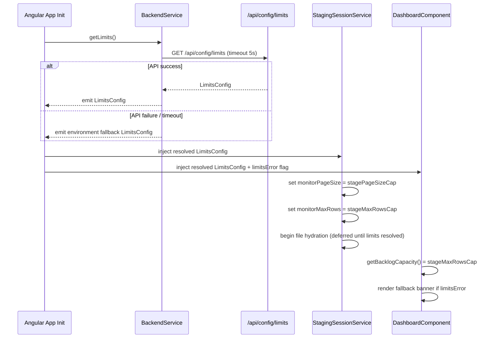

# Design Document: Backend-Driven Limits + Operator-First Dashboard UX

## Overview

This design wires the existing `/api/config/limits` backend endpoint as the primary source of truth for all frontend monitoring and dashboard limits. Environment file values are demoted to resilience fallbacks only. The dashboard is updated to use backend-authoritative capacity values for backlog indicators and to surface operator-actionable context (status chips, dispatch quick-actions, and a "Showing X of Y (cap Z)" label) during high-volume events.

### Current State

| Location | Value | Role today |
|---|---|---|
| `environment.ts` `monitoring.monitorPageSize` | 1000 | Primary — read directly in `StagingSessionService` |
| `environment.ts` `monitoring.monitorMaxRows` | 20000 | Primary — read directly in `StagingSessionService` |
| `GET /api/config/limits` | `stagePageSizeCap`, `stageMaxRowsCap`, … | Exists but never called by frontend |
| `dashboard.component.ts` `getBacklogCapacity()` | Returns constant `1000` | Hardcoded, unrelated to any real limit |

### Target State

- `GET /api/config/limits` is called once at startup; its values drive `monitorPageSize`, `monitorMaxRows`, and `Backlog_Capacity`.
- Environment values remain as typed fallbacks, used only when the API call fails.
- A non-blocking banner appears when fallback values are active.
- Sender cards show a status chip and a persistent Dispatch button when backlog pressure is elevated.
- The file list label reads `"Showing X of Y (cap: Z)"` to eliminate ambiguity.

---

## Architecture



---

## Components and Interfaces

### BackendService (`backend.service.ts`)

Add one public method:

```typescript
getLimits(): Observable<LimitsConfig>
```

- Calls `GET /api/config/limits`.
- Applies `timeout(5000)`.
- On error, catches and returns `of(environmentFallbackLimits)` — never re-throws.
- `environmentFallbackLimits` is a `LimitsConfig` built from `environment.monitoring` values.

The existing `LimitsConfig` interface is already defined and requires no changes:

```typescript
export interface LimitsConfig {
    previewMaxRowsCap: number;
    previewFetchCap: number;
    stagePageSizeCap: number;
    stageMaxRowsCap: number;
    stageDefaultMaxRows: number;
}
```

### StagingSessionService (`staging-session.service.ts`)

Replace the two `private readonly` constants that read directly from `environment.monitoring` with a limits-resolution flow:

```typescript
// Before (current)
private readonly monitorPageSize = Math.min(1000, Math.max(100, Number(environment.monitoring.monitorPageSize ?? 1000)));
private readonly monitorMaxRows  = Math.min(50000, Math.max(this.monitorPageSize, Number(environment.monitoring.monitorMaxRows ?? 20000)));

// After
private limitsResolved = false;
private monitorPageSize = environment.monitoring.monitorPageSize;  // fallback default
private monitorMaxRows  = environment.monitoring.monitorMaxRows;   // fallback default
```

On construction, call `backend.getLimits()` and assign values before any hydration:

```typescript
constructor(private backend: BackendService, private zone: NgZone) {
    this.subscribeToTokenChanges();
    this.backend.getLimits().subscribe(limits => {
        this.monitorPageSize = limits.stagePageSizeCap;
        this.monitorMaxRows  = limits.stageMaxRowsCap;
        this.limitsResolved  = true;
    });
}
```

`connectToSession()` defers the `setTimeout` hydration block until `limitsResolved` is true (poll with a short interval or use a `firstValueFrom` + `await` pattern in the init path).

### DashboardComponent (`dashboard.component.ts`)

Add two signals:

```typescript
resolvedLimits = signal<LimitsConfig | null>(null);
limitsError    = signal(false);
```

Load limits in `ngOnInit()` alongside the snapshot:

```typescript
this.backend.getLimits().subscribe({
    next: limits => { this.resolvedLimits.set(limits); this.limitsError.set(false); },
    error: ()     => { this.limitsError.set(true); }
});
```

Update `getBacklogCapacity()`:

```typescript
getBacklogCapacity(_sender: SenderPerformance): number {
    return this.resolvedLimits()?.stageMaxRowsCap ?? environment.monitoring.monitorMaxRows;
}
```

Update `getBacklogTooltip()`:

```typescript
getBacklogTooltip(sender: SenderPerformance): string {
    const cap = this.getBacklogCapacity(sender);
    return `${sender.backlog.toLocaleString()} / ${cap.toLocaleString()} backlog (cap: ${cap.toLocaleString()})`;
}
```

Add `getFileListLabel(loaded: number, total: number, cap: number): string` pure helper:

```typescript
getFileListLabel(loaded: number, total: number, cap: number): string {
    if (loaded >= total) return `Showing ${loaded.toLocaleString()} of ${total.toLocaleString()}`;
    if (loaded >= cap)   return `Showing ${loaded.toLocaleString()} of ${total.toLocaleString()} (cap reached)`;
    return `Showing ${loaded.toLocaleString()} of ${total.toLocaleString()} (cap: ${cap.toLocaleString()})`;
}
```

### DashboardComponent HTML (`dashboard.component.html`)

1. Add fallback banner immediately after the freshness banner:

```html
<div class="fallback-limits-banner" *ngIf="limitsError()" role="alert" aria-live="polite">
    <mat-icon aria-hidden="true">info</mat-icon>
    <span>Using local fallback limits — backend configuration unavailable.</span>
    <button mat-icon-button (click)="dismissLimitsBanner()" aria-label="Dismiss limits warning">
        <mat-icon>close</mat-icon>
    </button>
</div>
```

2. Add status chip and Dispatch button to each sender card in the `senders-grid`:

```html
<!-- Status chip -->
<span class="backlog-status-chip"
    [class.chip-normal]="getBacklogStatus(sender) === 'normal'"
    [class.chip-warning]="getBacklogStatus(sender) === 'warning'"
    [class.chip-critical]="getBacklogStatus(sender) === 'critical'">
    {{ getBacklogStatus(sender) | titlecase }}
</span>

<!-- Persistent dispatch quick-action (warning/critical only) -->
<button mat-stroked-button class="dispatch-quick-action"
    *ngIf="getBacklogStatus(sender) !== 'normal'"
    (click)="dispatchSender(sender); $event.stopPropagation()"
    [matTooltip]="'Dispatch queue for ' + sender.senderLabel">
    <mat-icon>send</mat-icon>
    Dispatch
</button>
```

3. Update the capacity label in the backlog indicator:

```html
<span class="capacity-label">
    {{ getBacklogTooltip(sender) }}
</span>
```

### ConfigController (`ConfigController.java`)

No logic changes needed. Add the five `@Value` defaults to `application.yml` so they are explicit and overridable.

### application.yml

Add under `app:`:

```yaml
app:
  preview:
    max-rows-cap: 20000
    fetch-cap: 20000
  stage:
    page-size-cap: 20000
    max-rows-cap: 100000
    default-max-rows: 20000
```

---

## Data Models

### LimitsConfig (existing, no change)

```typescript
export interface LimitsConfig {
    previewMaxRowsCap: number;   // max rows returned in a preview call
    previewFetchCap: number;     // max rows fetched per preview request
    stagePageSizeCap: number;    // → monitorPageSize in StagingSessionService
    stageMaxRowsCap: number;     // → monitorMaxRows in StagingSessionService + Backlog_Capacity in Dashboard
    stageDefaultMaxRows: number; // default max rows for stage-all operations
}
```

### Environment Fallback Shape (no change to interface)

```typescript
// environment.ts / environment.prod.ts — values unchanged, role demoted to fallback
monitoring: {
    monitorPageSize: 1000,   // maps to stagePageSizeCap fallback
    monitorMaxRows: 20000,   // maps to stageMaxRowsCap fallback
    ...
}
```

---

## Correctness Properties

A property is a characteristic or behavior that should hold true across all valid executions of a system — essentially, a formal statement about what the system should do. Properties serve as the bridge between human-readable specifications and machine-verifiable correctness guarantees.

### Property 1: getLimits() never errors

*For any* HTTP error condition (network failure, 4xx, 5xx, timeout), calling `BackendService.getLimits()` should emit exactly one `LimitsConfig` value and complete without error.

**Validates: Requirements 1.2**

---

### Property 2: Limits assignment from backend response

*For any* valid `LimitsConfig` returned by the API, `StagingSessionService` should assign `monitorPageSize = stagePageSizeCap` and `monitorMaxRows = stageMaxRowsCap` with no additional transformation.

**Validates: Requirements 2.2, 2.3**

---

### Property 3: Fallback values are not further clamped

*For any* environment fallback `LimitsConfig` (constructed from `environment.monitoring`), the values assigned to `monitorPageSize` and `monitorMaxRows` should equal the environment values exactly — no additional `Math.min` / `Math.max` clamping is applied.

**Validates: Requirements 3.3**

---

### Property 4: Backlog capacity reflects resolved limit

*For any* resolved `LimitsConfig`, `getBacklogCapacity()` should return `stageMaxRowsCap` from that config, not a constant.

**Validates: Requirements 5.1**

---

### Property 5: Backlog tooltip format

*For any* sender with backlog value B and resolved capacity C, `getBacklogTooltip()` should return a string containing B, C, and the substring `"(cap:"`.

**Validates: Requirements 5.4**

---

### Property 6: Backlog status tier classification

*For any* sender performance object, `getBacklogStatus()` should return:
- `'normal'` when `backlog / capacity < 0.75`
- `'warning'` when `0.75 ≤ backlog / capacity ≤ 1.0`
- `'critical'` when `backlog / capacity > 1.0`

**Validates: Requirements 8.1, 8.2**

---

### Property 7: File list label correctness

*For any* triple `(loaded, total, cap)` where all values are non-negative integers:
- If `loaded >= total`: label is `"Showing {loaded} of {total}"` (no cap suffix)
- If `loaded >= cap` and `loaded < total`: label contains `"cap reached"`
- Otherwise: label contains `"cap:"` and the cap value

**Validates: Requirements 6.1, 6.2, 6.3**

---

### Property 8: Dispatch button presence matches status

*For any* sender in `warning` or `critical` backlog status, the rendered sender card should contain a Dispatch quick-action button; for `normal` status, it should not.

**Validates: Requirements 8.4**

---

## Error Handling

| Scenario | Behavior |
|---|---|
| `/api/config/limits` returns 4xx/5xx | `getLimits()` catches, emits environment fallback, sets `limitsError = true` in Dashboard |
| `/api/config/limits` times out (>5s) | Same as above via `timeout(5000)` operator |
| `/api/config/limits` returns partial fields | Frontend uses received fields; missing fields fall back to environment values per-field |
| Limits resolved but stageMaxRowsCap = 0 | `getBacklogCapacity()` falls back to `environment.monitoring.monitorMaxRows` (guard against zero) |
| Fallback banner dismissed | `limitsError` signal remains true; banner hidden via local `limitsBannerDismissed` signal |

---

## Testing Strategy

### Unit Tests

- `BackendService.getLimits()` — verify it calls the correct URL and maps the response to `LimitsConfig`.
- `DashboardComponent.getFileListLabel()` — verify all three label variants with concrete examples.
- `DashboardComponent` fallback banner — verify it renders when `limitsError = true` and is hidden when `limitsError = false`.
- `ConfigController` — verify `/api/config/limits` returns all five fields (Spring MockMvc).

### Property-Based Tests

Use **fast-check** (already available in the Angular ecosystem via `npm install fast-check`) for frontend properties and **JUnit 5 + jqwik** for backend properties.

Each property test runs a minimum of **100 iterations**.

Tag format: `Feature: backend-driven-limits-dashboard-ux, Property {N}: {title}`

- **Property 1** — `fc.oneof(fc.constant('NetworkError'), fc.constant('TimeoutError'), fc.integer({min:400,max:599}))` → verify observable emits and completes.
- **Property 2** — `fc.record({ stagePageSizeCap: fc.integer({min:1}), stageMaxRowsCap: fc.integer({min:1}), ... })` → verify service fields match.
- **Property 3** — `fc.record({ monitorPageSize: fc.integer({min:100}), monitorMaxRows: fc.integer({min:1000}) })` → verify no extra clamping.
- **Property 4** — `fc.integer({min:1, max:100000})` as `stageMaxRowsCap` → verify `getBacklogCapacity()` returns it.
- **Property 5** — `fc.record({ backlog: fc.nat(), capacity: fc.integer({min:1}) })` → verify tooltip contains both values and `"(cap:"`.
- **Property 6** — `fc.record({ backlog: fc.nat(), capacity: fc.integer({min:1}) })` → verify status tier thresholds.
- **Property 7** — `fc.record({ loaded: fc.nat(), total: fc.nat(), cap: fc.integer({min:1}) })` → verify label string for all cases.
- **Property 8** — `fc.constantFrom('normal','warning','critical')` as status → verify dispatch button presence.
