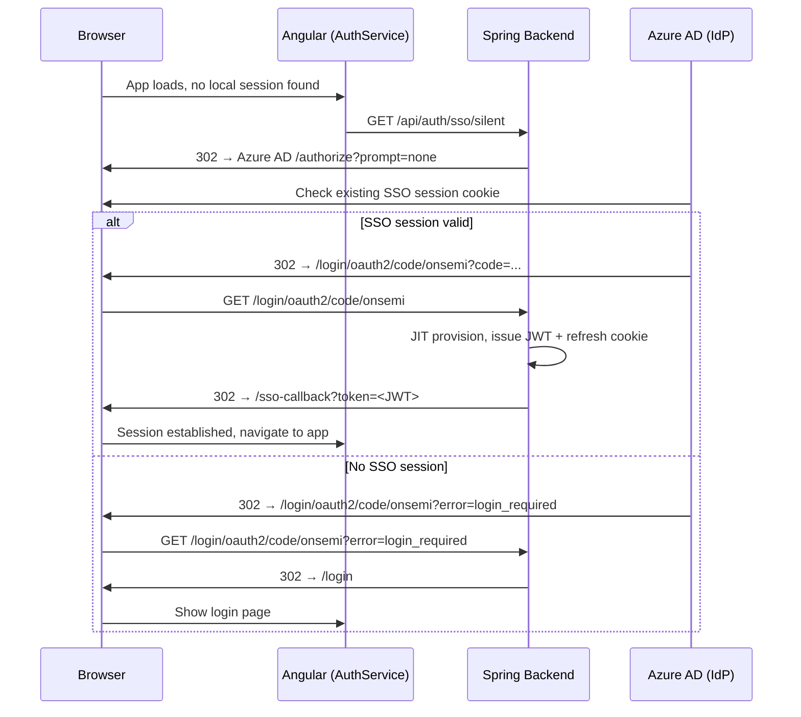
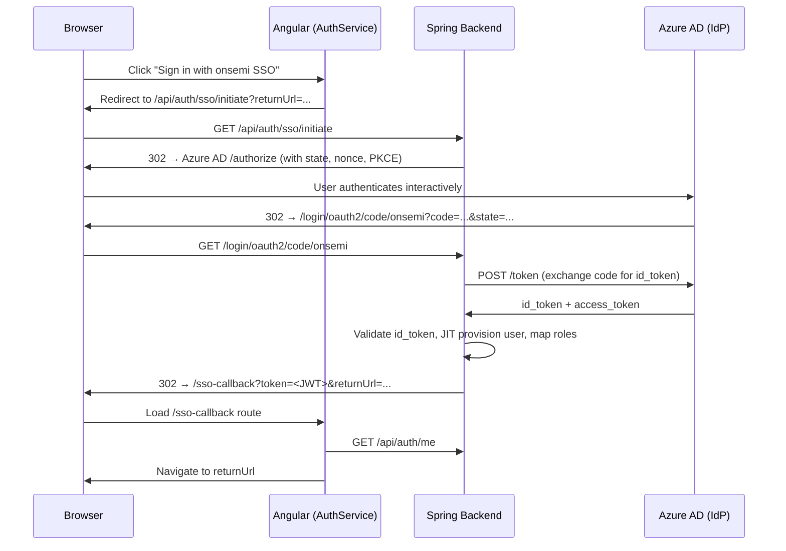

# Design Document: onsemi SSO Login

## Overview

This design adds OIDC-based Single Sign-On (SSO) for onsemi corporate users (Azure AD / Entra ID) while keeping the existing local username/password flow intact. The backend already has `spring-boot-starter-oauth2-client` on the classpath, so no new Maven dependency is needed. The approach uses Spring Security's built-in OAuth2 Login support to handle the OIDC authorization code flow, then bridges the result into the existing JWT + refresh-cookie session model so the Angular frontend requires minimal changes.

The protocol choice is **OIDC (OpenID Connect)** over OAuth2 Authorization Code flow with PKCE. This is the standard for Azure AD / Entra ID and is natively supported by Spring Security 6 (Spring Boot 3.2).

### Silent / Automatic SSO

A key UX goal is that an onsemi employee who is already signed into their corporate account (Azure AD session cookie present in the browser) should be automatically authenticated when they open the app — no login page interaction required.

This is achieved via the **OIDC `prompt=none` silent check**:

1. When the Angular app loads and finds no local session, `AuthService` calls `GET /api/auth/sso/silent` instead of showing the login page.
2. The backend redirects to Azure AD with `prompt=none` — Azure AD checks the existing SSO session cookie silently.
3. If the Azure AD session is valid, Azure AD redirects back with an authorization code and the flow completes normally (JIT provision → JWT → refresh cookie).
4. If the Azure AD session is absent or expired, Azure AD returns `error=login_required` or `error=interaction_required`. The backend catches this and redirects to `/login` so the user can choose their login method.
5. The silent check has a 5-second timeout; if it doesn't complete, the login page is shown as fallback.



---

## Architecture

### Interactive SSO flow (user clicks the SSO button)



---

## Components and Interfaces

### Backend

#### 1. `SsoProperties` (new — `config/SsoProperties.java`)
A `@ConfigurationProperties` bean that holds all SSO configuration:
```
reloader.sso.enabled          = true/false
reloader.sso.client-id        = <Azure app registration client ID>
reloader.sso.client-secret    = <client secret>
reloader.sso.tenant-id        = <Azure tenant ID>
reloader.sso.default-role     = USER
reloader.sso.role-mappings.*  = map of IdP group name → local role
                                 e.g. onsemi-exensioreload-admins=ADMIN
```

#### 2. `SecurityConfig` (modified)
- Conditionally register an `OAuth2LoginConfigurer` when `reloader.sso.enabled=true`.
- Register a custom `OAuth2AuthenticationSuccessHandler` that performs JIT provisioning and issues the local JWT.
- Keep the existing `JwtAuthenticationFilter` and local form login path unchanged.
- Add permit rules for `/login/oauth2/**` and `/api/auth/sso/**`.

#### 3. `SsoAuthenticationSuccessHandler` (new — `config/SsoAuthenticationSuccessHandler.java`)
Implements `AuthenticationSuccessHandler`. Called by Spring Security after a successful OIDC token exchange.

Responsibilities:
- Extract `email` and `name` claims from the `OidcUser`.
- Extract group/role claims and map them via `SsoProperties.roleMappings`.
- Call `SsoUserProvisioningService.provisionOrLoad(email, roles)`.
- Issue a JWT via `JwtUtil.generateToken(username, roles)`.
- Create and persist a `RefreshToken`, set the HTTP-only cookie.
- Redirect to `/sso-callback?token=<JWT>&returnUrl=<safe-url>`.

#### 4. `SsoUserProvisioningService` (new — `service/SsoUserProvisioningService.java`)
Encapsulates JIT provisioning logic:
- `provisionOrLoad(String email, Set<String> roles) → AppUser`
- If user with that email exists → update roles if changed, return user.
- If not → create new `AppUser` with `username = email`, `passwordHash = "{noop}SSO_USER_NO_PASSWORD"`, `enabled = true`, `status = ACTIVE`, assign roles.

#### 5. `SsoController` (new — `controller/SsoController.java`)
```
GET /api/auth/sso/initiate?returnUrl=...
GET /api/auth/sso/silent?returnUrl=...
```
- `/initiate` — stores `returnUrl` in the HTTP session and redirects to `/oauth2/authorization/onsemi` (interactive login, no `prompt` override).
- `/silent` — stores `returnUrl` and redirects to Azure AD with `prompt=none` appended to the authorization URL. If Azure AD returns `error=login_required` or `error=interaction_required` in the callback, the `OAuth2AuthenticationFailureHandler` redirects to `/login` instead of showing an error.

The Angular `AuthService` calls `/silent` on app startup when no local session exists. If it resolves, the user is silently authenticated. If it fails (redirects to `/login`), the login page is shown normally.

#### 6. `SsoCallbackComponent` (Angular — new route `/sso-callback`)
A minimal Angular component that:
- Reads `token` from the query string.
- Calls `AuthService.handleSsoCallback(token)`.
- Navigates to `returnUrl` (or `/exensioreload` as fallback).

#### 7. `AuthService` (Angular — modified)
Add `handleSsoCallback(token: string): Observable<void>`:
- Calls `setSession(token)` to store the JWT.
- Calls `loadMe()` to populate `currentUser`.
- Returns the observable so `SsoCallbackComponent` can navigate on completion.

Add `trySilentSso(returnUrl: string): void`:
- Called from the app initializer (or `AuthGuard`) when no local session is found and SSO is enabled.
- Navigates to `/api/auth/sso/silent?returnUrl=<returnUrl>` via `window.location.href` (full page redirect, not Angular router).
- A 5-second timeout guard prevents the silent check from blocking the UI indefinitely; if the redirect hasn't resolved, the login page is shown.

#### 8. `LoginComponent` (Angular — modified)
- Add "Sign in with onsemi SSO" button.
- Button is hidden when `ssoEnabled` config flag is `false` (fetched from `/api/auth/config`).
- On click: navigate to `/api/auth/sso/initiate?returnUrl=<current-returnUrl>`.

#### 9. `AuthConfigController` (new — `controller/AuthConfigController.java`)
```
GET /api/auth/config
```
Returns `{ "ssoEnabled": true/false }` so the frontend can conditionally show the SSO button without hardcoding.

---

## Data Models

### AppUser changes
No schema changes required. The existing `AppUser` entity supports SSO users:
- `username` = corporate email (e.g. `john.doe@onsemi.com`)
- `email` = same corporate email
- `passwordHash` = `{noop}SSO_USER_NO_PASSWORD` (prevents local login)
- `enabled` = `true`
- `roles` = mapped from IdP groups

### New application properties (no DB migration needed)
```yaml
reloader:
  sso:
    enabled: true
    client-id: ${ONSEMI_SSO_CLIENT_ID}
    client-secret: ${ONSEMI_SSO_CLIENT_SECRET}
    tenant-id: ${ONSEMI_SSO_TENANT_ID}
    default-role: USER
    role-mappings:
      onsemi-exensioreload-admins: ADMIN
      onsemi-exensioreload-superadmins: SUPER_ADMIN
```

### Spring Security OAuth2 client registration (auto-configured from `SsoProperties`)
```yaml
spring:
  security:
    oauth2:
      client:
        registration:
          onsemi:
            client-id: ${ONSEMI_SSO_CLIENT_ID}
            client-secret: ${ONSEMI_SSO_CLIENT_SECRET}
            authorization-grant-type: authorization_code
            redirect-uri: "{baseUrl}/login/oauth2/code/onsemi"
            scope: openid, profile, email, GroupMember.Read.All
        provider:
          onsemi:
            issuer-uri: https://login.microsoftonline.com/${ONSEMI_SSO_TENANT_ID}/v2.0
```

---

## Correctness Properties

A property is a characteristic or behavior that should hold true across all valid executions of a system — essentially, a formal statement about what the system should do. Properties serve as the bridge between human-readable specifications and machine-verifiable correctness guarantees.

Property 1: JIT provisioning idempotence
*For any* valid SSO email, calling `provisionOrLoad` twice with the same email should return the same `AppUser` record (same ID, same username) without creating a duplicate.
**Validates: Requirements 3.3**

Property 2: Role mapping completeness
*For any* set of IdP group claims, the mapped local roles should contain at least the default role `USER`, and any configured group-to-role mappings should be applied correctly.
**Validates: Requirements 4.1, 4.2**

Property 3: SSO session token equivalence
*For any* SSO-authenticated user, the JWT issued after SSO callback should be structurally identical to a JWT issued by local login — same claims format (`sub`, `roles`, `exp`) — so the existing `JwtAuthenticationFilter` accepts it without modification.
**Validates: Requirements 5.1, 5.4**

Property 4: Open redirect prevention
*For any* `returnUrl` value provided to the SSO initiate or callback endpoints, the system should only redirect to paths that start with `/` and do not contain `://` or `//`, rejecting all others by falling back to `/exensioreload`.
**Validates: Requirements 7.6**

Property 5: Replay prevention
*For any* OIDC `state` parameter, the backend should reject a callback where the `state` does not match the value stored in the session at initiation time.
**Validates: Requirements 7.3**

Property 6: Silent SSO fallback
*For any* silent OIDC attempt that results in `error=login_required` or `error=interaction_required` from Azure AD, the system should redirect to the login page rather than showing an error, so the user can still authenticate interactively.
**Validates: Requirements 8.3**

---

## Error Handling

| Scenario | Backend behavior | Frontend behavior |
|---|---|---|
| IdP unreachable at initiation | Spring Security throws; `SsoController` catches and redirects to `/login?reason=sso-error` | Login page shows "SSO unavailable, use local login" |
| Invalid/expired OIDC assertion | Spring Security rejects; `OAuth2AuthenticationFailureHandler` redirects to `/login?reason=sso-error` | Login page shows error message |
| JIT provisioning DB failure | `SsoAuthenticationSuccessHandler` catches, logs, redirects to `/login?reason=sso-error` | Login page shows generic error |
| SSO disabled via config | `SsoController` returns 404; Angular hides SSO button via `/api/auth/config` | SSO button not shown |
| Invalid returnUrl | Sanitized to `/exensioreload` in both `SsoController` and `SsoAuthenticationSuccessHandler` | User lands on default page |

---

## Testing Strategy

### Unit tests
- `SsoUserProvisioningServiceTest`: verify JIT create, idempotent load, role update on re-login.
- `SsoAuthenticationSuccessHandlerTest`: verify JWT is issued, cookie is set, redirect URL is correct, returnUrl is sanitized.
- `SsoPropertiesTest`: verify role mapping parsing from YAML.

### Property-based tests (using [jqwik](https://jqwik.net/) — Java PBT library)

Each property test runs a minimum of 100 iterations with randomly generated inputs.

Property 1 test — `SsoProvisioningIdempotenceTest`:
- Generate random email strings.
- Call `provisionOrLoad` twice; assert same ID returned.
- Tag: `Feature: onsemi-sso-login, Property 1: JIT provisioning idempotence`

Property 2 test — `RoleMappingCompletenessTest`:
- Generate random sets of IdP group names (some matching configured mappings, some not).
- Assert result always contains `USER` and that matching groups produce the correct mapped role.
- Tag: `Feature: onsemi-sso-login, Property 2: Role mapping completeness`

Property 3 test — `SsoJwtEquivalenceTest`:
- Generate random usernames and role sets.
- Issue JWT via SSO path and local path; assert both parse correctly through `JwtUtil.extractUsername` and `JwtUtil.extractRoles`.
- Tag: `Feature: onsemi-sso-login, Property 3: SSO session token equivalence`

Property 4 test — `ReturnUrlSanitizationTest`:
- Generate arbitrary strings as `returnUrl`.
- Assert that only strings starting with `/` and not containing `://` or `//` pass through; all others map to `/exensioreload`.
- Tag: `Feature: onsemi-sso-login, Property 4: Open redirect prevention`

Property 5 test — `StateValidationTest`:
- Generate random state strings.
- Assert that a callback with a mismatched state is rejected (returns 401 or redirects to error).
- Tag: `Feature: onsemi-sso-login, Property 5: Replay prevention`
