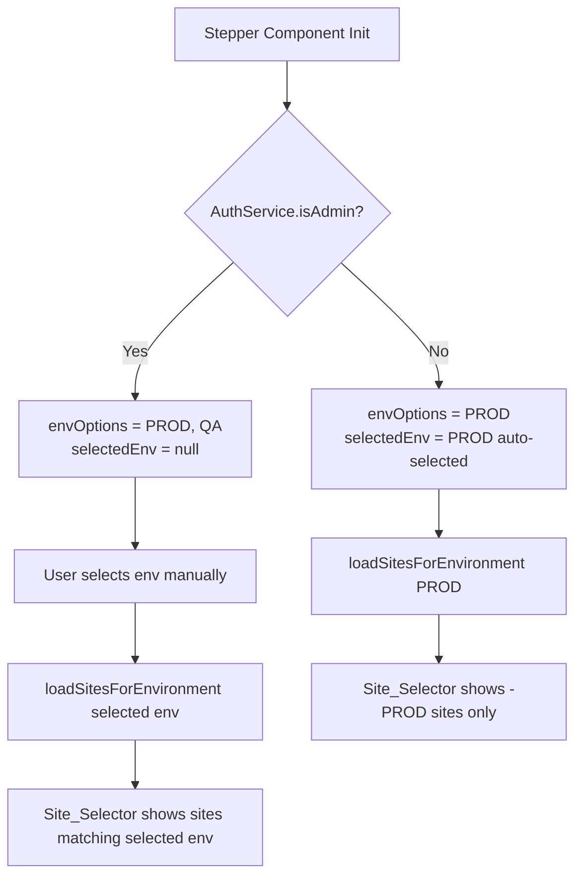

# Design Document: QA Access Control

## Overview

The stepper's environment selector currently shows `['PROD', 'QA']` to all users. This change restricts QA environment access to `ADMIN` and `SUPER_ADMIN` roles only. Regular users will only see `PROD`, which will be auto-selected on component init. The `AuthService` already exposes `isAdmin()` which covers both admin roles — no backend changes are needed.

---

## Architecture



---

## Components and Interfaces

### StepperComponent changes

The only component that needs modification is `stepper.component.ts` and its template `stepper.component.html`.

**New computed property:**

```typescript
// Inject AuthService
private readonly authService = inject(AuthService);

// Computed environment options based on role
readonly envOptions = computed<('PROD' | 'QA')[]>(() =>
  this.authService.isAdmin() ? ['PROD', 'QA'] : ['PROD']
);
```

**Auto-select PROD for regular users on init:**

```typescript
ngOnInit(): void {
  if (!this.authService.isAdmin()) {
    this.selectedEnv.set('PROD');
    // trigger site load for PROD immediately
    this.onEnvChange('PROD');
  }
}
```

**Template change** — replace the hardcoded options array:

```html
<!-- Before -->
[options]="['PROD', 'QA']"

<!-- After -->
[options]="envOptions()"
```

No changes are needed to `BackendService`, `AuthService`, or any backend endpoint. The existing `listSitesForEnvironment()` already filters by suffix — the role check simply controls which environment values are available to select.

---

## Data Models

No new data models. The existing `AuthService.isAdmin()` method returns `true` for both `ADMIN` and `SUPER_ADMIN` roles:

```typescript
isAdmin(): boolean {
  const roles = this.userSubject.value?.roles || [];
  return roles.includes('ADMIN') || roles.includes('SUPER_ADMIN');
}
```

---

## Correctness Properties

*A property is a characteristic or behavior that should hold true across all valid executions of a system — essentially, a formal statement about what the system should do. Properties serve as the bridge between human-readable specifications and machine-verifiable correctness guarantees.*

### Property-Based Testing Overview

Property-based testing (PBT) validates software correctness by testing universal properties across many generated inputs. The PBT library for this Angular/TypeScript project is **fast-check**.

---

Property 1: Environment options match user role
*For any* user, the environment options computed by the stepper should contain `QA` if and only if the user has the `ADMIN` or `SUPER_ADMIN` role.
**Validates: Requirements 1.1, 1.2**

---

Property 2: Site list contains only role-appropriate sites
*For any* list of mixed PROD and QA sites and any user role, the sites rendered in the Site_Selector should contain only sites whose suffix matches the environments available to that user (i.e., no `-QA` sites for regular users).
**Validates: Requirements 2.1, 2.2**

---

## Error Handling

| Scenario | Handling |
|---|---|
| `AuthService.isAdmin()` returns `false` for a new user with no roles | `envOptions` defaults to `['PROD']` — safe fallback |
| Regular user somehow has `QA` pre-selected in state (e.g., stale signal) | `envOptions` computed property drives the template; QA option is not rendered, so it cannot be selected |
| Site list API returns QA sites when PROD is selected | `listSitesForEnvironment()` already filters by suffix — QA sites are excluded at the service layer |

---

## Testing Strategy

### Unit Tests

- `StepperComponent`: test that `envOptions` returns `['PROD']` for regular users and `['PROD', 'QA']` for admin users
- `StepperComponent`: test that `selectedEnv` is auto-set to `PROD` on init for regular users
- `StepperComponent`: test that `selectedEnv` is `null` on init for admin users

### Property-Based Tests (fast-check)

Each property test runs a minimum of **100 iterations**.

| Property | Test description | Tag |
|---|---|---|
| Property 1 | Generate random role arrays; assert `envOptions` contains QA iff roles include ADMIN or SUPER_ADMIN | `Feature: qa-access-control, Property 1` |
| Property 2 | Generate random mixed site lists; assert filtered list contains no `-QA` sites for regular users | `Feature: qa-access-control, Property 2` |
