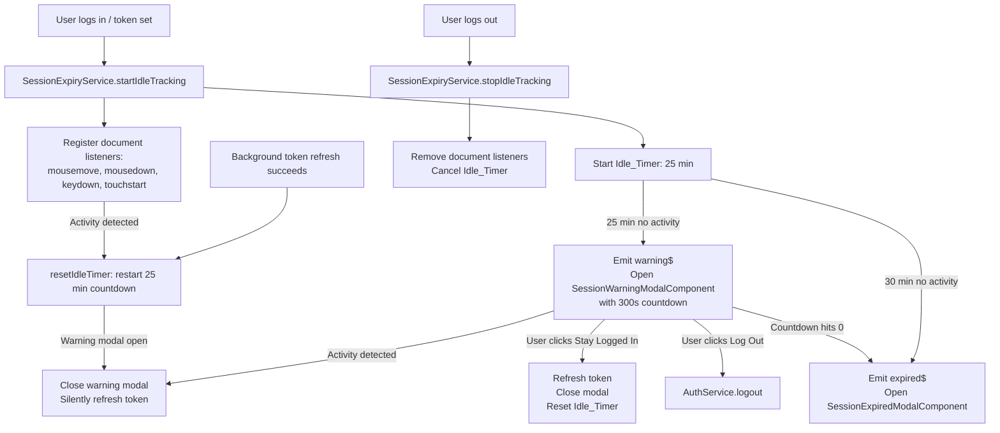

# Design Document: Session Idle Timeout

## Overview

The existing session expiry system fires a warning based on the JWT token's `exp` claim — 2 minutes before the token expires. This interrupts active users. The fix is to replace the JWT-expiry-driven warning with an inactivity-driven idle timer.

The idle timer resets on every user activity event. Only when the user has been idle for 25 minutes does the warning modal appear. If the user remains idle for another 5 minutes (30 min total), the session expires. Active users never see the warning because the JWT is silently refreshed in the background before it expires.

The existing `SessionExpiryService`, `SessionWarningModalComponent`, and `SessionExpiredModalComponent` are reused. The key change is in `SessionExpiryService`: replace `scheduleWarning(token)` (JWT-expiry-based) with an idle timer that resets on activity.

---

## Architecture



---

## Components and Interfaces

### SessionExpiryService (modified)

The existing `scheduleWarning(token)` / `cancelWarning()` API is replaced with an idle-tracking API. The `notifyExpired()` method and modal coordination methods remain unchanged.

```typescript
// New public API
startIdleTracking(): void;   // called by AuthService.setSession(token)
stopIdleTracking(): void;    // called by AuthService.setSession(null)

// Unchanged
notifyExpired(): void;
openWarningModal(secondsRemaining: number): void;
openExpiredModal(): void;
```

**Internal implementation:**

```typescript
private readonly IDLE_WARNING_MS = 25 * 60 * 1000;  // 25 minutes
private readonly IDLE_EXPIRE_MS  = 30 * 60 * 1000;  // 30 minutes

private idleWarningSub: Subscription | null = null;
private idleExpirySub: Subscription | null = null;
private activityHandler: (() => void) | null = null;

startIdleTracking(): void {
  this.stopIdleTracking();
  this.scheduleIdleTimers();
  this.activityHandler = () => this.onActivity();
  document.addEventListener('mousemove', this.activityHandler);
  document.addEventListener('mousedown', this.activityHandler);
  document.addEventListener('keydown', this.activityHandler);
  document.addEventListener('touchstart', this.activityHandler);
}

stopIdleTracking(): void {
  this.cancelIdleTimers();
  if (this.activityHandler) {
    document.removeEventListener('mousemove', this.activityHandler);
    document.removeEventListener('mousedown', this.activityHandler);
    document.removeEventListener('keydown', this.activityHandler);
    document.removeEventListener('touchstart', this.activityHandler);
    this.activityHandler = null;
  }
}

private scheduleIdleTimers(): void {
  this.cancelIdleTimers();
  this.idleWarningSub = timer(this.IDLE_WARNING_MS).subscribe(() => {
    this.warningSubject.next(300); // 5-minute warning window
    this.openWarningModal(300);
  });
  this.idleExpirySub = timer(this.IDLE_EXPIRE_MS).subscribe(() => {
    this.expiredSubject.next();
    this.openExpiredModal();
  });
}

private cancelIdleTimers(): void {
  this.idleWarningSub?.unsubscribe();
  this.idleWarningSub = null;
  this.idleExpirySub?.unsubscribe();
  this.idleExpirySub = null;
}

private onActivity(): void {
  // If warning modal is open, close it and refresh token silently
  if (this.modalOpen && this.activeModalType === 'warning') {
    this.activeDialogRef?.close();
    this.activeDialogRef = null;
    this.modalOpen = false;
    this.activeModalType = null;
    this.authService.refresh().subscribe(); // silent refresh
  }
  // Always reset the idle timers
  this.scheduleIdleTimers();
}
```

### AuthService changes

Replace `scheduleWarning` / `cancelWarning` calls with `startIdleTracking` / `stopIdleTracking`:

```typescript
// In setSession(token: string | null):
if (token) {
  // ...existing token storage...
  this.sessionExpiryService.startIdleTracking();  // replaces scheduleWarning(token)
} else {
  // ...existing cleanup...
  this.sessionExpiryService.stopIdleTracking();   // replaces cancelWarning()
}
```

The existing `scheduleRefreshForToken(token)` at `exp - 30s` remains unchanged — it handles silent background refresh for active users. After a successful refresh, `setSession(newToken)` is called, which calls `startIdleTracking()` again, resetting the idle timer.

### SessionWarningModalComponent changes

The modal currently receives `secondsRemaining` from `GLASS_DIALOG_DATA` and counts down from that value. No changes needed — it will now always receive `300` (5 minutes) as the starting value.

The existing `token$` subscription that auto-closes the modal on background refresh remains and works correctly with the new flow.

---

## Data Models

```typescript
// Constants in SessionExpiryService
const IDLE_WARNING_MS = 25 * 60 * 1000;  // 25 minutes
const IDLE_EXPIRE_MS  = 30 * 60 * 1000;  // 30 minutes
const WARNING_WINDOW_SECONDS = 300;       // 5 minutes shown in modal
```

No new data models required.

---

## Correctness Properties

*A property is a characteristic or behavior that should hold true across all valid executions of a system — essentially, a formal statement about what the system should do. Properties serve as the bridge between human-readable specifications and machine-verifiable correctness guarantees.*

### Property-Based Testing Overview

Property-based testing (PBT) validates software correctness by testing universal properties across many generated inputs. The PBT library for this Angular/TypeScript project is **fast-check**.

---

Property 1: Activity always resets the idle timer
*For any* sequence of activity events fired at any point during the idle countdown, the idle timer should be reset to the full Inactivity_Threshold (25 minutes) after each event — regardless of how much time had elapsed.
**Validates: Requirements 1.2, 5.2**

---

Property 2: Activity while warning modal is open closes the modal
*For any* activity event fired while the warning modal is open, the modal should be closed and the idle timer should be reset to 25 minutes.
**Validates: Requirements 1.3, 4.1, 4.2**

---

Property 3: Warning fires only after idle threshold
*For any* sequence of activity events followed by a period of inactivity, the warning event should be emitted only after the full Inactivity_Threshold (25 minutes) of continuous inactivity — not before.
**Validates: Requirements 2.1**

---

Property 4: Expiry fires only after expiry threshold
*For any* period of inactivity, the session-expired event should be emitted only after the full Expiry_Threshold (30 minutes) of continuous inactivity — not before, and not if activity resets the timer.
**Validates: Requirements 3.1**

---

## Error Handling

| Scenario | Handling |
|---|---|
| Activity event fires after session has already expired | `stopIdleTracking()` removes listeners on logout — no spurious resets |
| Token refresh fails when activity closes warning modal | `notifyExpired()` is called, expired modal opens |
| Multiple rapid activity events (e.g., mouse movement) | `scheduleIdleTimers()` cancels and restarts — debouncing via timer replacement |
| `document.addEventListener` unavailable (SSR) | Guard with `typeof document !== 'undefined'` check |

---

## Testing Strategy

### Unit Tests

- `SessionExpiryService`: test `startIdleTracking` registers 4 event listeners
- `SessionExpiryService`: test `stopIdleTracking` removes all listeners and cancels timers
- `SessionExpiryService`: test `onActivity` closes warning modal and calls `refresh()`
- `SessionExpiryService`: test warning fires after 25 min with fake timers
- `SessionExpiryService`: test expiry fires after 30 min with fake timers

### Property-Based Tests (fast-check)

Each property test runs a minimum of **100 iterations**.

| Property | Test description | Tag |
|---|---|---|
| Property 1 | Generate random sequences of activity events at random times; assert idle timer always resets to 25 min | `Feature: session-idle-timeout, Property 1` |
| Property 2 | Generate activity events while modal is open; assert modal closes and timer resets | `Feature: session-idle-timeout, Property 2` |
| Property 3 | Generate activity sequences with varying gaps; assert warning only fires after 25 min of continuous inactivity | `Feature: session-idle-timeout, Property 3` |
| Property 4 | Generate inactivity periods of varying lengths; assert expiry only fires at/after 30 min | `Feature: session-idle-timeout, Property 4` |
