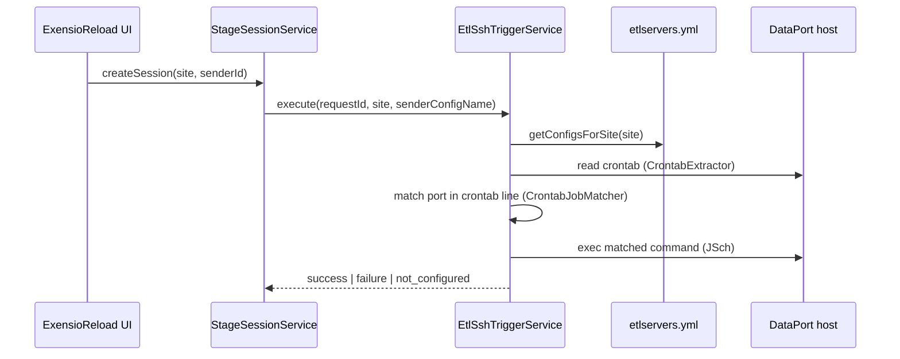

# ETL SSH Trigger — Configuration & Operations

ExensioReload can trigger CP work in **two independent ways**:

| Mechanism | Config | When it runs | What it does |
|-----------|--------|--------------|--------------|
| **Sender queue dispatch** (primary) | `dbconnections.yml`, `refdb.dispatch.*` | Scheduled + manual Dispatch | Inserts rows into `DTP_SENDER_QUEUE_ITEM`; site CP consumes the queue |
| **ETL SSH trigger** (optional) | `etlservers.yml`, `etl.trigger.enabled` | New session create + `POST /api/etl-trigger/execute` | SSH to DataPort host, match remote **crontab**, run command once |

Both can be enabled together. Queue dispatch does **not** require `etlservers.yml`.

---

## 1. Enable ETL SSH trigger

### Step 1 — `etlservers.yml`

File: `backend/src/main/resources/etlservers.yml`

Each top-level key is a site/server name (e.g. `CEBU-PROD`). Fields:

| Field | Description |
|-------|-------------|
| `host` | SSH hostname |
| `port` | SSH port (often `60170` in production) |
| `user` / `password` | SSH credentials |
| `timeoutMs` | Connection timeout (default 30000) |

Keys should align with staging **site** names (`CEBU` matches `CEBU-PROD`).

**Security:** Do not commit production passwords to git if policy forbids it. Prefer environment-specific overrides or a secured config mount in deployment.

### Step 2 — Application flag

```yaml
# application.yml or env
etl:
  trigger:
    enabled: true
```

Or environment variable:

```bash
ETL_TRIGGER_ENABLED=true
```

Default is `false` (SSH trigger is a no-op).

### Step 3 — Restart backend

On startup you should see:

```text
ETL SSH trigger: loaded N server(s) from classpath:etlservers.yml
```

### Step 4 — Verify

```bash
curl -s -H "Authorization: Bearer <token>" \
  http://localhost:8004/exensio-reload/api/etl-trigger/status
```

Example response:

```json
{
  "enabled": true,
  "serversLoaded": true,
  "serverCount": 14
}
```

---

## 2. Runtime flow (when enabled)



1. **`EtlServerConfigLoader`** loads `etlservers.yml` at startup (`@PostConstruct`).
2. **`EtlSshTriggerService`** checks `etl.trigger.enabled` and `hasConfigs()`.
3. Servers are filtered by **site** when possible (`CEBU` → `CEBU-PROD`).
4. **Sender port** is parsed from `senderConfigName` (cpConfig-style string). If no digits are found, the SSH **port from YAML** (e.g. `60170`) is used to match crontab lines.
5. SSH runs the matched crontab command **once** (no retry).
6. Result is audited and stored for idempotency by `requestId`.

Manual trigger (same logic):

`POST /api/etl-trigger/execute?requestId=...&userId=...&site=...&senderConfigName=...`

Pass a real **cpConfig** string (with embedded port) in `senderConfigName` when calling the API directly.

---

## 3. Status outcomes

| Status | Meaning |
|--------|---------|
| `not_configured` | Feature disabled, YAML empty/missing, or no matching crontab |
| `success` | SSH command executed on at least one server |
| `failure` | SSH/crontab error on a server |

Session creation **never fails** because of ETL trigger errors.

---

## 4. `etljobs.yml` — not used

`backend/src/main/resources/etljobs.yml` is **not loaded** by the application. Job commands come from the **remote crontab** on each ETL server, not from this file. It may be kept as documentation/sample only.

---

## 5. Troubleshooting

| Symptom | Check |
|---------|--------|
| Always `not_configured` | `ETL_TRIGGER_ENABLED=true`; log line “loaded N server(s)”; `/api/etl-trigger/status` |
| Wrong server SSH’d | Site name vs YAML key (`CEBU` vs `CEBU-PROD`) |
| No crontab match | Crontab on host contains sender port (often `60170`); pass cpConfig with port via API |
| SSH auth failure | Credentials in `etlservers.yml`; firewall to `host:port` |
| Queue still empty | ETL SSH ≠ queue dispatch; use **Dispatch** / `SenderDispatchService` |

---

## 6. Code references

| Class | Role |
|-------|------|
| `EtlServerConfigLoader` | Loads `classpath:etlservers.yml` |
| `EtlTriggerProperties` | `etl.trigger.enabled` |
| `EtlSshTriggerService` | Orchestrates SSH + crontab |
| `SenderDispatchService` | Queue-based CP (separate path) |
| `EtlTriggerController` | `/api/etl-trigger/*` |

See also: [EXENSIORELOAD.md](EXENSIORELOAD.md), [INTEGRATION_ES_EXENSIO.md](INTEGRATION_ES_EXENSIO.md).
