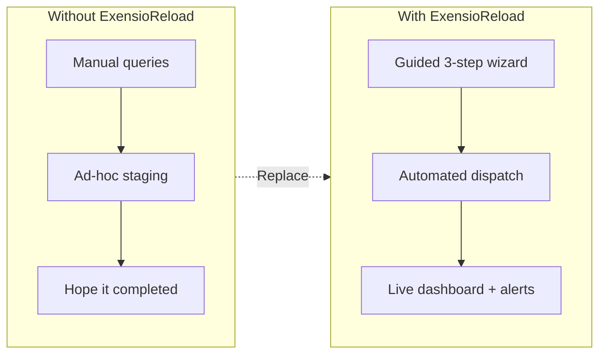
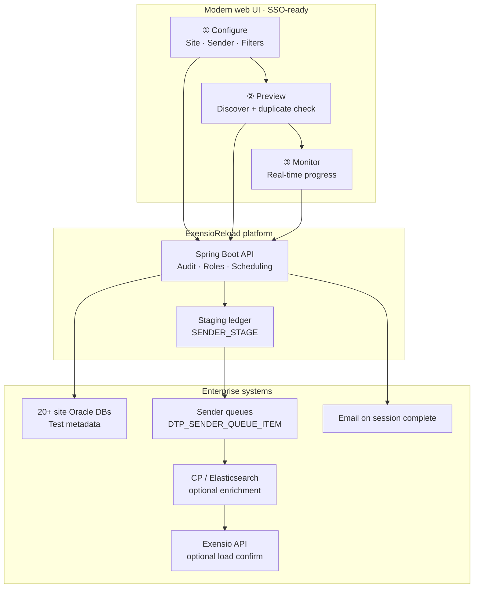
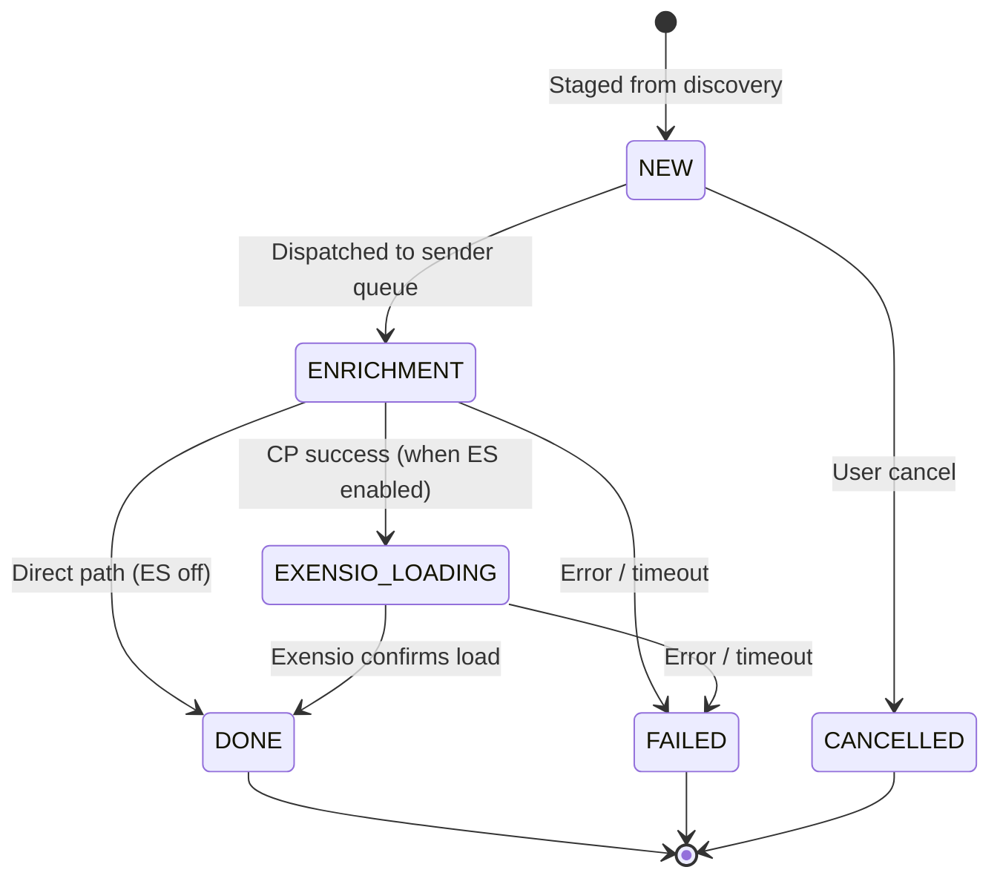
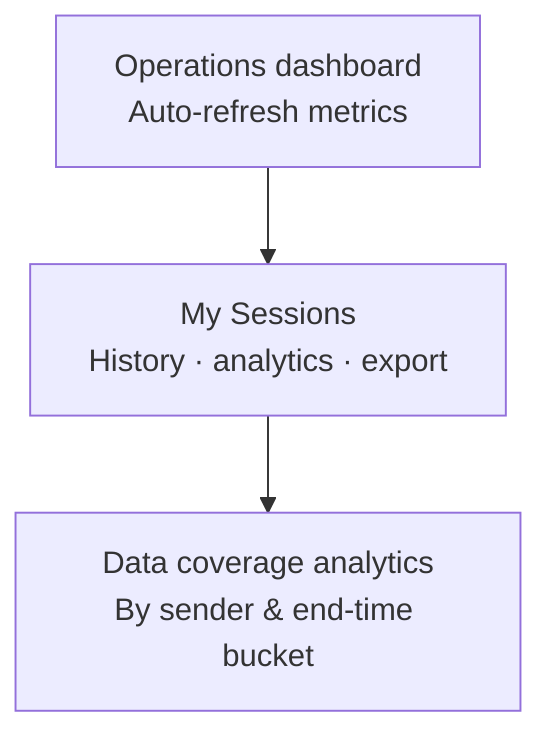
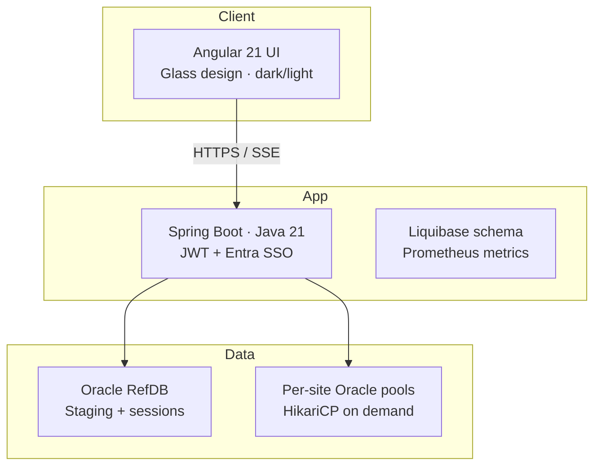
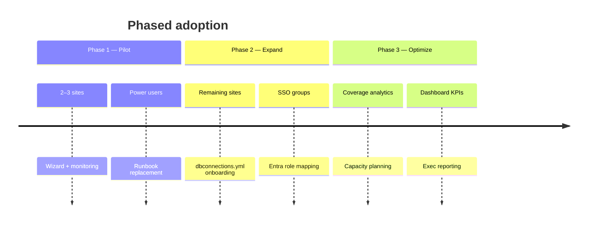

# ExensioReload — Executive Overview

**Controlled, self-service resend of semiconductor test data across 20+ manufacturing sites**

| | |
|---|---|
| **Audience** | Engineering leadership, operations, IT |
| **Format** | 2-page briefing (print or PDF) |
| **Version** | 1.0 · onsemi internal |

---

## The challenge

Test data gaps and late-arriving files still force teams to **re-push lot/wafer payloads** into downstream systems (sender queues, CP enrichment, Exensio). Today that work is often:

- **Manual** — ad-hoc SQL, scripts, and ticket-driven handoffs  
- **Opaque** — little visibility into what was already resent or what succeeded  
- **Risky** — duplicate sends, wrong date ranges, and no audit trail  
- **Slow** — each site uses different Oracle sources and queue mechanics  

**Cost:** engineer time, delayed yield/analysis decisions, and repeated fire drills when data is missing.

---

## The solution

**ExensioReload** is an enterprise web application that standardizes the full **discover → stage → dispatch → monitor** lifecycle for test-data resends.



**One platform** for operators and engineers: search metadata, stage only what is needed, track every file to completion, and prove what was covered—by site, sender, lot, and **end-time date range**.

---

## How it works (3 steps)



| Step | What the user does | What the business gets |
|------|--------------------|-------------------------|
| **Configure** | Pick environment, site, sender; filter by lot, wafer, date range, tester/data type | Precise scope—no “send everything” mistakes |
| **Preview** | See matching files; warnings for **already-staged duplicates** | Avoid double-loading the same payload |
| **Monitor** | Live status per file; session history and analytics | Confidence before closing the incident |

---

## End-to-end data pipeline



Background services poll queues and optional CP/Exensio integrations; users see a **single status** in the UI. Completed sessions trigger **email notification**.

---

## Why executives should care

### Operational impact

| Theme | Benefit |
|-------|---------|
| **Time to resolution** | Self-service resend in minutes, not multi-day script cycles |
| **Coverage clarity** | Session **end-time coverage** shows exactly which dates were resent—reduces overlap and gaps |
| **Scale** | One app for **20+ sites** (PROD/QA), not 20 different playbooks |
| **Governance** | Role-based access, audit logs, duplicate detection |

### Risk reduction

- **Duplicate staging warnings** before dispatch  
- **Immutable staging ledger** (`SENDER_STAGE`) with request IDs and timestamps  
- **Controlled writes** to external DBs (gated by configuration)  
- **Enterprise SSO** (Microsoft Entra OIDC) with group-to-role mapping  

### Visibility



- **Dashboard** — staged / ready / in-flight / done / failed across sites  
- **My Sessions** — drill-down, charts, CSV export, file-level end times  
- **Coverage reporting** — cross-session view by data end-time (day/week/month)  

---

## Technology at a glance (credibility, not complexity)



| Layer | Choice | Why it matters |
|-------|--------|----------------|
| Frontend | Angular 21, standalone components | Maintainable, fast UX, real-time monitoring |
| Backend | Spring Boot 3, Java 21 | Standard onsemi stack, schedulers, security |
| Data | Oracle RefDB + site DBs | Fits existing manufacturing data estate |
| Ops | Metrics, pool diagnostics, email alerts | Production operability |

---

## Who uses it

| Persona | Typical use |
|---------|-------------|
| **Test / yield engineer** | Resend missing CP or Exensio loads for a lot/wafer/date window |
| **Site operations** | Track open sessions and confirm completion |
| **Platform / admin** | User provisioning, SSO groups, environment configuration |
| **Leadership** | Dashboard health and session outcomes (not ticket noise) |

---

## Deployment & security summary

- **Deployment:** On-prem / internal enterprise (context path `/exensioreload`)  
- **Authentication:** Local JWT + optional **Microsoft Entra SSO** (7-day refresh for seamless return)  
- **Authorization:** `SUPER_ADMIN` · `ADMIN` · `USER` with method-level security  
- **Audit:** User actions, IP, and user-agent on sensitive operations  

---

## Suggested rollout narrative



| Phase | Focus | Success metric |
|-------|--------|----------------|
| **Pilot** | 2–3 high-volume sites, guided resends | ↓ manual scripts / tickets |
| **Expand** | SSO + all production sites | ↑ self-service completion rate |
| **Optimize** | Coverage + dashboard KPIs | ↓ duplicate resends; faster MTTR |

---

## Bottom line

> **ExensioReload turns test-data resend from a tribal, site-by-site exercise into a governed, observable factory capability**—with the same rigor we expect from production systems: audit, roles, real-time status, and clear date coverage.

**Ask:** Sponsor site onboarding, Entra group mapping, and operational ownership so engineering teams standardize on one resend path.

---

## Appendix — One-page cheat sheet (print this page)

```
┌─────────────────────────────────────────────────────────────────────────┐
│  EXENSIORELOAD                                                          │
│  Discover · Stage · Dispatch · Monitor test data (20+ sites)            │
├─────────────────────────────────────────────────────────────────────────┤
│  PROBLEM          Manual resends · duplicates · no coverage view       │
│  SOLUTION         3-step wizard + staging ledger + live monitoring       │
│  USERS            Engineers · ops · admins                               │
│  INTEGRATIONS     Site Oracle · sender queues · CP/ES · Exensio (opt.)   │
│  SECURITY         Entra SSO · RBAC · audit trail                         │
│  WIN              Faster MTTR · fewer duplicates · provable coverage     │
└─────────────────────────────────────────────────────────────────────────┘
```

**Contact / ownership:** *[Add application owner name and distribution list]*  
**Documentation:** `docs/EXENSIORELOAD.md` · `docs/SSO_ONBOARDING_DETAILS.md`

---

*To export as PDF: open this file in VS Code / Cursor with Markdown preview, or use Pandoc / “Print to PDF” from a Mermaid-capable viewer (e.g. GitHub, GitLab, or [mermaid.live](https://mermaid.live)).*
