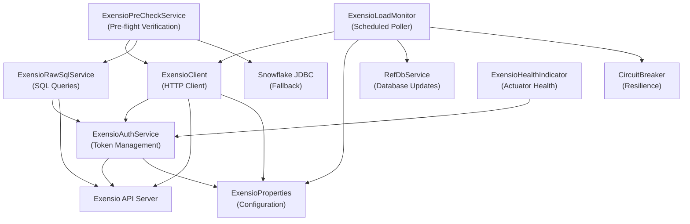
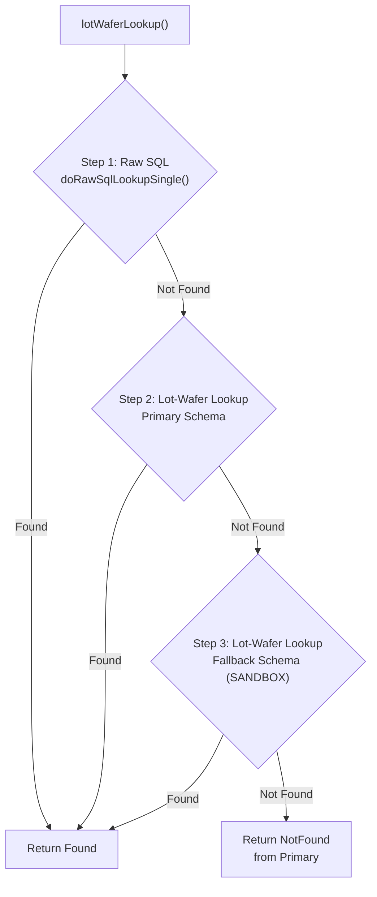
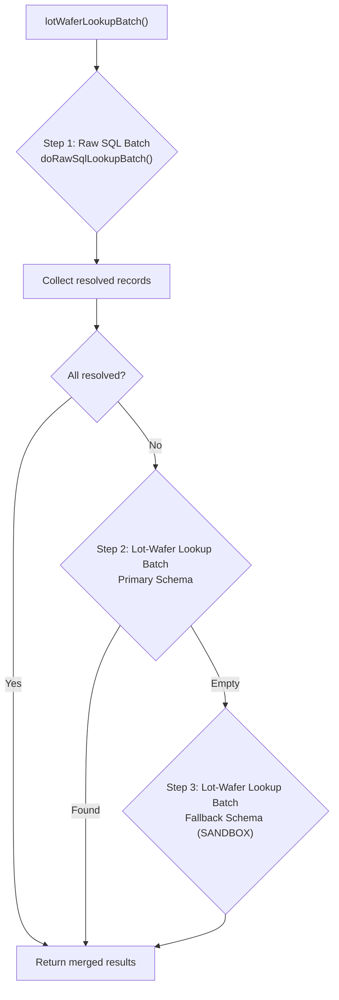
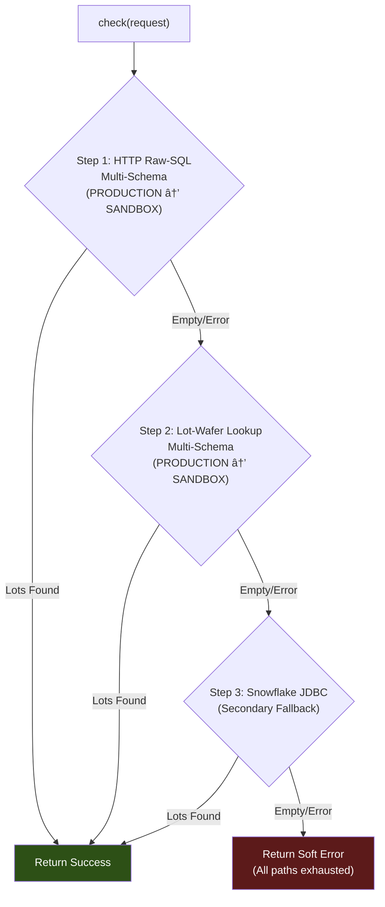
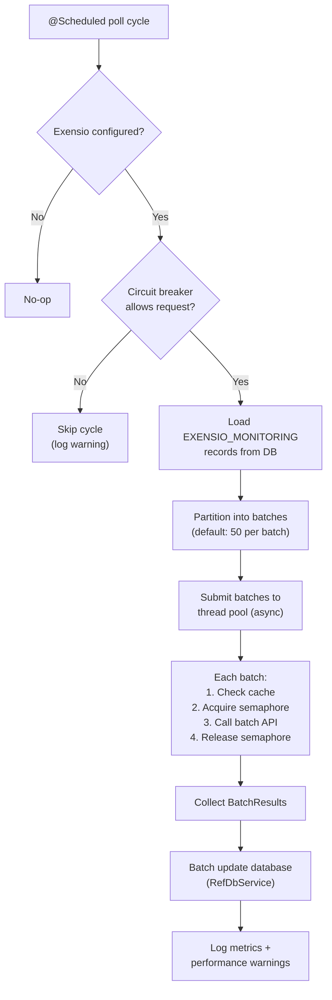
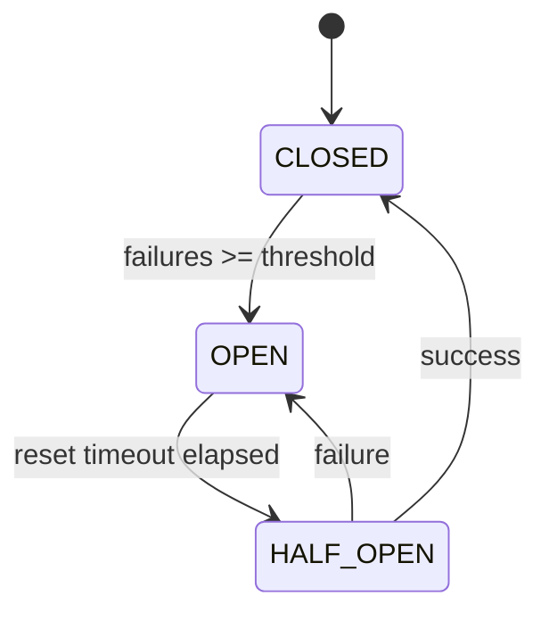
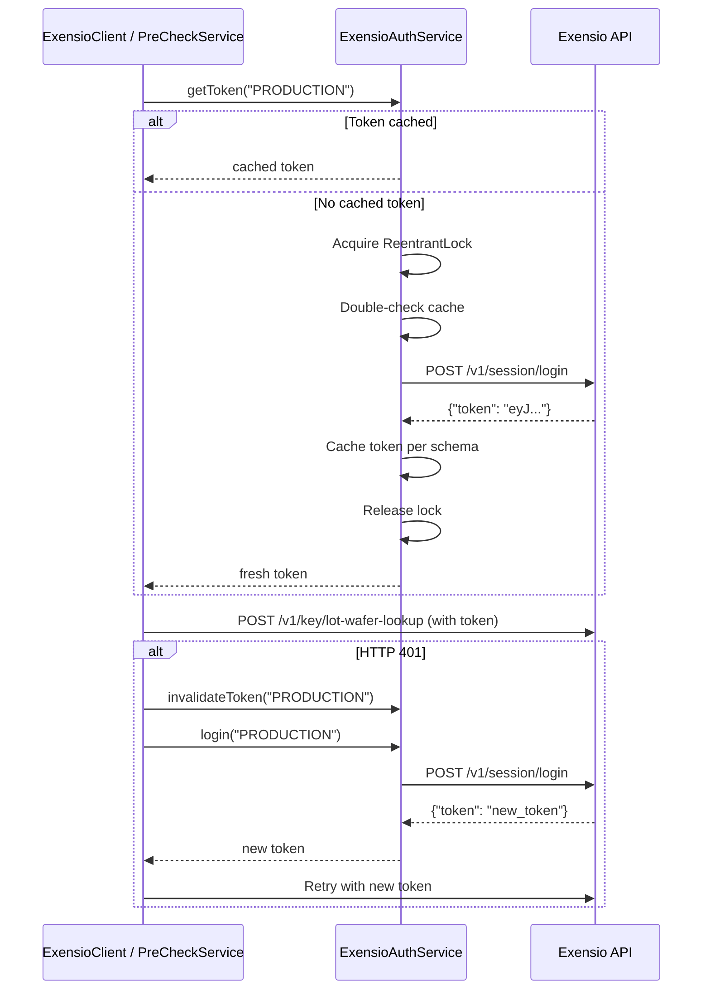

# Exensio API Integration — Detailed Documentation

> [!NOTE]
> This document describes how the **exensioreload** backend application integrates with the **Exensio Loading API** to verify, look up, and monitor semiconductor lot/wafer data loading status.

---

## Table of Contents

1. [Architecture Overview](#1-architecture-overview)
2. [Exensio API Endpoints Used](#2-exensio-api-endpoints-used)
3. [Authentication Flow](#3-authentication-flow)
4. [Lot-Wafer Lookup — Single Record](#4-lot-wafer-lookup--single-record)
5. [Lot-Wafer Lookup — Batch](#5-lot-wafer-lookup--batch)
6. [Raw SQL Endpoint](#6-raw-sql-endpoint)
7. [Pre-Flight Lot Existence Check](#7-pre-flight-lot-existence-check)
8. [Load Monitoring Pipeline](#8-load-monitoring-pipeline)
9. [Schema Fallback Strategy](#9-schema-fallback-strategy)
10. [PGC Key Resolution](#10-pgc-key-resolution)
11. [Resilience Patterns](#11-resilience-patterns)
12. [Configuration Reference](#12-configuration-reference)
13. [Data Flow Diagrams](#13-data-flow-diagrams)
14. [Key Classes Reference](#14-key-classes-reference)

---

## 1. Architecture Overview

The application acts as an intermediary between semiconductor manufacturing data senders and the **Exensio** data warehouse. It uses the Exensio REST API to:

1. **Authenticate** — Obtain session tokens via login endpoint
2. **Look up lot/wafer data** — Verify that data has been loaded into Exensio (single or batch)
3. **Execute raw SQL queries** — Query Exensio's Oracle database directly for lot metadata
4. **Pre-flight checks** — Verify lot existence before staging data for reload
5. **Monitor loading status** — Poll for records in `EXENSIO_MONITORING` state and drive status transitions

### Component Interaction



### Shared Infrastructure

All Exensio HTTP operations share a single `HttpClient` bean created by [ExensioHttpClientFactory](file:///c:/Users/fg8n8x/Desktop/wip/exensioreload/backend/src/main/java/com/onsemi/cim/apps/exensio/exensioreload/config/ExensioHttpClientFactory.java):

- **Redirect policy**: `NEVER` — 3xx responses are treated as errors (catches misconfigured URLs)
- **Connect timeout**: 10 seconds
- **Bean qualifier**: `exensioHttpClient`

---

## 2. Exensio API Endpoints Used

The application communicates with **four** Exensio REST API endpoints:

| Endpoint | Method | Purpose | Used By |
|---|---|---|---|
| `/v1/session/login` | `POST` | Authenticate and obtain Bearer token | `ExensioAuthService` |
| `/v1/session/logout` | `POST` | Invalidate session token on shutdown | `ExensioAuthService` |
| `/v1/key/lot-wafer-lookup` | `POST` | Look up lot/wafer keys by lot ID + wafer ID | `ExensioClient` |
| `/v1/key/raw-sql` | `POST` | Execute arbitrary Oracle SQL against Exensio DB | `ExensioClient`, `ExensioRawSqlService`, `ExensioPreCheckService` |

### Base URL Resolution

The base URL is environment-dependent, resolved by [ExensioProperties.resolvedBaseUrl()](file:///c:/Users/fg8n8x/Desktop/wip/exensioreload/backend/src/main/java/com/onsemi/cim/apps/exensio/exensioreload/config/ExensioProperties.java#L346-L348):

```java
// ExensioProperties.java
public String resolvedBaseUrl() {
    return "PROD".equalsIgnoreCase(env) ? prodUrl : qaUrl;
}
```

| Config Property | Env Variable | Description |
|---|---|---|
| `exensio.qa-url` | `EXENSIO_QA_URL` | QA environment base URL |
| `exensio.prod-url` | `EXENSIO_PROD_URL` | Production environment base URL |
| `exensio.env` | `EXENSIO_ENV` | Active environment (`QA` or `PROD`) |

---

## 3. Authentication Flow

**Service**: [ExensioAuthService](file:///c:/Users/fg8n8x/Desktop/wip/exensioreload/backend/src/main/java/com/onsemi/cim/apps/exensio/exensioreload/service/ExensioAuthService.java)

### 3.1 Login Request

```
POST {baseUrl}/v1/session/login
Content-Type: application/json
```

**Request Body:**
```json
{
  "username": "<exensio.username>",
  "password": "<exensio.password>",
  "dbname": "<resolved dbname>",
  "dbschema": "<schema>"   // e.g., "PRODUCTION" or "SANDBOX"
}
```

**Success Response (HTTP 2xx):**
```json
{
  "token": "eyJhbGciOi..."
}
```

The `token` field is extracted and cached per schema in a `ConcurrentHashMap<String, String>`.

### 3.2 Token Management

| Operation | Description |
|---|---|
| `getToken(schema)` | Returns cached token or triggers fresh login |
| `invalidateToken(schema)` | Removes cached token (called on HTTP 401) |
| `login(schema)` | Thread-safe login with `ReentrantLock` + double-check pattern |
| `logout()` | `@PreDestroy` — logs out all schemas on application shutdown |

### 3.3 Token Refresh on 401

When any API call receives HTTP 401, the calling service:

1. Calls `authService.invalidateToken(schema)` to clear the stale token
2. Calls `authService.login(schema)` to obtain a fresh token
3. Retries the original API call once with the new token

### 3.4 Logout on Shutdown

```
POST {baseUrl}/v1/session/logout
Authorization: Bearer <token>
Content-Type: application/json
```

Executed for every cached schema token during `@PreDestroy`.

### 3.5 Error Handling

- **3xx redirects**: Surfaced as errors (not followed) — indicates URL misconfiguration
- **Non-2xx**: Throws `ExensioAuthException` with HTTP status and response body
- **Missing token field**: Throws `ExensioAuthException`
- **Network errors**: Wrapped in `ExensioAuthException`

---

## 4. Lot-Wafer Lookup — Single Record

**Service**: [ExensioClient.lotWaferLookup()](file:///c:/Users/fg8n8x/Desktop/wip/exensioreload/backend/src/main/java/com/onsemi/cim/apps/exensio/exensioreload/service/ExensioClient.java#L108-L111)

### 4.1 Lookup Strategy (Multi-Step)

The single-record lookup follows a **3-step cascading strategy**:



### 4.2 Lot-Wafer Lookup API Request

```
POST {baseUrl}/v1/key/lot-wafer-lookup
Authorization: Bearer <token>
Content-Type: application/json
Timeout: 15 seconds
```

**Request Body:**
```json
{
  "pgc_key": 1,
  "lot_ids": ["LOT001"],
  "wafer_ids": ["06"]
}
```

| Field | Type | Description |
|---|---|---|
| `pgc_key` | `int` | Program Group Class key (see [§10 PGC Key Resolution](#10-pgc-key-resolution)) |
| `lot_ids` | `string[]` | Array of lot ID strings to look up |
| `wafer_ids` | `string[]` | Array of wafer ID strings (empty array for lot-level lookups) |

### 4.3 Response Structure

```json
{
  "lots": [{
    "lot_key": 2776623,
    "lot_id": "LOT001",
    "wafers": [{
      "wafer_id": "KG01HK4X_06",
      "wafer_key": 4633046,
      "pg_key": 12345,
      "ppid": "WS::CM8012X_FT",
      "end_time": "2026-08-15T10:30:00Z"
    }]
  }]
}
```

### 4.4 Response Parsing

Parsed by [parseResponse()](file:///c:/Users/fg8n8x/Desktop/wip/exensioreload/backend/src/main/java/com/onsemi/cim/apps/exensio/exensioreload/service/ExensioClient.java#L1075-L1145) into a sealed interface result:

```java
// ExensioLotWaferResult.java — Discriminated union
public sealed interface ExensioLotWaferResult {
    record Found(long lotKey, long waferKey, long pgKey,
                 String ppid, String lotId, String waferId,
                 String fileName) implements ExensioLotWaferResult {}
    record NotFound() implements ExensioLotWaferResult {}
    record Error(String message) implements ExensioLotWaferResult {}
}
```

### 4.5 Wafer Selection Logic

When multiple wafers are returned, the **best candidate** is selected by:

1. **Wafer ID match**: If `targetWaferId` is provided, only matching wafers are considered
2. **End-time proximity**: When `targetEndTime` is provided, the wafer with the closest `end_time` wins
3. **First available**: Without target constraints, the first wafer is returned

### 4.6 PPID Test-Phase Validation

After finding a candidate, the PPID suffix is validated against the expected `testPhase`:

```java
// ppidMatchesTestPhase() logic:
// 1. testPhase is null/blank → ACCEPT (no check)
// 2. ppid is null/blank     → ACCEPT (cannot validate)
// 3. ppid ends with "_<testPhase>" (case-insensitive) → ACCEPT
// 4. Otherwise → REJECT (downgrade to NotFound)
```

Example: If `testPhase = "FT"`, then `ppid = "WS::CM8012X_FT"` → ✅ accepted, but `ppid = "WS::CM8012X_PROBE"` → ❌ rejected (retries next cycle).

---

## 5. Lot-Wafer Lookup — Batch

**Service**: [ExensioClient.lotWaferLookupBatch()](file:///c:/Users/fg8n8x/Desktop/wip/exensioreload/backend/src/main/java/com/onsemi/cim/apps/exensio/exensioreload/service/ExensioClient.java#L321-L384)

### 5.1 Batch Strategy (Multi-Step)

Similar to single lookup but operates on collections:



### 5.2 Batch API Request

```
POST {baseUrl}/v1/key/lot-wafer-lookup
Authorization: Bearer <token>
Content-Type: application/json
Timeout: 30 seconds
```

**Request Body (batch):**
```json
{
  "pgc_key": 1,
  "lot_ids": ["LOT001", "LOT002", "LOT003"],
  "wafer_ids": ["06", "07", "08"]
}
```

The `pgc_key` for a batch is resolved by **majority vote** — the most common PGC key across all records in the batch is used.

### 5.3 Retry with Exponential Backoff

The batch lookup includes built-in retry logic:

| Parameter | Default | Config Property |
|---|---|---|
| Max attempts | 3 | `exensio.retry-max-attempts` |
| Base delay | 1000 ms | `exensio.retry-base-delay-ms` |
| Backoff formula | `baseDelay × 2^(attempt-1)` | — |

**Retry triggers:**
- HTTP 401 → Refresh token and retry immediately
- HTTP 429, 500, 502, 503, 504, Timeout → Exponential backoff
- Other errors → Return immediately (non-transient)

### 5.4 Result Mapping

The [BatchLookupResult](file:///c:/Users/fg8n8x/Desktop/wip/exensioreload/backend/src/main/java/com/onsemi/cim/apps/exensio/exensioreload/dto/BatchLookupResult.java) maps API response lots back to individual records:

| Update Type | Meaning | Action |
|---|---|---|
| `COMPLETED` | Wafer found in Exensio | Mark record as DONE, store `wafer_key` + `pg_key` |
| `NOT_FOUND` | No matching wafer found | Retry next cycle (or timeout → FAILED) |
| `LOAD_FAILED` | Confirmed load error in Exensio | Mark as permanently FAILED |
| `ERROR` | API call failed | Retry next cycle |
| `COMPLETED_MANUAL_VERIFICATION_REQUIRED` | Timeout with no definitive result | Needs human review |

---

## 6. Raw SQL Endpoint

**Services**: [ExensioClient](file:///c:/Users/fg8n8x/Desktop/wip/exensioreload/backend/src/main/java/com/onsemi/cim/apps/exensio/exensioreload/service/ExensioClient.java#L874-L921), [ExensioRawSqlService](file:///c:/Users/fg8n8x/Desktop/wip/exensioreload/backend/src/main/java/com/onsemi/cim/apps/exensio/exensioreload/service/ExensioRawSqlService.java), [ExensioPreCheckService](file:///c:/Users/fg8n8x/Desktop/wip/exensioreload/backend/src/main/java/com/onsemi/cim/apps/exensio/exensioreload/service/ExensioPreCheckService.java)

### 6.1 API Request

```
POST {baseUrl}/v1/key/raw-sql
Authorization: Bearer <token>
Content-Type: application/json
Timeout: 20 seconds (configurable)
```

**Request Body:**
```json
{
  "sql": "SELECT lot_id, wafer_id, lot_key, wafer_key, pg_key, ppid, file_name, end_time FROM (...)"
}
```

### 6.2 Response Formats

The endpoint may return two shapes, both handled:

**Format A — Direct array:**
```json
[
  {"LOT_ID": "LOT001", "WAFER_ID": "06", "WAFER_KEY": 4633046, ...},
  {"LOT_ID": "LOT001", "WAFER_ID": "07", "WAFER_KEY": 4633047, ...}
]
```

**Format B — Wrapped in `rows`:**
```json
{
  "rows": [
    {"LOT_ID": "LOT001", "WAFER_ID": "06", "WAFER_KEY": 4633046, ...}
  ]
}
```

### 6.3 SQL Queries Generated

The application generates **Oracle SQL** that queries Exensio's internal tables:

#### Single-Record Lookup SQL

```sql
SELECT lot_id, wafer_id, lot_key, wafer_key, pg_key, ppid, file_name, end_time, schema_name
FROM (
  SELECT lot_id, wafer_id, lot_key, wafer_key, pg_key, ppid, file_name, end_time, schema_name,
         ROW_NUMBER() OVER (PARTITION BY lot_id, wafer_id ORDER BY end_time DESC) AS rn
  FROM (
    -- PRODUCTION schema
    SELECT l.lot_id AS lot_id,
           NVL(w.wf_id,'') AS wafer_id,
           ol.lot_key AS lot_key,
           NVL(w.wf_key,0) AS wafer_key,
           NVL(ol.pg_key,0) AS pg_key,
           NVL(p.ppid,'') AS ppid,
           SUBSTR(NVL(de.file_name,''), 1, 15) AS file_name,
           NVL(TO_CHAR(ol.end_time, 'YYYY-MM-DD"T"HH24:MI:SS"Z"'),'') AS end_time,
           'PRODUCTION' AS schema_name
    FROM PRODUCTION.op_log ol
    JOIN PRODUCTION.lot l ON l.lot_key = ol.lot_key
    JOIN PRODUCTION.program p ON p.pg_key = ol.pg_key
    LEFT JOIN PRODUCTION.wf_log wfl ON wfl.lg_key = ol.lg_key
    LEFT JOIN PRODUCTION.wafer w ON w.wf_key = wfl.wf_key
    LEFT JOIN PRODUCTION.df_export de ON de.lg_key = ol.lg_key
         AND (w.wf_key IS NULL OR de.wf_key = w.wf_key)
    WHERE ol.pgc_key = ?pgc_key          -- Parameter: frontend resolves from data type
      AND l.lot_id IN ('LOT001', 'lot001')
      AND (?is_wafer_level = 0 OR w.wf_num = ?wafer_num)

    UNION ALL

    -- SANDBOX schema
    SELECT l.lot_id AS lot_id,
           NVL(w.wf_id,'') AS wafer_id,
           ol.lot_key AS lot_key,
           NVL(w.wf_key,0) AS wafer_key,
           NVL(ol.pg_key,0) AS pg_key,
           NVL(p.ppid,'') AS ppid,
           SUBSTR(NVL(de.file_name,''), 1, 15) AS file_name,
           NVL(TO_CHAR(ol.end_time, 'YYYY-MM-DD"T"HH24:MI:SS"Z"'),'') AS end_time,
           'SANDBOX' AS schema_name
    FROM SANDBOX.op_log ol
    JOIN SANDBOX.lot l ON l.lot_key = ol.lot_key
    JOIN SANDBOX.program p ON p.pg_key = ol.pg_key
    LEFT JOIN SANDBOX.wf_log wfl ON wfl.lg_key = ol.lg_key
    LEFT JOIN SANDBOX.wafer w ON w.wf_key = wfl.wf_key
    LEFT JOIN SANDBOX.df_export de ON de.lg_key = ol.lg_key
         AND (w.wf_key IS NULL OR de.wf_key = w.wf_key)
    WHERE ol.pgc_key = ?pgc_key          -- Parameter: same pgc_key from frontend
      AND l.lot_id IN ('LOT001', 'lot001')
      AND (?is_wafer_level = 0 OR w.wf_num = ?wafer_num)
  )
) WHERE rn = 1
  AND ROWNUM <= 200
```

**Query parameters (resolved from frontend data type input):**

| Parameter | Source | Description |
|---|---|---|
| `?pgc_key` | Frontend → `DataTypePgcKeyMapper` | Resolved from user's data type input (e.g., `probe` → 1, `ft` → 2) |
| `?is_wafer_level` | Frontend → `ExensioSqlUtilService.isWaferLevelClass()` | 1 for wafer-level PGC keys (1, 4, 5, 14), 0 for lot-level (2) |
| `?wafer_num` | Frontend → `ExensioSqlUtilService.stripWaferPrefix()` | Numeric wafer number extracted from user input (e.g., `W06` → 6, `06` → 6) |

**Key features of this query:**

| Feature | Implementation |
|---|---|
| **Multi-schema** | `UNION ALL` across `PRODUCTION.*` and `SANDBOX.*` tables |
| **Schema tracking** | `schema_name` column identifies source schema |
| **Filename limit** | `SUBSTR(file_name, 1, 15)` truncates to 15 characters |
| **Per-wafer filtering** | For wafer-level PGC keys (1, 4, 5, 14), wafer ID filter is applied |
| **Lot-level fallback** | For lot-level PGC key (2), wafer join becomes optional (returns lot-only rows) |
| **Deduplication** | `ROW_NUMBER()` keeps only the most recent record per lot/wafer |

**Wafer-level vs lot-level behavior by PGC key:**

| PGC Key | Data Type | Level | Wafer Filter |
|---|---|---|---|
| 1 | probe | Wafer | Yes - per wafer |
| 4 | map/binmap/wxml/upm | Wafer | Yes - per wafer |
| 5 | pcm | Wafer | Yes - per wafer |
| 14 | defect | Wafer | Yes - per wafer |
| 2 | ft/final test | Lot | No - lot only |

#### Exensio Database Tables Used

| Table | Alias | Purpose |
|---|---|---|
| `op_log` | `ol` | Operation log — central join table linking lots, programs, wafers |
| `lot` | `l` | Lot master data (`lot_key`, `lot_id`) |
| `program` | `p` | Program definitions (`pg_key`, `ppid`) |
| `wf_log` | `wfl` | Wafer log — links operations to wafers |
| `wafer` | `w` | Wafer master data (`wf_key`, `wf_id`, `wf_num`) |
| `df_export` | `de` | Data file export records (`file_name`) |
| `dp_log` | `dl` | Data processing log (error detection) |
| `error_message` | `em` | Error message definitions |
| `string_holder` | `sh1-4` | Error message text segments |
| `raw_file` | `rf` | Raw file metadata |

### 6.4 Raw Data Load Error Query

[queryRawDataLoadErrors()](file:///c:/Users/fg8n8x/Desktop/wip/exensioreload/backend/src/main/java/com/onsemi/cim/apps/exensio/exensioreload/service/ExensioClient.java#L715-L798) queries the `DP_LOG` + `ERROR_MESSAGE` + `STRING_HOLDER` tables to detect Exensio-side load failures:

```sql
SELECT l.lot_id, NVL(w.wf_id, '') AS wafer_id,
       NVL(p.ppid, '') AS program_name,
       NVL(rf.file_name, '') AS file_name,
       dl.error_code,
       COALESCE(sh1.str_value, '') || COALESCE(sh2.str_value, '') ||
       COALESCE(sh3.str_value, '') || COALESCE(sh4.str_value, '') AS full_error_message,
       TO_CHAR(dl.start_time, 'YYYY-MM-DD"T"HH24:MI:SS"Z"') AS error_time
FROM op_log ol
JOIN lot l ON l.lot_key = ol.lot_key
JOIN program p ON p.pg_key = ol.pg_key
LEFT JOIN wf_log wl ON wl.lg_key = ol.lg_key
LEFT JOIN wafer w ON w.wf_key = wl.wf_key
JOIN dp_log dl ON dl.start_time = ol.insert_time
LEFT JOIN raw_file rf ON rf.rawfile_key = dl.rawfile_key
JOIN error_message em ON em.msg_key = dl.msg_key
LEFT JOIN string_holder sh1 ON sh1.str_key = em.str_key1
LEFT JOIN string_holder sh2 ON sh2.str_key = em.str_key2
LEFT JOIN string_holder sh3 ON sh3.str_key = em.str_key3
LEFT JOIN string_holder sh4 ON sh4.str_key = em.str_key4
WHERE dl.error_code != 0
  AND l.lot_id IN ('LOT001', 'LOT002')
ORDER BY l.lot_id, dl.start_time DESC
```

This query is used to determine whether a "not found" result is actually a **confirmed load failure** in Exensio, which changes the record status to `LOAD_FAILED` instead of continuing to retry.

---

## 7. Pre-Flight Lot Existence Check

**Service**: [ExensioPreCheckService](file:///c:/Users/fg8n8x/Desktop/wip/exensioreload/backend/src/main/java/com/onsemi/cim/apps/exensio/exensioreload/service/ExensioPreCheckService.java)  
**Cache**: [ExensioPreCheckCacheService](file:///c:/Users/fg8n8x/Desktop/wip/exensioreload/backend/src/main/java/com/onsemi/cim/apps/exensio/exensioreload/service/ExensioPreCheckCacheService.java)

### 7.1 Orchestration Strategy

The pre-check follows a **4-step cascading strategy** to maximize the chance of finding lots:



### 7.2 Pre-Check SQL (Oracle via raw-sql endpoint)

The pre-check generates Oracle SQL that:

1. Joins `op_log` → `lot` → `program` → `wf_log` → `wafer`
2. Filters by `pgc_key` (derived from data type)
3. Optionally filters by wafer ID (for wafer-level classes)
4. Optionally filters by date range (year/month blocks)
5. Optionally matches filename prefixes via `df_export`
6. Returns: `lot_id`, `end_time`, `ppid`, `wafer_id`, `wafer_key`, `pg_key`

### 7.3 Pre-Check SQL (Snowflake Fallback)

When HTTP paths fail, queries Snowflake table `ANALYTICSPRD.MFG.EXENSIO_PROD_OPLOG_METADATA`:

```sql
WITH provided_lots AS (
    SELECT value::VARCHAR AS lot_id
    FROM TABLE(FLATTEN(PARSE_JSON(?)))
),
found_lots AS (
    SELECT DISTINCT LOT_ID, WAFER_ID, SCHEMANAME
    FROM ANALYTICSPRD.MFG.EXENSIO_PROD_OPLOG_METADATA
    WHERE PGC_KEY = ?
      AND INSERT_TIME >= TO_DATE(? || '-01', 'YYYY-MM-DD')
      AND LOT_ID IN (SELECT lot_id FROM provided_lots)
),
ranked AS (
    SELECT LOT_ID, WAFER_ID, SCHEMANAME,
           ROW_NUMBER() OVER (
               PARTITION BY LOT_ID, WAFER_ID
               ORDER BY CASE WHEN UPPER(SCHEMANAME) LIKE '%PROD%' THEN 0 ELSE 1 END
           ) AS rn
    FROM found_lots
)
SELECT p.lot_id, COALESCE(r.WAFER_ID, '') AS wafer_id,
       COALESCE(r.SCHEMANAME, 'NOT FOUND') AS schema_loaded
FROM provided_lots p
LEFT JOIN ranked r ON p.lot_id = r.lot_id AND r.rn = 1
ORDER BY schema_loaded, p.lot_id
```

### 7.4 Pre-Check Caching

Results are cached by [ExensioPreCheckCacheService](file:///c:/Users/fg8n8x/Desktop/wip/exensioreload/backend/src/main/java/com/onsemi/cim/apps/exensio/exensioreload/service/ExensioPreCheckCacheService.java) using Caffeine:

| Setting | Default | Config |
|---|---|---|
| TTL | 5 minutes | `exensio.precheck-cache-ttl-minutes` |
| Max entries | 1000 | hardcoded |
| Cache key | Hash of `(lotIds, waferIds, dataType, blocks, snowflakeFallback)` | — |

---

## 8. Load Monitoring Pipeline

**Service**: [ExensioLoadMonitor](file:///c:/Users/fg8n8x/Desktop/wip/exensioreload/backend/src/main/java/com/onsemi/cim/apps/exensio/exensioreload/service/ExensioLoadMonitor.java)

### 8.1 Poll Cycle

The monitor runs on a **fixed-delay schedule** (default: 60 seconds) and processes records in `EXENSIO_MONITORING` status:



### 8.2 Batch Processing Flow

Each batch goes through:

1. **Validation**: Records with missing lot IDs are immediately marked `LOAD_FAILED`
2. **Cache lookup**: Check Caffeine cache for previously resolved lot/wafer pairs
3. **Concurrency control**: Acquire semaphore permit (max concurrent requests)
4. **API call**: `ExensioClient.lotWaferLookupBatch(records)`
5. **Result processing**:
   - `COMPLETED` → Cache result, mark DONE with `wafer_key` + `pg_key`
   - `NOT_FOUND` → Check for raw data load errors in `DP_LOG`
     - If load error found → Mark `LOAD_FAILED` with error details
     - If timeout exceeded → Mark `COMPLETED_MANUAL_VERIFICATION_REQUIRED`
     - Otherwise → Leave for retry next cycle
   - Batch API failure → Retry each record individually via single lookup

### 8.3 Dead Letter Queue

Records that fail repeatedly are moved to a dead letter queue:

| Setting | Default | Description |
|---|---|---|
| Threshold | 5 | Consecutive failures before DLQ |
| Action | Mark `LOAD_FAILED` | Record stops being retried |
| Message | "Exensio load failed after N consecutive failures — moved to dead letter queue" | — |

> [!IMPORTANT]
> Timeout states (`ENRICHMENT_TIMEOUT`, `EXENSIO_TIMEOUT`) do **not** count toward the DLQ failure threshold — they are expected conditions handled separately.

### 8.4 SSE Event Emission

After processing each record, a `ROW_UPDATE` Server-Sent Event is emitted via [StageMonitorService](file:///c:/Users/fg8n8x/Desktop/wip/exensioreload/backend/src/main/java/com/onsemi/cim/apps/exensio/exensioreload/stage/StageMonitorService.java) for real-time UI updates, including per-record integration status fields:

- `exensioIntegrationStatus`: `success`, `not_found`, `timeout`, `failure`, `error`
- `exensioIntegrationMessage`: Human-readable status message with `traceId`

---

## 9. Schema Fallback Strategy

The application implements a **multi-schema fallback** pattern to maximize data discovery across Exensio schemas.

### 9.1 Schema Resolution

[ExensioProperties.resolvedDbschema()](file:///c:/Users/fg8n8x/Desktop/wip/exensioreload/backend/src/main/java/com/onsemi/cim/apps/exensio/exensioreload/config/ExensioProperties.java#L356-L372):

| Condition | Primary Schema |
|---|---|
| Both ES + Exensio configured, `env=PROD/PRD` | `PRODUCTION` |
| Both ES + Exensio configured, `env=SBX/SANDBOX` | `SANDBOX` |
| Only Exensio configured | `PRODUCTION` |

[resolvedDbschemaFallback()](file:///c:/Users/fg8n8x/Desktop/wip/exensioreload/backend/src/main/java/com/onsemi/cim/apps/exensio/exensioreload/config/ExensioProperties.java#L375-L389):

| Primary Schema | Fallback Schema |
|---|---|
| `PRODUCTION` | `SANDBOX` |
| `SANDBOX` | `null` (no fallback) |

### 9.2 Fallback Sequence

Every lookup operation follows this pattern:

1. **Raw SQL → Primary schema** (PRODUCTION)
2. **Raw SQL → Fallback schema** (SANDBOX) — only if step 1 returned empty
3. **Lot-wafer-lookup → Primary schema** (PRODUCTION) — only if raw SQL found nothing
4. **Lot-wafer-lookup → Fallback schema** (SANDBOX) — only if step 3 returned empty

### 9.3 Configuration

```yaml
exensio:
  schema-fallback-enabled: true
  schema-fallback-priority-list: "PRODUCTION,SANDBOX"
  enable-snowflake-secondary: true
  schema-fallback-max-attempts: 3
  schema-fallback-backoff-base-ms: 100
  schema-fallback-backoff-max-ms: 5000
```

---

## 10. PGC Key Resolution

The **Program Group Class key** (`pgc_key`) determines which type of semiconductor test data to query in Exensio.

### 10.1 Data Type → PGC Key Mapping

Defined in [DataTypePgcKeyMapper.resolve()](file:///c:/Users/fg8n8x/Desktop/wip/exensioreload/backend/src/main/java/com/onsemi/cim/apps/exensio/exensioreload/service/DataTypePgcKeyMapper.java) and exposed via [ExensioPreCheckService.resolvePgcKey()](file:///c:/Users/fg8n8x/Desktop/wip/exensioreload/backend/src/main/java/com/onsemi/cim/apps/exensio/exensioreload/service/ExensioPreCheckService.java#L638-L640):

| Data Type | PGC Key | Level | Description |
|---|---|---|---|
| `probe` | 1 | Wafer | Probe/wafer sort test data |
| `ft`, `final test` | 2 | Lot | Final test data |
| `map`, `binmap`, `wxml`, `upm` | 4 | Wafer | Wafer map / bin map data |
| `pcm` | 5 | Wafer | Process Control Monitor data |
| `defect` | 14 | Wafer | Defect inspection data |
| `null`, blank, or unknown | 2 | Lot | Default to Final Test |

### 10.2 Wafer-Level vs Lot-Level

Determined by [ExensioSqlUtilService.isWaferLevelClass()](file:///c:/Users/fg8n8x/Desktop/wip/exensioreload/backend/src/main/java/com/onsemi/cim/apps/exensio/exensioreload/service/ExensioSqlUtilService.java#L95-L97):

- **Wafer-level** (PGC keys 1, 4, 5, 14): SQL includes `wafer` table joins and wafer ID filtering
- **Lot-level** (PGC key 2): SQL only joins `lot` table, no wafer filtering

### 10.3 Wafer ID Normalization

[ExensioSqlUtilService.stripWaferPrefix()](file:///c:/Users/fg8n8x/Desktop/wip/exensioreload/backend/src/main/java/com/onsemi/cim/apps/exensio/exensioreload/service/ExensioSqlUtilService.java#L78-L85) strips leading letter prefixes:

| Input | Output |
|---|---|
| `W01` | `01` |
| `W-01` | `01` |
| `WF_05` | `05` |
| `WAFER12` | `12` |
| `01` | `01` |

---

## 11. Resilience Patterns

### 11.1 Circuit Breaker

**Class**: [CircuitBreaker](file:///c:/Users/fg8n8x/Desktop/wip/exensioreload/backend/src/main/java/com/onsemi/cim/apps/exensio/exensioreload/service/CircuitBreaker.java)



| Setting | Default | Config |
|---|---|---|
| Enable | `true` | `exensio.enable-circuit-breaker` |
| Failure threshold | 5 | `exensio.circuit-breaker-threshold` |
| Reset timeout | 60,000 ms | `exensio.circuit-breaker-reset-ms` |

### 11.2 Retry with Exponential Backoff

- **Max attempts**: 3 (`exensio.retry-max-attempts`)
- **Base delay**: 1,000 ms (`exensio.retry-base-delay-ms`)
- **Formula**: `delay = baseDelay × 2^(attempt - 1)` → 1s, 2s, 4s
- **Transient errors**: HTTP 429, 500, 502, 503, 504, Timeout, `IOException`

### 11.3 Concurrency Limiting

- **Semaphore**: Limits concurrent API requests (default: 10, config: `exensio.max-concurrent-requests`)
- **Thread pool**: Fixed-size pool for parallel batch processing (default: 5, config: `exensio.thread-pool-size`)
- **Daemon threads**: Named `exensio-worker-<id>` for easy debugging

### 11.4 Caching

**Lookup Cache** (in `ExensioLoadMonitor`):

| Setting | Default | Config |
|---|---|---|
| Enable | `true` | `exensio.cache-enabled` |
| Max size | 10,000 | `exensio.cache-maximum-size` |
| TTL | 60 minutes | `exensio.cache-expire-after-write-minutes` |
| Key format | `"<lot>|<wafer>"` | — |

### 11.5 Health Indicator

[ExensioHealthIndicator](file:///c:/Users/fg8n8x/Desktop/wip/exensioreload/backend/src/main/java/com/onsemi/cim/apps/exensio/exensioreload/service/ExensioHealthIndicator.java) registers with Spring Boot Actuator:

- **UP**: Token can be obtained successfully
- **DOWN**: Exensio not configured, auth failed, or connection error

---

## 12. Configuration Reference

All configuration is under the `exensio` prefix in [application.yml](file:///c:/Users/fg8n8x/Desktop/wip/exensioreload/backend/src/main/resources/application.yml#L154-L189):

### Core Settings

| Property | Env Variable | Default | Description |
|---|---|---|---|
| `exensio.enabled` | `EXENSIO_ENABLED` | `false` | Master switch for Exensio integration |
| `exensio.env` | `EXENSIO_ENV` | `QA` | Target environment (`QA` or `PROD`) |
| `exensio.qa-url` | `EXENSIO_QA_URL` | — | QA base URL |
| `exensio.prod-url` | `EXENSIO_PROD_URL` | — | Production base URL |
| `exensio.username` | `EXENSIO_USERNAME` | — | Login username |
| `exensio.password` | `EXENSIO_PASSWORD` | — | Login password |
| `exensio.dbname` | `EXENSIO_DBNAME` | — | Database name for login |
| `exensio.dbschema` | `EXENSIO_DBSCHEMA` | `PRODUCTION` | Schema (auto-detected, kept for compat) |

### Polling & Timeout

| Property | Default | Description |
|---|---|---|
| `exensio.poll-interval-ms` | `60000` | Monitor poll interval (ms) |
| `exensio.timeout-minutes` | `60` | Max time in `EXENSIO_MONITORING` before FAILED |

### Batch & Parallel Processing

| Property | Env Variable | Default | Range | Description |
|---|---|---|---|---|
| `exensio.batch-size` | `EXENSIO_BATCH_SIZE` | `50` | 1–100 | Records per batch API call |
| `exensio.thread-pool-size` | `EXENSIO_THREAD_POOL_SIZE` | `5` | 1–20 | Worker threads for parallel batches |
| `exensio.max-concurrent-requests` | `EXENSIO_MAX_CONCURRENT_REQUESTS` | `10` | 1–50 | Max concurrent API calls |

### Circuit Breaker

| Property | Env Variable | Default | Description |
|---|---|---|---|
| `exensio.enable-circuit-breaker` | `EXENSIO_ENABLE_CIRCUIT_BREAKER` | `true` | Enable circuit breaker pattern |
| `exensio.circuit-breaker-threshold` | `EXENSIO_CIRCUIT_BREAKER_THRESHOLD` | `5` | Failures before opening |
| `exensio.circuit-breaker-reset-ms` | `EXENSIO_CIRCUIT_BREAKER_RESET_MS` | `60000` | Reset timeout (ms) |

### Raw SQL

| Property | Env Variable | Default | Description |
|---|---|---|---|
| `exensio.prefer-raw-sql` | `EXENSIO_PREFER_RAW_SQL` | `true` | Try raw-sql before lot-wafer-lookup |
| `exensio.raw-sql-timeout-seconds` | `EXENSIO_RAW_SQL_TIMEOUT_SECONDS` | `20` | HTTP timeout for raw-sql calls |
| `exensio.raw-sql-row-limit` | `EXENSIO_RAW_SQL_ROW_LIMIT` | `200` | Max rows from raw SQL queries |

### Schema Fallback

| Property | Env Variable | Default | Description |
|---|---|---|---|
| `exensio.schema-fallback-enabled` | `EXENSIO_SCHEMA_FALLBACK_ENABLED` | `true` | Enable multi-schema fallback |
| `exensio.schema-fallback-priority-list` | `EXENSIO_SCHEMA_FALLBACK_PRIORITY_LIST` | `PRODUCTION,SANDBOX` | Schema query order |
| `exensio.enable-snowflake-secondary` | `EXENSIO_ENABLE_SNOWFLAKE_SECONDARY` | `true` | Enable Snowflake as final fallback |

### Retry & Dead Letter Queue

| Property | Default | Description |
|---|---|---|
| `exensio.retry-max-attempts` | `3` | Max API call retry attempts |
| `exensio.retry-base-delay-ms` | `1000` | Base delay for exponential backoff |
| `exensio.dead-letter-queue-threshold` | `5` | Consecutive failures before DLQ |

> [!NOTE]
> These three properties are not declared explicitly in `application.yml`; they exist as `@ConfigurationProperties` fields on `ExensioProperties`. Spring Boot's relaxed binding resolves them from the same `exensio.*` prefix, so they can be overridden via YAML or environment variables (`EXENSIO_RETRY_MAX_ATTEMPTS`, `EXENSIO_RETRY_BASE_DELAY_MS`, `EXENSIO_DEAD_LETTER_QUEUE_THRESHOLD`) without adding them to the base file.

---

## 13. Data Flow Diagrams

### 13.1 End-to-End Data Loading Verification

```mermaid
sequenceDiagram
    participant User as User / Frontend
    participant Backend as ExensioReload Backend
    participant Auth as ExensioAuthService
    participant Client as ExensioClient
    participant API as Exensio API Server
    participant DB as RefDB (Local DB)

    User->>Backend: Stage lot/wafer data
    Backend->>DB: Insert record (status: QUEUED)

    Note over Backend: ... Processing Pipeline ...

    Backend->>DB: Update status → EXENSIO_MONITORING

    Note over Backend: ExensioLoadMonitor @Scheduled poll

    Backend->>DB: Load EXENSIO_MONITORING records
    Backend->>Auth: getToken("PRODUCTION")
    Auth-->>Backend: Bearer token (cached or fresh login)

    Backend->>Client: lotWaferLookupBatch(records)

    Client->>API: POST /v1/key/raw-sql (Oracle SQL)
    API-->>Client: JSON rows (or empty)

    alt Raw SQL found results
        Client-->>Backend: BatchLookupResult (lots found)
    else Raw SQL empty
        Client->>API: POST /v1/key/lot-wafer-lookup
        API-->>Client: JSON response
        Client-->>Backend: BatchLookupResult
    end

    alt Wafer found (COMPLETED)
        Backend->>DB: Update → DONE (wafer_key, pg_key)
        Backend-->>User: SSE: ROW_UPDATE (success)
    else Not found + timeout
        Backend->>DB: Update → MANUAL_VERIFICATION_REQUIRED
        Backend-->>User: SSE: ROW_UPDATE (timeout)
    else Load error detected
        Backend->>API: POST /v1/key/raw-sql (DP_LOG query)
        API-->>Backend: Error details
        Backend->>DB: Update → LOAD_FAILED
        Backend-->>User: SSE: ROW_UPDATE (failure)
    end
```



### 13.2 Authentication Token Lifecycle



---

## 14. Key Classes Reference

| Class | File | Role |
|---|---|---|
| [ExensioClient](file:///c:/Users/fg8n8x/Desktop/wip/exensioreload/backend/src/main/java/com/onsemi/cim/apps/exensio/exensioreload/service/ExensioClient.java) | `service/ExensioClient.java` | HTTP client for lot-wafer-lookup and raw-sql endpoints |
| [ExensioAuthService](file:///c:/Users/fg8n8x/Desktop/wip/exensioreload/backend/src/main/java/com/onsemi/cim/apps/exensio/exensioreload/service/ExensioAuthService.java) | `service/ExensioAuthService.java` | Per-schema token management (login/logout/cache) |
| [ExensioLoadMonitor](file:///c:/Users/fg8n8x/Desktop/wip/exensioreload/backend/src/main/java/com/onsemi/cim/apps/exensio/exensioreload/service/ExensioLoadMonitor.java) | `service/ExensioLoadMonitor.java` | Scheduled poller for EXENSIO_MONITORING records |
| [ExensioPreCheckService](file:///c:/Users/fg8n8x/Desktop/wip/exensioreload/backend/src/main/java/com/onsemi/cim/apps/exensio/exensioreload/service/ExensioPreCheckService.java) | `service/ExensioPreCheckService.java` | Pre-flight lot existence verification |
| [ExensioPreCheckCacheService](file:///c:/Users/fg8n8x/Desktop/wip/exensioreload/backend/src/main/java/com/onsemi/cim/apps/exensio/exensioreload/service/ExensioPreCheckCacheService.java) | `service/ExensioPreCheckCacheService.java` | Caching wrapper for pre-check results |
| [ExensioRawSqlService](file:///c:/Users/fg8n8x/Desktop/wip/exensioreload/backend/src/main/java/com/onsemi/cim/apps/exensio/exensioreload/service/ExensioRawSqlService.java) | `service/ExensioRawSqlService.java` | Unified raw-SQL query builder and executor |
| [ExensioSqlUtilService](file:///c:/Users/fg8n8x/Desktop/wip/exensioreload/backend/src/main/java/com/onsemi/cim/apps/exensio/exensioreload/service/ExensioSqlUtilService.java) | `service/ExensioSqlUtilService.java` | Shared SQL utilities (escaping, date clauses, wafer normalization) |
| [ExensioProperties](file:///c:/Users/fg8n8x/Desktop/wip/exensioreload/backend/src/main/java/com/onsemi/cim/apps/exensio/exensioreload/config/ExensioProperties.java) | `config/ExensioProperties.java` | Configuration properties (bound from `exensio.*` YAML) |
| [ExensioHttpClientFactory](file:///c:/Users/fg8n8x/Desktop/wip/exensioreload/backend/src/main/java/com/onsemi/cim/apps/exensio/exensioreload/config/ExensioHttpClientFactory.java) | `config/ExensioHttpClientFactory.java` | Shared `HttpClient` bean factory |
| [ExensioHealthIndicator](file:///c:/Users/fg8n8x/Desktop/wip/exensioreload/backend/src/main/java/com/onsemi/cim/apps/exensio/exensioreload/service/ExensioHealthIndicator.java) | `service/ExensioHealthIndicator.java` | Spring Boot Actuator health check |
| [ExensioLotWaferResult](file:///c:/Users/fg8n8x/Desktop/wip/exensioreload/backend/src/main/java/com/onsemi/cim/apps/exensio/exensioreload/service/ExensioLotWaferResult.java) | `service/ExensioLotWaferResult.java` | Sealed interface for lookup results (Found/NotFound/Error) |
| [DataTypePgcKeyMapper](file:///c:/Users/fg8n8x/Desktop/wip/exensioreload/backend/src/main/java/com/onsemi/cim/apps/exensio/exensioreload/service/DataTypePgcKeyMapper.java) | `service/DataTypePgcKeyMapper.java` | Maps data type strings to PGC key integers |
| [CircuitBreaker](file:///c:/Users/fg8n8x/Desktop/wip/exensioreload/backend/src/main/java/com/onsemi/cim/apps/exensio/exensioreload/service/CircuitBreaker.java) | `service/CircuitBreaker.java` | Circuit breaker state machine for API resilience |
| [BatchLookupResult](file:///c:/Users/fg8n8x/Desktop/wip/exensioreload/backend/src/main/java/com/onsemi/cim/apps/exensio/exensioreload/dto/BatchLookupResult.java) | `dto/BatchLookupResult.java` | Parsed batch API response with record-level mapping |

---

## 15. Pipeline Dependency Orchestration

> [!NOTE]
> **New in MVP**: The system now supports configuration-driven, dependency-aware pipeline stages that replace hard-coded enrichment logic. This section documents the Pipeline Dependency Orchestration feature.

### Overview

The Pipeline Dependency Orchestration system enables **declarative pipeline configuration** where stages like CP, PP_LOG, Exensio verification, and future enrichments can be defined with explicit dependencies. This eliminates timing issues and race conditions in multi-stage data processing.

### Supported Stage Types

| Stage Type | Handler Class | Behavior |
|---|---|---|
| **CP** | CpCompletionHandler | Elasticsearch-based completion detection |
| **PPLOG** | PpLogCompletionHandler | Oracle 
efdb.pp_log table-based completion detection |
| **EXENSIO** | ExensioVerificationHandler | Exensio API-based wafer/lot verification (delegated to ExensioLoadMonitor) |

### Configuration in dbconnections.yml

Add a pipeline section to any site to enable orchestration:

`yaml
CEBU-PROD:
  dbType: oracle
  schema: DATAPORT_OWNER
  # ... database connection config ...
  
  # NEW: Pipeline configuration (Task 15.2, Requirement 1.1)
  pipeline:
    stages:
      # Stage 1: CP enrichment (no dependencies — first stage)
      - name: cp
        type: CP
        timeoutMinutes: 30
      
      # Stage 2: PP_LOG enrichment (depends on CP completion)
      - name: pplog
        type: PPLOG
        dependsOn: [cp]
        timeoutMinutes: 20
      
      # Stage 3: Exensio verification (depends on PP_LOG)
      - name: exensio
        type: EXENSIO
        dependsOn: [pplog]
        timeoutMinutes: 60
`

### Common Pipeline Patterns

#### Pattern 1: CP only (legacy behavior)
`yaml
pipeline:
  stages:
    - name: cp
      type: CP
      timeoutMinutes: 30
`

#### Pattern 2: CP → Exensio (skip PP_LOG)
`yaml
pipeline:
  stages:
    - name: cp
      type: CP
      timeoutMinutes: 30
    - name: exensio
      type: EXENSIO
      dependsOn: [cp]
      timeoutMinutes: 60
`

#### Pattern 3: PP_LOG only (PP_LOG as primary, CP disabled)
`yaml
pipeline:
  stages:
    - name: pplog
      type: PPLOG
      timeoutMinutes: 25
`

#### Pattern 4: Exensio only (direct lookup, no enrichment)
`yaml
pipeline:
  stages:
    - name: exensio
      type: EXENSIO
      timeoutMinutes: 60
`

### How It Works

1. **Record Processing**: When a record enters enrichment, CpLogMonitor queries for records in both ELASTICSEARCH_MONITORING (legacy) and CP_MONITORING (pipeline) status
2. **Orchestrator Decision**: For each record, PipelineOrchestrator.determineNextAction() evaluates:
   - Is there a pipeline config for this site?
   - Are current stage dependencies satisfied?
   - Which stage handler to invoke next?
3. **Stage Execution**: The appropriate handler (CpCompletionHandler, PpLogCompletionHandler, etc.) checks for completion
4. **Progression**: On completion, the record advances to the next stage. On timeout/error, it either retries or fails
5. **SSE Events**: Status changes are emitted via Server-Sent Events for real-time monitoring

### Key Components

| Component | File | Responsibility |
|---|---|---|
| **PipelineOrchestrator** | pipeline/PipelineOrchestrator.java | Core orchestration logic; determines next action per record |
| **PipelineConfigCache** | pipeline/PipelineConfigCache.java | Caches parsed pipeline configs per site |
| **PipelineStatusTracker** | pipeline/PipelineStatusTracker.java | Tracks stage progress and metadata per record |
| **StageHandler** | pipeline/StageHandler.java | Interface for stage completion detection handlers |
| **CpCompletionHandler** | pipeline/CpCompletionHandler.java | Checks CP completion via Elasticsearch |
| **PpLogMonitor** | service/PpLogMonitor.java | Scheduled poller for PPLOG_MONITORING records |
| **PipelineStatusController** | controller/PipelineStatusController.java | REST API for pipeline diagnostics and retry |
| **PipelineConfigValidator** | pipeline/PipelineConfigValidator.java | Validates pipeline configs at startup |

### Adding New Stage Types

To add a new stage type (e.g., Scribe, Lot Genealogy):

1. **Create a handler** implementing StageHandler:
   `java
   @Component
   public class ScribeCompletionHandler implements StageHandler {
       @Override
       public StageType getStageType() { return StageType.SCRIBE; }
       
       @Override
       public StageResult checkCompletion(StageRecord record, Map<String, Object> config) {
           // Query Scribe API or database to check if data loaded
           // Return StageResult.completed(), .notFound(), .error(), or .timeout()
       }
   }
   `

2. **Register in StageHandlerRegistry** — automatically discovered via @Component

3. **Add to dbconnections.yml**:
   `yaml
   pipeline:
     stages:
       - name: scribe
         type: SCRIBE
         dependsOn: [exensio]
   `

### Monitoring Pipeline Progress

#### REST API

**Get pipeline status for a record**:
`http
GET /api/pipeline/status/{recordId}
`

Response:
`json
{
  "recordId": 12345,
  "site": "CEBU-PROD",
  "currentStage": "pplog",
  "completedStages": { "cp": "2025-02-15T10:30:00Z" },
  "pendingStages": ["exensio"],
  "pipelineAgeMinutes": 45,
  "stageMetadata": { "cp": { "cpOutputPath": "/data/123" } }
}
`

**Retry a timed-out record**:
`http
POST /api/pipeline/retry/{recordId}
`

#### JMX Metrics

Monitor via JMX (ObjectName: com.onsemi.exensio:type=PipelineOrchestrator):
- TotalRecordsProcessed — Total records processed across all stages
- RecordsByStageType — Per-stage record counts
- TimeoutsByStage — Timeouts per stage
- DependencyWaitsByStage — Dependency wait counts
- AverageStageDurationMs — Average duration per stage

### Configuration Properties

| Property | Default | Description |
|---|---|---|
| pipeline.cache.expire-after-minutes | 5 | Pipeline config cache expiration time (minutes) |
| cp.elasticsearch.poll-interval-ms | 60000 | CP/Elasticsearch polling interval (ms) — Task 10.1 |
| pplog.poll-interval-ms | 60000 | PP_LOG monitoring polling interval (ms) — Task 11.2 |

### Status Names

Pipeline-aware records use status names that reflect their stage:
- CP_MONITORING — Monitoring CP stage completion (replaces ELASTICSEARCH_MONITORING for pipeline sites)
- PPLOG_MONITORING — Monitoring PP_LOG stage completion
- EXENSIO_MONITORING — Monitoring Exensio stage completion
- CP_TIMEOUT, PPLOG_TIMEOUT, etc. — Stage-specific timeout statuses

Legacy sites (no pipeline config) continue using ELASTICSEARCH_MONITORING status.

### Backward Compatibility

The system maintains **full backward compatibility**:
- Sites **without** a pipeline section in dbconnections.yml use legacy direct-processing behavior
- The PipelineOrchestrator.determineNextAction() returns useLegacyPath() for unconfigured sites
- Existing enrichment logic is unchanged; orchestration is opt-in per site

### Example: Enabling Pipeline for a Site

1. Add pipeline config to dbconnections.yml
2. Restart the application (config validation runs at startup)
3. New records to that site will follow the pipeline path automatically
4. Existing enrichment records continue using legacy logic (no migration needed)

### Requirements Met by Pipeline Orchestration

- **Req 1.1–1.5**: Configuration schema, parsing, validation, circular dependency detection
- **Req 2.1–2.5**: Orchestrator service, next-action determination, dependency checking
- **Req 3–4**: CP and PP_LOG completion detection via handlers
- **Req 5–6**: State tracking, timeout detection, API endpoints
- **Req 9–11**: Error handling, timeout diagnostics, error thresholds, monitoring schedulers
- **Req 12**: Performance optimization (batch processing ready)

### Troubleshooting

**Pipeline not activating for a site:**
- Verify dbconnections.yml has pipeline: section with stages: array
- Check application logs for PipelineConfigValidator validation errors
- Ensure stage names and types are spelled correctly

**Record stuck in XX_MONITORING status:**
- Check logs for handler exceptions (ES unreachable, pp_log down, etc.)
- Verify dependencies are complete: GET /api/pipeline/status/{recordId}
- Use POST /api/pipeline/retry/{recordId} to retry manually if timed out

**Orchestrator not making decisions:**
- Ensure PipelineConfigCache is populated (check logs for config load messages)
- Verify StageHandlerRegistry has handlers for all configured stage types
- Check PipelineStatusTracker logs for state retrieval errors
