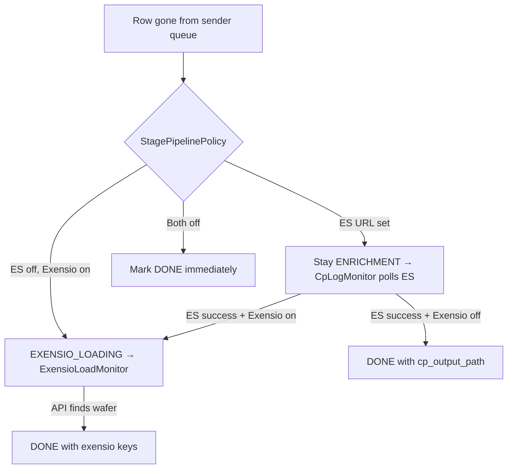

# Elasticsearch & Exensio API — Integration Guide

This guide explains how to **enable, configure, and verify** the two optional completion monitors in ExensioReload:

| Integration | Purpose | Spring property prefix |
|-------------|---------|------------------------|
| **CP Elasticsearch** | Confirm CP enrichment succeeded/failed from dataport logs | `cp.elasticsearch.*` |
| **Exensio Loading API** | Confirm lot/wafer exists in Exensio after CP | `exensio.*` |

Both are **optional**. The app uses a capability-based router (`StagePipelinePolicy`) so you can deploy any combination without code changes.

---

## 1. How routing works (read this first)

After a staged file is dispatched, CP removes it from `DTP_SENDER_QUEUE_ITEM`. `SenderQueueMonitor` detects that and asks `StagePipelinePolicy` what to do next:



### Deployment matrix

| `CP_ES_URL` | `EXENSIO_ENABLED` | After CP consumes queue | Final confirmation |
|-------------|-------------------|-------------------------|-------------------|
| empty | `false` | **DONE** | None (fastest path) |
| empty | `true` | **EXENSIO_LOADING** | Exensio `lot-wafer-lookup` |
| set | `false` | **ENRICHMENT** | ES logs → **DONE** (stores CP paths) |
| set | `true` | **ENRICHMENT** | ES logs → **EXENSIO_LOADING** → Exensio API → **DONE** |

**Priority:** Elasticsearch wins over Exensio when both are configured (ES verifies CP first).

### Wait-time behavior ("no ES monitor")

The monitor path is chosen **immediately** when CP consumes the queue row. There is **no timer** that later “falls back” to **no ES**.

- **ES configured** → record stays in **ENRICHMENT** until ES success/failure.
  - If ES never finds a log, the record **fails** after `cp.elasticsearch.enrichment-timeout-minutes` (default **30 min**).
  - There is **no automatic fallback** to Exensio if ES is configured but times out.
- **ES not configured** → ES monitor is **skipped entirely** (no wait). The next step is decided immediately:
  - **Exensio configured** → record moves to **EXENSIO_LOADING** and waits for Exensio polling.
  - **Exensio not configured** → record is marked **DONE** immediately.

### Exensio wait time (when Exensio is configured)

If Exensio is configured, the system polls Exensio on a fixed interval and times out after a configured wait:

- Poll interval: `exensio.poll-interval-ms` (default **60s**)
- Max wait before FAILED: `exensio.timeout-minutes` (default **60 min**)

So when ES is off but Exensio is on, records still **wait up to 60 minutes** in **EXENSIO_LOADING** before failing.

**Code references:**

- Policy: `StagePipelinePolicy.java`
- Transitions: `StagePipelineOrchestrator.java`, `SenderQueueMonitor.java`, `CpLogMonitor.java`, `ExensioLoadMonitor.java`
- Config: `application.yml` (`cp.elasticsearch`, `exensio`)

---

## 2. Prerequisites (all environments)

1. **ExensioReload backend** running with access to:
   - Oracle **RefDB** (`SENDER_STAGE`)
   - Per-site Oracle DBs (`dbconnections.yml`) including `DTP_SENDER_QUEUE_ITEM`
2. **Network** from the app server to:
   - Elasticsearch cluster (HTTPS, port 9200 or your proxy)
   - Exensio API host (HTTPS)
3. **Staging workflow** working without monitors first (discover → stage → dispatch → queue consumption visible in UI).

Monitors are **background schedulers**; no frontend changes are required.

---

## 3. CP Elasticsearch integration

### 3.1 What it does

| Component | Schedule (default) | Role |
|-----------|-------------------|------|
| `SenderQueueMonitor` | every 10s | Detects queue consumption; leaves rows in **ENRICHMENT** when ES is on |
| `CpLogMonitor` | every 60s | Queries ES for CP log lines matching `data_id` + `lot` |

**Outcomes:**

- **Success** (log contains `output path = …`) → `EXENSIO_LOADING` (if Exensio on) or **DONE** (if Exensio off); stores `cp_output_path`, `cp_output_target`
- **Failure** (`error.type` / `error.message` in log) → **FAILED**
- **Not found** within timeout → **FAILED** (default 30 minutes in ENRICHMENT)

If `cp.elasticsearch.url` is **blank**, `CpLogMonitor` is a **no-op** (logs DEBUG message "Elasticsearch not configured" and returns immediately). Safe to deploy.

### 3.2 Configuration

#### `application.yml` (defaults)

```yaml
cp:
  elasticsearch:
    url: ${CP_ES_URL:}
    api-key: ${CP_ES_API_KEY:}
    username: ${CP_ES_USERNAME:}
    password: ${CP_ES_PASSWORD:}
    index-pattern: logs*dataport*
    cp-config-filter: "*_sender*"
        # Optional: If different sites index the country under different field names,
        # provide a per-location mapping. Keys are the site keys from dbconnections.yml
        # (upper-cased, e.g. EXTERNAL-PROD or EXTERNAL-QA). Values are the ES field
        # name that contains the country (e.g. service.country, service_country).
        # Prefer adding this mapping to your profile YAML (application-*.yml).
        # Example:
        # service-country-field-by-location:
        #   EXTERNAL-PROD: service.country
        #   EXTERNAL-QA: service_country
    poll-interval-ms: 60000
    enrichment-timeout-minutes: 30
```

#### Environment variables (recommended for production)

| Variable | Required | Description |
|----------|----------|-------------|
| `CP_ES_URL` | **Yes** (to enable) | **Base ES URL only**, e.g. `https://elasticsearch.company.com:9200` (do **not** include `/logs*dataport*/_search`; the app appends that automatically) |
| `CP_ES_API_KEY` | Preferred | Elasticsearch API key (Authorization: `ApiKey …`) |
| `CP_ES_USERNAME` | If no API key | Basic auth user |
| `CP_ES_PASSWORD` | If no API key | Basic auth password |

**Activation rule:** `CpElasticsearchProperties.isConfigured()` → `url` is non-blank.

#### Optional tuning

| Property | Default | Meaning |
|----------|---------|---------|
| `index-pattern` | `logs*dataport*` | ES index pattern appended to `/_search` |
| `cp-config-filter` | `*sender*` | Wildcard on field `cpConfig` |
| `poll-interval-ms` | `60000` | `CpLogMonitor` interval |
| `enrichment-timeout-minutes` | `30` | Max wait in ENRICHMENT before FAILED |

### 3.3 Elasticsearch log requirements

`ElasticsearchLogService` issues a `_search` with **must** clauses:

| ES field | Match |
|----------|--------|
| `cpConfig` | wildcard `*_sender*` (configurable) |
| `service.country` | optional term filter, for example `PHO` for External logs |
| `idData` | term = staged `data_id` |
| `mLot` | term = staged `lot` |
| `@timestamp` | `gte` record `updated_at` (set when CP consumes the queue row and the status flips to `ENRICHMENT`) |

In other words, the ES time window should start at the moment the payload is removed from `DTP_SENDER_QUEUE_ITEM` and the app marks the RefDB row as `ENRICHMENT`.

**Success detection:** any hit whose `message` contains `output path` (case-insensitive).  
Path is parsed with regex `output path\s*=\s*(.+)`.  
`cp_output_target` is derived from path text: `PRODUCTION`, `SANDBOX`, or `UNKNOWN`.

**Failure detection:** `_source` has `error.type` or `error.message`.

Ensure your CP/dataport logs index documents use these field names (or adjust code/index mapping with your platform team).

If your environments/sites use a different field name than `service.country`, configure the
per-location mapping described above. The application resolves the correct field name at
runtime using the site key from `SENDER_STAGE.site` (the same keys used in `dbconnections.yml`).

### 3.4 Example manual ES test

Replace placeholders and run from a host that can reach ES:

```bash
curl -s -u "$CP_ES_USERNAME:$CP_ES_PASSWORD" \
  -H "Content-Type: application/json" \
  -X POST "${CP_ES_URL%/}/logs*dataport*/_search" \
  -d '{
    "size": 2,
    "_source": ["@timestamp", "cpConfig", "idData", "idFile", "message", "log.level"],
    "query": {
      "bool": {
        "must": [
          { "wildcard": { "cpConfig": { "value": "*_sender*", "case_insensitive": true } } },
          { "term": { "idData": "YOUR_DATA_ID" } },
          { "term": { "idFile": "YOUR_FILE_ID" } },
          { "term": { "mLot": "YOUR_LOT" } },
          { "range": { "@timestamp": { "gte": "2025-05-31T16:00:00Z" } } }
        ],
        "should": [
          { "wildcard": { "message": { "value": "*output path*PRODUCTION*", "case_insensitive": true, "boost": 4 } } },
          { "wildcard": { "message": { "value": "*SANDBOX*", "case_insensitive": true, "boost": 3 } } },
          { "bool": { "must_not": [{ "term": { "log.level": "ERROR" } }], "boost": 3 } },
          { "term": { "log.level": { "value": "ERROR", "boost": 1 } } }
        ],
        "minimum_should_match": 1
      }
    },
    "sort": [{ "@timestamp": { "order": "desc" } }]
  }'
```

If your site indexes the country as `service_country`, update the `term` clause accordingly
or add a per-location mapping in your profile so the application builds the query correctly.

If you are constructing a one-off curl by hand, use the **base ES host** in `CP_ES_URL` and keep the query path as `/<index-pattern>/_search`.

Recommended profile YAML snippet (add to `application-onsemi-oracle.yml` or `application.yml`):

```yaml
cp:
  elasticsearch:
    service-country-filter: PHO
    service-country-field-by-location:
      EXTERNAL-PROD: service.country
      EXTERNAL-QA: service_country
```

### 3.5 Verification checklist (ES)

1. Set `CP_ES_URL` (and auth), restart backend.
  - If your ES cluster mixes regions/services, set `CP_ES_SERVICE_COUNTRY_FILTER=PHO` to isolate External logs.
2. Stage and dispatch a small session (1–2 files).
3. In UI, files should stay **ENRICHMENT** / “Enrichment / Translation” after leaving the queue (not immediate DONE).
4. In logs, look for:
   - `ES configured: marked N record(s) as ENRICHMENT` (queue monitor)
   - `CP enrichment success for record id=…` or timeout/failure messages (`CpLogMonitor`)
5. In `SENDER_STAGE`, confirm `cp_output_path` / `cp_output_target` populated on success.

### 3.6 ES troubleshooting

| Symptom | Likely cause | Action |
|---------|--------------|--------|
| Immediate **DONE** after queue | `CP_ES_URL` empty | Set URL and restart |
| Stuck **ENRICHMENT** forever | No matching ES logs / wrong fields | Validate `idData`, `mLot`, `cpConfig`, timestamp |
| **FAILED** timeout 30m | Logs arrive after timeout | Increase `enrichment-timeout-minutes` or fix CP logging delay |
| Warn “ES query failed … skipping” | Network/auth/HTTP errors | Fix connectivity; record retried next cycle (not auto-FAILED) |

---

## 4. Exensio Loading API integration

### 4.1 What it does

| Component | Schedule (default) | Role |
|-----------|-------------------|------|
| `SenderQueueMonitor` | every 10s | If ES off and Exensio on → **EXENSIO_LOADING** when queue row gone |
| `CpLogMonitor` | every 60s | If ES on and Exensio on → **EXENSIO_LOADING** after ES success |
| `ExensioLoadMonitor` | every 60s | Polls Exensio for all **EXENSIO_LOADING** rows |

**Outcomes:**

- Wafer found → **DONE**; stores `exensio_wafer_key`, `exensio_pg_key`
- Not found within timeout → **FAILED** (default 60 minutes in EXENSIO_LOADING)
- Missing lot/wafer on record → **FAILED** immediately

If `exensio.enabled=false` or base URL empty, `ExensioLoadMonitor` is a **no-op**.

### 4.2 Configuration

#### `application.yml`

```yaml
exensio:
  enabled: ${EXENSIO_ENABLED:false}
  env: ${EXENSIO_ENV:QA}
  qa-base-url: ${EXENSIO_QA_URL:}
  prod-base-url: ${EXENSIO_PROD_URL:}
  username: ${EXENSIO_USERNAME:}
  password: ${EXENSIO_PASSWORD:}
  dbname: ${EXENSIO_DBNAME:}
  dbschema: ${EXENSIO_DBSCHEMA:PRODUCTION}
  poll-interval-ms: 60000
  timeout-minutes: 60
  batch-size: 50
  thread-pool-size: 5
  max-concurrent-requests: 10
  enable-circuit-breaker: true
  circuit-breaker-threshold: 5
  circuit-breaker-reset-ms: 60000
```

#### Environment variables

| Variable | Required | Description |
|----------|----------|-------------|
| `EXENSIO_ENABLED` | **Yes** | `true` to activate |
| `EXENSIO_ENV` | Yes | `QA` or `PROD` — selects `qa-base-url` vs `prod-base-url` |
| `EXENSIO_QA_URL` | For QA | Base URL, e.g. `https://exensio-qa.company.com` |
| `EXENSIO_PROD_URL` | For PROD | Production base URL |
| `EXENSIO_USERNAME` | **Yes** | API user |
| `EXENSIO_PASSWORD` | **Yes** | API password |
| `EXENSIO_DBNAME` | Optional | Login body `dbname`; defaults to `EXENSIO_ENV` |
| `EXENSIO_DBSCHEMA` | Optional | Default `PRODUCTION` |

**Activation rule:** `ExensioProperties.isConfigured()` → `enabled=true` **and** resolved base URL non-blank.

### 4.3 API endpoints used

| Step | Method | Path | Body / headers |
|------|--------|------|----------------|
| Login | `POST` | `/v1/session/login` | `{ "username", "password", "dbname", "dbschema" }` → `{ "token": "…" }` |
| Lookup (batch) | `POST` | `/v1/key/lot-wafer-lookup` | `Authorization: Bearer <token>`, `{ "pgc_key": 1, "lot_ids": [...], "wafer_ids": [...] }` |
| Logout (shutdown) | `POST` | `/v1/session/logout` | Bearer token |

Implemented in `ExensioAuthService` and `ExensioClient`. Token is cached in memory; **401** triggers re-login and one retry.

### 4.4 Example manual API test

```bash
# 1) Login
TOKEN=$(curl -s -X POST "$EXENSIO_QA_URL/v1/session/login" \
  -H "Content-Type: application/json" \
  -d "{\"username\":\"$EXENSIO_USERNAME\",\"password\":\"$EXENSIO_PASSWORD\",\"dbname\":\"QA\",\"dbschema\":\"PRODUCTION\"}" \
  | jq -r .token)

# 2) Lot-wafer lookup
curl -s -X POST "$EXENSIO_QA_URL/v1/key/lot-wafer-lookup" \
  -H "Authorization: Bearer $TOKEN" \
  -H "Content-Type: application/json" \
  -d '{"pgc_key":1,"lot_ids":["YOUR_LOT"],"wafer_ids":["YOUR_WAFER"]}'
```

### 4.5 Verification checklist (Exensio)

1. Set `EXENSIO_ENABLED=true`, URL, credentials; restart backend.
2. Prefer starting with **ES disabled** and Exensio only (simpler path): files should go **EXENSIO_LOADING** after CP consumes queue.
3. In logs:
   - `ExensioLoadMonitor initialized: threadPoolSize=…`
   - `CP consumed N record(s) … awaiting Exensio API verification (ES disabled)`
   - `Exensio poll cycle started: N records in EXENSIO_LOADING`
   - `Exensio poll cycle completed … done=…`
4. UI shows **Exensio Loading**, then **Done** with keys in DB (`exensio_wafer_key`, `exensio_pg_key`).

### 4.6 Exensio troubleshooting

| Symptom | Likely cause | Action |
|---------|--------------|--------|
| Stuck **EXENSIO_LOADING** | `EXENSIO_ENABLED=false` or URL empty | Enable and set `EXENSIO_QA_URL` / `EXENSIO_PROD_URL` |
| **FAILED** “Missing lot or wafer” | Staged metadata incomplete | Fix discovery filters / metadata source |
| **FAILED** timeout 60m | Wafer not in Exensio yet | Confirm CP actually loaded; adjust `timeout-minutes` |
| Circuit breaker OPEN in logs | Repeated API failures | Fix Exensio service; wait `circuit-breaker-reset-ms` |
| Auth errors on startup | Bad credentials / dbname | Test login curl above |

---

## 5. Recommended rollout order

Industry practice: **add one integration at a time**, validate in QA, then combine.

### Phase A — Baseline (no external monitors)

```bash
# Leave unset or empty
CP_ES_URL=
EXENSIO_ENABLED=false
```

Expected: queue consumption → **DONE**. Use this to prove dispatch and UI monitoring.

### Phase B — Exensio only (no Elasticsearch)

```bash
CP_ES_URL=
EXENSIO_ENABLED=true
EXENSIO_ENV=QA
EXENSIO_QA_URL=https://your-exensio-qa-host
EXENSIO_USERNAME=...
EXENSIO_PASSWORD=...
```

Expected: queue consumption → **EXENSIO_LOADING** → Exensio poll → **DONE**.

### Phase C — Elasticsearch only (no Exensio)

```bash
CP_ES_URL=https://your-es-host:9200
CP_ES_API_KEY=...   # or USERNAME/PASSWORD
EXENSIO_ENABLED=false
```

Expected: queue consumption → **ENRICHMENT** → ES success → **DONE** (with `cp_output_path`).

### Phase D — Full pipeline (ES + Exensio)

Set both. Expected: **ENRICHMENT** → ES success → **EXENSIO_LOADING** → Exensio → **DONE** with CP + Exensio columns populated.

---

## 6. Operations reference

### Status values in `SENDER_STAGE`

| Status | Meaning |
|--------|---------|
| `NEW` | Staged, not yet dispatched |
| `ENRICHMENT` | In sender queue and/or awaiting ES verification |
| `EXENSIO_LOADING` | CP step done (or ES success); awaiting Exensio API |
| `DONE` | Terminal success |
| `FAILED` | Terminal error (see `error_message`) |

### Background task intervals

| Task | Property | Default |
|------|----------|---------|
| Queue inspection | `refdb.dispatch.monitor-interval-ms` | 10000 ms |
| ES poll | `cp.elasticsearch.poll-interval-ms` | 60000 ms |
| Exensio poll | `exensio.poll-interval-ms` | 60000 ms |
| Dispatch to queue | `refdb.dispatch.interval-ms` | 60000 ms |

### Log messages to search

```text
# Elasticsearch
ES configured: marked
CP enrichment success
CP enrichment failure
CP enrichment timeout
Elasticsearch not configured

# Exensio
ExensioLoadMonitor initialized
awaiting Exensio API verification
Exensio poll cycle started
Exensio poll cycle completed
Exensio not configured
Circuit breaker is OPEN
```

### Database columns (audit trail)

| Column | Set by |
|--------|--------|
| `cp_output_path`, `cp_output_target` | ES success (`CpLogMonitor`) |
| `exensio_wafer_key`, `exensio_pg_key` | Exensio success (`ExensioLoadMonitor`) |
| `processed_at` | **DONE** transition |
| `error_message` | **FAILED** (max ~500 chars) |

---

## 7. Security & networking

- Store secrets in **environment variables** or your vault — not committed in git.
- Allow **outbound HTTPS** from the ExensioReload JVM to ES and Exensio hosts.
- ES API key is preferred over basic auth where supported.
- Exensio password is sent only to `/v1/session/login` over TLS.
- No inbound ports are opened by these integrations (pull-only schedulers).

---

## 8. Local development quick start

1. Start backend: `java -jar … --spring.profiles.active=onsemi-oracle` (or your profile).
2. Export only the integrations you need, e.g.:

```powershell
$env:EXENSIO_ENABLED="true"
$env:EXENSIO_ENV="QA"
$env:EXENSIO_QA_URL="https://..."
$env:EXENSIO_USERNAME="..."
$env:EXENSIO_PASSWORD="..."
```

3. Run a one-file staging session in the UI (Stepper → Monitor).
4. Tail `logs/exensioreload.log` for the messages in §6.

---

## 6. Logging Configuration

### Recommended log levels

For **production environments**, use these settings in `application.yml` or environment variable `LOGGING_LEVEL_ROOT`:

```yaml
logging:
  level:
    root: INFO
    com.onsemi.cim.apps.exensio: INFO
    # CP Elasticsearch monitor — see all ES query outcomes (success/failure/timeout)
    com.onsemi.cim.apps.exensio.exensioreload.service.ElasticsearchLogService: INFO
    com.onsemi.cim.apps.exensio.exensioreload.service.CpLogMonitor: INFO
    # pp_log fallback (less critical, can be DEBUG)
    # com.onsemi.cim.apps.exensio.exensioreload.service.RefDbService: DEBUG
```

### What you'll see in logs

| Log Message | Level | Meaning | Action |
|---|---|---|---|
| `CP success (PRODUCTION in message) for dataId=...` | INFO | File enriched, routed to PRODUCTION | None — normal flow |
| `CP success (SANDBOX in message) for dataId=...` | INFO | File enriched, routed to SANDBOX | None — normal flow |
| `CP failure (log.level=ERROR) for dataId=...: ...` | INFO | CP reported error during processing | Check error message; record will be marked FAILED |
| `CP enrichment timeout for record id=... dataId=...` | INFO | No ES log found after 30 min (default) | Increase `enrichment-timeout-minutes` or investigate CP delays |
| `No CP log yet for record id=... dataId=... — will retry next cycle` | DEBUG | First few poll cycles; normal during enrichment | None — will keep retrying |
| `ES query payload (dataId=..., idFile=...): url=..., body=...` | INFO | Full ES query being sent (enable via `logRequestPayloads: true`) | Useful for debugging mismatches |
| `Elasticsearch query failed for dataId=..., lot=...: ...` | WARN | Network/auth/HTTP error talking to ES | Check ES connectivity and credentials |

### Enabling request payload logging (debug only)

Add to `application.yml` to see full ES query JSON (very verbose):

```yaml
cp:
  elasticsearch:
    logRequestPayloads: true  # Set to false in production
```

---

## 7. ES Status Codes (Monitoring UI)

When monitoring a session in the UI, the **integration status** field shows what happened with Elasticsearch:

| Status | Message | Meaning | Next Step |
|--------|---------|---------|-----------|
| `success` | `CP log found in ES` | Elasticsearch query succeeded and found enrichment output | File moves to EXENSIO_LOADING (if enabled) or DONE |
| `failure` | `<error message from CP log>` | CP reported an error during processing | File marked FAILED; check error details |
| `timeout` | `CP enrichment timeout — no log found in Elasticsearch after 30 minutes` | ES never received a CP log for this file | Increase timeout or check CP pipeline delays |
| `not_found` | `No ES log yet — retrying` | First few poll cycles; ES log not available yet | Normal — will retry every 60 seconds |
| `error` | `ES query failed: <error>` | Network/auth/HTTP error contacting Elasticsearch | Check ES cluster connectivity and credentials |
| `pending` | `Waiting for first check` | ES polling not started yet | Normal at session start |
| `not_configured` | `Not configured` | ES URL is blank; monitoring disabled | Enable ES by setting `CP_ES_URL` and restarting |

### How to read the UI monitoring display

In the Stepper → **Monitor** view:

```
File: ABC123_lot001.dat
Status: ENRICHMENT
Elasticsearch: [✓] CP log found in ES
  └─ Last checked: 2 seconds ago
```

- ✓ = Success (green)
- ✗ = Failure (red)
- ⏱ = Timeout (orange)
- ⏳ = Pending / not_found (yellow)

---

## 8. Troubleshooting ES Integration

### Issue: Files stuck in "ENRICHMENT" status indefinitely

| Symptom | Likely cause | Solution |
|---------|--------------|----------|
| All files stay ENRICHMENT for hours | `CP_ES_URL` is misconfigured (hostname typo, wrong port) | Verify URL format: `https://elasticsearch.company.com:9200` |
| Files eventually timeout after 30 min | No ES logs being generated for files | Check if CP is actually processing files; verify `cpConfig` filter matches your logs |
| Only specific files timeout | Mismatched query filters (`idData`, `idFile`, `lot`) | Check SENDER_STAGE columns match ES document fields |
| All files fail with "error" status | ES authentication failed (API key/password wrong) | Verify `CP_ES_API_KEY` or `CP_ES_USERNAME`/`CP_ES_PASSWORD` are correct |
| Network timeout errors in logs | ES cluster unreachable | Ping ES from app server; check firewall rules; verify HTTPS cert is trusted |

### Issue: Files fail with wrong error message

| Symptom | Cause | Solution |
|---------|-------|----------|
| Error says "CP processing error" but has details | Message field was empty in ES log | CP logs not capturing full error — check CP configuration |
| Output path shows "UNKNOWN" instead of "PRODUCTION"/"SANDBOX" | Path string doesn't contain those keywords | CP output path format changed; update regex or adjust `detectOutputTarget()` method |
| pp_log fallback never triggered | Message doesn't contain "executed successfully" | CP logs don't use that phrase — check actual log message text |

### Issue: Some records get pp_log fallback, others don't

| Symptom | Cause | Fix |
|---------|-------|-----|
| Only some files trigger pp_log queries | ES message has keyword (PRODUCTION/SANDBOX) before "executed successfully" | Priority order: PRODUCTION/SANDBOX match first, so pp_log is skipped; this is correct |
| pp_log query always returns no rows | `lot` or `idFile` mismatch between SENDER_STAGE and pp_log | Verify column mapping; ensure `metadataId` matches pp_log's `idFile` concept |
| pp_log queries work some times | Random failures; SQL error in logs | Check pp_log datasource connectivity; ensure `refdb.pp-log-*` properties are set |

### Issue: "No ES hits" after query looks correct

| Symptom | Cause | Solution |
|---------|-------|----------|
| Query payload looks right but returns empty | ES index has no documents matching time window | Ensure `@timestamp` range includes time when CP processed file; may be delayed |
| Query returns hits but result is "NotFound" | Hit message doesn't match success/failure keywords | ES message format doesn't contain "PRODUCTION", "SANDBOX", "executed successfully", or `log.level=ERROR` |
| `cpConfig` filter mismatch | Value is `*sender*` but docs have `_sender`, `sender`, or custom value | Update `cp.elasticsearch.cp-config-filter` to match your index; e.g., `*_sender*` |

### Debug: Manually test ES query

Use the curl command from §3.4 with your actual values:

```bash
export CP_ES_URL="https://elasticsearch.company.com:9200"
export CP_ES_USERNAME="elastic_user"
export CP_ES_PASSWORD="your_password"

# Replace YOUR_DATA_ID, YOUR_FILE_ID, YOUR_LOT with actual values from SENDER_STAGE
curl -s -u "$CP_ES_USERNAME:$CP_ES_PASSWORD" \
  -H "Content-Type: application/json" \
  -X POST "${CP_ES_URL%/}/logs*dataport*/_search" \
  -d '{
    "size": 2,
    "_source": ["@timestamp", "cpConfig", "idData", "idFile", "message", "log.level"],
    "query": {
      "bool": {
        "must": [
          { "wildcard": { "cpConfig": { "value": "*_sender*", "case_insensitive": true } } },
          { "term": { "idData": "YOUR_DATA_ID" } },
          { "term": { "idFile": "YOUR_FILE_ID" } },
          { "term": { "mLot": "YOUR_LOT" } },
          { "range": { "@timestamp": { "gte": "2025-05-31T16:00:00Z" } } }
        ]
      }
    },
    "sort": [{ "@timestamp": { "order": "desc" } }]
  }'
```

- **0 hits returned** → Adjust time range or filter values
- **Hits returned but not matching success/failure keywords** → Adjust regex or add missing field matching
- **Connection refused** → Check ES URL, port, firewall
- **401 Unauthorized** → Check credentials

---

## 9. Related documentation

- [EXENSIORELOAD.md](EXENSIORELOAD.md) — architecture, API list, data flow
- [EXECUTIVE_PRESENTATION.md](EXECUTIVE_PRESENTATION.md) — high-level pipeline diagram
- Config source: `backend/src/main/resources/application.yml`
- Properties classes: `CpElasticsearchProperties.java`, `ExensioProperties.java`

---

*Last updated for capability-based routing (`StagePipelinePolicy`). If behaviour differs from this doc, the Java policy/orchestrator classes are the source of truth.*
