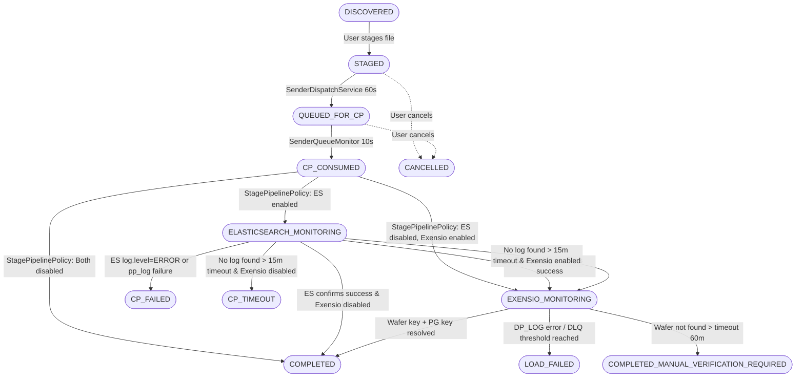
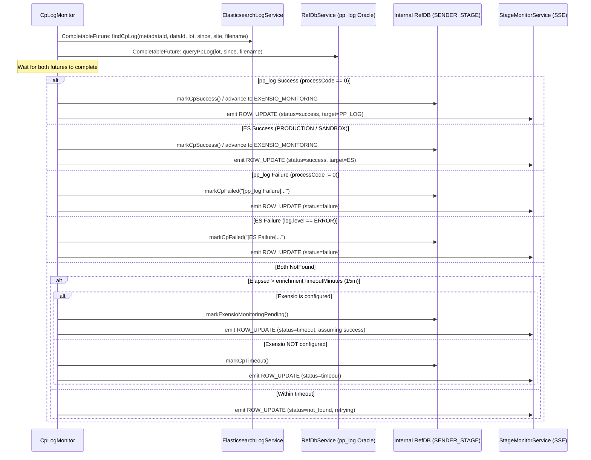
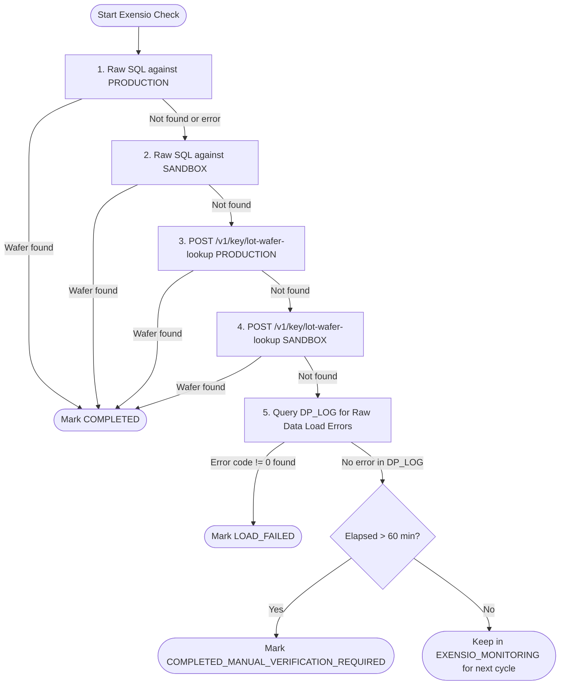

# Elasticsearch & Exensio API Integration — Processing, Errors & UI Telemetry

> **Target Audience**: Systems Engineers, Backend Developers, Frontend Developers, and Operations Teams  
> **Applicable Version**: ExensioReload v3.0+  
> **Status**: Comprehensive Technical Architecture, Troubleshooting Guide & Known Issues Analysis

---

## Executive Summary

ExensioReload manages high-volume semiconductor test data resends across 20+ manufacturing sites. The core pipeline relies on two external integrations to monitor and confirm asynchronous file processing:

1. **Command Processor (CP) Elasticsearch & pp_log Engine**: Detects whether raw tester data was enriched and routed to the target environment (`PRODUCTION` or `SANDBOX`).
2. **Exensio Loading API & Direct Oracle SQL Engine**: Confirms that wafer/lot records were successfully parsed, ingested, and registered into the Exensio data warehouse (`WAFER_KEY`, `PG_KEY`).

This document provides complete technical specifications of how these two external engines are polled, how events are processed, how errors are classified and formatted, how real-time status is rendered in the Angular glassmorphism UI, and an in-depth analysis of why operational issues and data discrepancies occur.

---

## Table of Contents

1. [End-to-End Pipeline & State Machine](#1-end-to-end-pipeline--state-machine)
2. [Elasticsearch (CP Log Monitor) Engine](#2-elasticsearch-cp-log-monitor-engine)
   - [HTTP REST Query Architecture](#21-http-rest-query-architecture)
   - [Query Structure & Boost Scoring](#22-query-structure--boost-scoring)
   - [Hit Evaluation Priority](#23-hit-evaluation-priority)
   - [Parallel Query with Oracle `pp_log`](#24-parallel-query-with-oracle-pp_log)
   - [Clock Skew, Lookback Buffers & Timezone Handling](#25-clock-skew-lookback-buffers--timezone-handling)
   - [Circuit Breaker & Fallback Wildcards](#26-circuit-breaker--fallback-wildcards)
3. [Exensio Loading API & SQL Engine](#3-exensio-loading-api--sql-engine)
   - [Authentication & Multi-Schema Sessions](#31-authentication--multi-schema-sessions)
   - [Lookup Flow: Raw SQL -> Endpoint -> Schema Fallback](#32-lookup-flow-raw-sql---endpoint---schema-fallback)
   - [Deep Error Extraction via `DP_LOG` & `STRING_HOLDER`](#33-deep-error-extraction-via-dp_log--string_holder)
   - [Batch Processing, Thread Pooling & Concurrency Throttling](#34-batch-processing-thread-pooling--concurrency-throttling)
   - [Dead Letter Queue (DLQ) & Circuit Breaker](#35-dead-letter-queue-dlq--circuit-breaker)
4. [Error Classification & Diagnostic Formatting](#4-error-classification--diagnostic-formatting)
   - [Backend Error Message Formats](#41-backend-error-message-formats)
   - [Frontend Error Badge Resolution (`CP` vs `Exensio`)](#42-frontend-error-badge-resolution-cp-vs-exensio)
5. [UI Reporting & Real-Time Telemetry](#5-ui-reporting--real-time-telemetry)
   - [Dashboard Metrics & Backlog Aggregation](#51-dashboard-metrics--backlog-aggregation)
   - [Real-Time SSE Channels & Events](#52-real-time-sse-channels--events)
   - [Virtual Scrolling File Table & Integration Badges](#53-virtual-scrolling-file-table--integration-badges)
6. [Known Issues, Root Causes & Operational Pitfalls](#6-known-issues-root-causes--operational-pitfalls)
   - [Issue 1: Accounting Imbalance & Missing Pipeline States](#issue-1-accounting-imbalance--missing-pipeline-states)
   - [Issue 2: Dead Column `processing` in Data Integrity Checks](#issue-2-dead-column-processing-in-data-integrity-checks)
   - [Issue 3: Clock Skew, Lookback Windows & False Timeouts](#issue-3-clock-skew-lookback-windows--false-timeouts)
   - [Issue 4: Premature Auto-Advancing to Exensio](#issue-4-premature-auto-advancing-to-exensio)
   - [Issue 5: Circuit Breaker Cascading Lockouts](#issue-5-circuit-breaker-cascading-lockouts)
   - [Issue 6: Raw SQL Failures & Loss of File-Level Matching](#issue-6-raw-sql-failures--loss-of-file-level-matching)
   - [Issue 7: Frontend State Legend vs Backend Enum Disconnect](#issue-7-frontend-state-legend-vs-backend-enum-disconnect)
   - [Issue 8: PPID Test-Phase Suffix Rejections](#issue-8-ppid-test-phase-suffix-rejections)
7. [Operational Troubleshooting Runbook](#7-operational-troubleshooting-runbook)
   - [Database Diagnostics (PostgreSQL & Oracle)](#71-database-diagnostics-postgresql--oracle)
   - [Tracing Requests Across Systems (Trace IDs)](#72-tracing-requests-across-systems-trace-ids)
   - [Remediation Runbook for Stuck Records](#73-remediation-runbook-for-stuck-records)

---

## 1. End-to-End Pipeline & State Machine

The reload process moves files through a formal 12-state deterministic state machine enforced by database CHECK constraints (`chk_sender_stage_status`).



### State Definitions & Enums (`PipelineStatus`)

| State Value | Pipeline Stage | Description | Terminal? |
|---|---|---|---|
| `DISCOVERED` | Discovery | Metadata identified in external site Oracle DB, not yet staged | No |
| `STAGED` | Staged | Ingested into internal `SENDER_STAGE` table | No |
| `QUEUED_FOR_CP` | External Queue | Written to site's `DTP_SENDER_QUEUE_ITEM` table | No |
| `CP_CONSUMED` | CP Dequeue | Site CP agent picked up the file from queue | No |
| `ELASTICSEARCH_MONITORING` | CP Enrichment | Polling Elasticsearch and Oracle `pp_log` in parallel | No |
| `CP_TIMEOUT` | Enrichment Timeout | No CP logs found after timeout threshold (when Exensio is off) | No |
| `EXENSIO_MONITORING` | Exensio Ingest | Polling Exensio API / Oracle DB for wafer registration | No |
| `COMPLETED_MANUAL_VERIFICATION_REQUIRED` | Manual Verification Required | System unable to automatically verify via Exensio API for **any reason** (timeout, API 503, query error, missing wafer). Delivered to outbox; verify in Exensio GUI | Semi |
| `COMPLETED` | Success | Fully processed; verified in CP and Exensio | Yes |
| `CP_FAILED` | CP Error | CP encountered error (`log.level=ERROR` or `process_code!=0`) | Yes |
| `LOAD_FAILED` | Exensio Ingest Rejection | Exensio loader explicitly rejected the file (`dp_log.error_code!=0`). Never used for API lookup failures | Yes |
| `CANCELLED` | Aborted | Soft-deleted or cancelled by user | Yes |

---

## 2. Elasticsearch (CP Log Monitor) Engine

### 2.1 HTTP REST Query Architecture

- **Class**: `ElasticsearchLogService.java`
- **Scheduler**: `CpLogMonitor.java` (default fixed delay: `60000ms`)
- **Transport**: Standard JDK 21 `java.net.http.HttpClient` (HTTP POST)
- **Dependencies**: Jackson `ObjectMapper` (no proprietary ES client library)
- **Target URL**: `${cp.elasticsearch.url}/${cp.elasticsearch.index-pattern}/_search` (default index: `logs*dataport*`)

Authentication uses either:
1. `ApiKey <base64>` header when `cp.elasticsearch.api-key` is supplied.
2. `Basic <base64>` header when username and password are provided.

Every query generates a unique `traceId` (UUID) that is logged with start time, JSON payload, response status, execution duration, and outcome.

### 2.2 Query Structure & Boost Scoring

The query combines boolean `must` filters for exact file identification with weighted `should` scoring clauses:

```json
{
  "query": {
    "bool": {
      "must": [
        {
          "wildcard": {
            "cpConfig": {
              "value": "*sender*",
              "case_insensitive": true
            }
          }
        },
        {
          "term": {
            "idData": "98765432"
          }
        },
        {
          "term": {
            "idFile": "123456"
          }
        },
        {
          "wildcard": {
            "inputFileName": {
              "value": "*WAFER_TEST_DATA*",
              "case_insensitive": true
            }
          }
        },
        {
          "range": {
            "@timestamp": {
              "gte": "2026-09-04T06:15:00Z"
            }
          }
        }
      ],
      "should": [
        {
          "wildcard": {
            "message": {
              "value": "*output path*PRODUCTION*",
              "case_insensitive": true,
              "boost": 4
            }
          }
        },
        {
          "wildcard": {
            "message": {
              "value": "*SANDBOX*",
              "case_insensitive": true,
              "boost": 3
            }
          }
        },
        {
          "bool": {
            "boost": 3,
            "must_not": [
              {
                "term": {
                  "log.level": "ERROR"
                }
              }
            ]
          }
        },
        {
          "term": {
            "log.level": {
              "value": "ERROR",
              "boost": 1
            }
          }
        }
      ],
      "minimum_should_match": 1
    }
  },
  "sort": [
    {
      "@timestamp": {
        "order": "desc"
      }
    }
  ],
  "size": 100,
  "_source": [
    "@timestamp",
    "cpConfig",
    "idData",
    "idFile",
    "inputFileName",
    "message",
    "log.level"
  ]
}
```

### 2.3 Hit Evaluation Priority

When the response arrives, `ElasticsearchLogService.parseResponse()` evaluates hits in two passes:

```
Pass 1: Success Scan (Skipping log.level == 'ERROR')
  ├─ Priority 1: Message contains "COMMANDS FLOW EXECUTED SUCCESSFULLY"
  │              --> Success (Target: PRODUCTION)
  ├─ Priority 2: Message contains "OUTPUT PATH = "
  │              --> Success (Target: PRODUCTION, regex output path extracted)
  ├─ Priority 3: Message contains "PRODUCTION"
  │              --> Success (Target: PRODUCTION)
  ├─ Priority 4: Message contains "SANDBOX"
  │              --> Success (Target: SANDBOX)
  └─ Priority 5: Message contains "executed successfully" / "command processor successfully"
                 --> Success (Target: PP_LOG fallback)

Pass 2: Error Scan (Only evaluated if Pass 1 found no success)
  └─ If any hit has log.level == 'ERROR'
     --> Failure (errorMessage extracted from message field)

Fallthrough:
  └─ Return CpLogResult.NotFound
```

### 2.4 Parallel Query with Oracle `pp_log`

In production, `CpLogMonitor.processRecord()` queries **both Elasticsearch and the production Oracle `pp_log` table concurrently** using `CompletableFuture.supplyAsync()`:



**Precedence Rule**: `pp_log` is the authoritative manufacturing record. If `pp_log` reports success, it wins immediately, even if ES has not indexed the log yet.

### 2.5 Clock Skew, Lookback Buffers & Timezone Handling

- **The Problem**: If the application server and the Elasticsearch cluster differ in clock time or timezone interpretation, querying `@timestamp >= since` results in 0 hits because logs appear to have occurred in the "past".
- **The Solution**: The query applies a lookback buffer:
  ```java
  int bufferSeconds = props.getLookbackBufferSeconds(); // Default: 900 (15 minutes)
  Instant esLookbackTime = lookbackTime.minusSeconds(bufferSeconds);
  ```
- **Configuration**:
  - `cp.elasticsearch.lookback-buffer-seconds`: Default `900`.
  - `cp.elasticsearch.enrichment-timeout-minutes`: Default `15`.

### 2.6 Circuit Breaker & Fallback Wildcards

- **Circuit Breaker**: An internal state machine (`CLOSED`, `OPEN`, `HALF_OPEN`) trips when `FAILURE_THRESHOLD = 5` consecutive HTTP or network errors occur. In the `OPEN` state, all queries instantly throw `ElasticsearchQueryException("Circuit breaker is OPEN")` for `TIMEOUT_DURATION = 60000ms` without making network calls.
- **Fallback Wildcard Query**: If the configured `cpConfigFilter` (e.g. `*sender*`) returns `NotFound`, the service automatically re-executes the search once using a broad fallback query to maximize recall.

---

## 3. Exensio Loading API & SQL Engine

### 3.1 Authentication & Multi-Schema Sessions

Exensio enforces strict schema isolation between `PRODUCTION` and `SANDBOX`. 

- **Service**: `ExensioAuthService.java`
- **Login Endpoint**: `POST {exensio.resolvedBaseUrl}/v1/session/login`
- **Body**:
  ```json
  {
    "username": "${EXENSIO_USERNAME}",
    "password": "${EXENSIO_PASSWORD}",
    "dbname": "${EXENSIO_DBNAME}",
    "dbschema": "PRODUCTION"
  }
  ```
- **Token Handling**:
  - Bearer tokens are cached per-schema in a thread-safe `ConcurrentHashMap`.
  - On HTTP `401 Unauthorized`, `ExensioClient` invalidates the token, triggers an automatic re-login, and retries the request once.
  - Shutdown hook (`@PreDestroy`) executes `POST /v1/session/logout` for all active schema sessions.

### 3.2 Lookup Flow: Raw SQL -> Endpoint -> Schema Fallback

When verifying records in `EXENSIO_MONITORING`, the system executes a 3-tier lookup sequence:



#### Step 1: Raw SQL Lookup (`/v1/key/raw-sql`)

Why raw SQL is preferred: It queries the Exensio Oracle database directly, joining `op_log`, `lot`, `program`, `wf_log`, `wafer`, and `df_export`, allowing exact file name matching:

```sql
SELECT lot_id, wafer_id, lot_key, wafer_key, pg_key, ppid, file_name, end_time 
FROM (
    SELECT l.lot_id AS lot_id, NVL(w.wf_id,'') AS wafer_id,
           ol.lot_key AS lot_key, NVL(w.wf_key,0) AS wafer_key,
           NVL(ol.pg_key,0) AS pg_key, NVL(p.ppid,'') AS ppid,
           NVL(de.file_name,'') AS file_name,
           NVL(TO_CHAR(ol.end_time, 'YYYY-MM-DD"T"HH24:MI:SS"Z"'),'') AS end_time
    FROM op_log ol
    JOIN lot l ON l.lot_key = ol.lot_key
    JOIN program p ON p.pg_key = ol.pg_key
    LEFT JOIN wf_log wfl ON wfl.lg_key = ol.lg_key
    LEFT JOIN wafer w ON w.wf_key = wfl.wf_key
    LEFT JOIN df_export de ON de.lg_key = ol.lg_key AND (w.wf_key IS NULL OR de.wf_key = w.wf_key)
    WHERE (ol.pgc_key = ? AND l.lot_id IN (?, ?) AND (w.wf_id IN (?, ?) OR w.wf_num = ?))
    ORDER BY ol.end_time DESC
) WHERE ROWNUM <= 200;
```

#### Step 2: REST Lot-Wafer Lookup (`/v1/key/lot-wafer-lookup`)

If raw SQL fails or is disabled, the standard REST endpoint is invoked:

```json
{
  "pgc_key": 1,
  "lot_ids": ["LOT12345"],
  "wafer_ids": ["01", "02"]
}
```

- `pgc_key`: Resolved via `ExensioPreCheckService.resolvePgcKey(dataType)`:
  - `1` = Wafer Sort (CP)
  - `2` = Final Test (FT)
- PPID Validation: When `testPhase` is specified (e.g. `CP1`), the returned program PPID must end with `_<testPhase>` (case-insensitive); otherwise it is rejected.

### 3.3 Deep Error Extraction via `DP_LOG` & `STRING_HOLDER`

When a wafer returns `NOT_FOUND`, rather than assuming it is still loading, `ExensioClient.queryRawDataLoadErrors()` executes an inspection query against Exensio's internal loader error tables:

```sql
SELECT l.lot_id, NVL(w.wf_id, '') AS wafer_id, NVL(p.ppid, '') AS program_name, 
       NVL(rf.file_name, '') AS file_name, dl.error_code, 
       COALESCE(sh1.str_value, '') || COALESCE(sh2.str_value, '') || 
       COALESCE(sh3.str_value, '') || COALESCE(sh4.str_value, '') AS full_error_message, 
       TO_CHAR(dl.start_time, 'YYYY-MM-DD"T"HH24:MI:SS"Z"') AS error_time 
FROM op_log ol 
JOIN lot l ON l.lot_key = ol.lot_key 
JOIN program p ON p.pg_key = ol.pg_key 
LEFT JOIN wf_log wl ON wl.lg_key = ol.lg_key 
LEFT JOIN wafer w ON w.wf_key = wl.wf_key 
JOIN dp_log dl ON dl.start_time = ol.insert_time 
LEFT JOIN raw_file rf ON rf.rawfile_key = dl.rawfile_key 
JOIN error_message em ON em.msg_key = dl.msg_key 
LEFT JOIN string_holder sh1 ON sh1.str_key = em.str_key1 
LEFT JOIN string_holder sh2 ON sh2.str_key = em.str_key2 
LEFT JOIN string_holder sh3 ON sh3.str_key = em.str_key3 
LEFT JOIN string_holder sh4 ON sh4.str_key = em.str_key4 
WHERE dl.error_code != 0 AND l.lot_id IN ('LOT12345')
ORDER BY l.lot_id, dl.start_time DESC;
```

If Exensio logged an error in `DP_LOG`, the record is transitioned to `LOAD_FAILED` with the full reconstructed error text, preventing false timeouts.

### 3.4 Batch Processing, Thread Pooling & Concurrency Throttling

To prevent overwhelming the Exensio server:
- **Batching**: Records in `EXENSIO_MONITORING` are chunked into batches of `exensio.batch-size` (default: `50`).
- **Worker Pool**: Batches are processed in parallel by an `ExecutorService` sized to `exensio.thread-pool-size` (default: `5`).
- **Concurrency Limiter**: A `Semaphore` enforces `exensio.max-concurrent-requests` (default: `10`) across all active threads.
- **Caffeine Cache**: Successfully resolved `lot|wafer` -> `(waferKey, pgKey)` pairs are cached to eliminate redundant API calls.

### 3.5 Dead Letter Queue (DLQ) & Circuit Breaker

1. **Dead Letter Queue**:
   - `failureCounts` tracks consecutive non-success results per record.
   - When count reaches `exensio.dead-letter-queue-threshold` (default: `3`), the record is marked `LOAD_FAILED` with the message:
     `"Exensio lookup exceeded maximum failure threshold (3 attempts). Moved to Dead Letter Queue."`
2. **Circuit Breaker**:
   - If Exensio API fails `circuit-breaker-threshold` (default: `5`) times consecutively, the breaker opens.
   - All subsequent batches skip API calls for `circuit-breaker-reset-ms` (default: `60000ms`), logging warnings instead of hammering the broken endpoint.

---

## 4. Error Classification & Diagnostic Formatting

### 4.1 Backend Error Message Formats

All errors stored in `SENDER_STAGE.ERROR_MESSAGE` follow strict structured formatting to allow accurate programmatic parsing and UI rendering:

| Failure Mode | Source | Format Pattern | Stored In Database |
|---|---|---|---|
| CP Processing Error | Elasticsearch | `[ES Failure] lot={lot}, idFile={idFile}, dataId={dataId}, log.level=ERROR, message="{msg}", traceId={uuid}` | `status='CP_FAILED'` |
| CP Process Code != 0 | Oracle `pp_log` | `[pp_log Failure] lot={lot}, idFile={idFile}, filename={file}, process_code!=0, log_message="{msg}"` | `status='CP_FAILED'` |
| CP Stuck Timeout | CP Log Monitor | `[Stuck in Enrichment] lot={lot}, idFile={idFile}, minutes_stuck={min}, timeout_threshold={thresh} minutes` | `status='COMPLETED_MANUAL_VERIFICATION_REQUIRED'` |
| Enrichment Timeout | CP Log Monitor | `[Enrichment Unresolved] ES: idData={id} since={ts}; pp_log: lot={lot} idFile={id}; Exensio: {reason}` | `status='COMPLETED_MANUAL_VERIFICATION_REQUIRED'` |
| Exensio Loader Error | Exensio `DP_LOG` | `[Exensio Failure] Exensio Raw Data Load Error (code {code}): {msg} (traceId={uuid})` | `status='LOAD_FAILED'` |
| Exensio Dead Letter | Exensio Monitor | `[Exensio Failure] Exensio lookup exceeded maximum failure threshold ({n} attempts)...` | `status='LOAD_FAILED'` |
| Exensio Wafer Timeout | Exensio Monitor | `Exensio load timeout — wafer not found after {n} minutes. May need retry. (traceId={uuid})` | `status='COMPLETED_MANUAL_VERIFICATION_REQUIRED'` |

### 4.2 Frontend Error Badge Resolution (`CP` vs `Exensio`)

In `RealtimeMonitoringFileListComponent.detectErrorSource()`:

```typescript
// Error source badge detection
if (msg.startsWith('[cp ') || msg.includes('cp enrichment') || 
    msg.includes('cp failure') || msg.includes('cp timeout') || msg.includes('cp pp_log')) {
  return 'CP';
}
if (msg.startsWith('[exensio ') || msg.includes('exensio load') || 
    msg.includes('exensio failure') || msg.includes('exensio api') || msg.includes('dead letter queue')) {
  return 'Exensio';
}
```

The UI displays:
- A colored chip (`CP` in dark blue, `Exensio` in purple) next to the error.
- A truncated 140-character inline summary.
- An accessible hover tooltip containing the full untruncated message and trace ID.

---

## 5. UI Reporting & Real-Time Telemetry

### 5.1 Dashboard Metrics & Backlog Aggregation

Dashboard statistics are computed in `RefDbService.fetchStatuses()` and mapped in `DashboardController.toMetrics()`:

```sql
SELECT site, sender_id, MAX(sender_name) AS sender_name, COUNT(*),
       SUM(CASE WHEN status = 'STAGED' THEN 1 ELSE 0 END) AS staged,
       SUM(CASE WHEN status = 'QUEUED_FOR_CP' THEN 1 ELSE 0 END) AS queued,
       SUM(CASE WHEN status = 'ELASTICSEARCH_MONITORING' THEN 1 ELSE 0 END) AS es_mon,
       SUM(CASE WHEN status = 'CP_TIMEOUT' THEN 1 ELSE 0 END) AS cp_to,
       SUM(CASE WHEN status = 'EXENSIO_MONITORING' THEN 1 ELSE 0 END) AS ex_mon,
       SUM(CASE WHEN status = 'COMPLETED_MANUAL_VERIFICATION_REQUIRED' THEN 1 ELSE 0 END) AS comp_mv,
       SUM(CASE WHEN status = 'CP_FAILED' THEN 1 ELSE 0 END) AS cp_failed,
       SUM(CASE WHEN status = 'LOAD_FAILED' THEN 1 ELSE 0 END) AS load_failed,
       SUM(CASE WHEN status = 'COMPLETED' THEN 1 ELSE 0 END) AS completed,
       SUM(CASE WHEN status = 'CANCELLED' THEN 1 ELSE 0 END) AS cancelled
FROM SENDER_STAGE
GROUP BY site, sender_id;
```

#### Backlog Formula

The dashboard "Backlog" counter measures records currently pending or unresolved in the pipeline:

$$\text{Backlog} = \text{queuedForCp} + \text{elasticsearchMonitoring} + \text{cpTimeout} + \text{exensioMonitoring} + \text{completedManualVerification}$$

> [!IMPORTANT]
> `cpTimeout` and `completedManualVerification` are deliberately included in Backlog because these records represent unconfirmed outcomes that require operator action or automatic retry.

### 5.2 Real-Time SSE Channels & Events

Clients connect via Server-Sent Events (SSE) to:
`GET /exensioreload/api/stage/monitor/{requestId}`

The backend pushes three event types:

| Event Name | Frequency | Payload Contents |
|---|---|---|
| `ROW_UPDATE` | On any record transition | Full record fields + `cpIntegrationStatus`, `cpIntegrationMessage`, `exensioIntegrationStatus`, `exensioIntegrationMessage`, `cpOutputPath`, `cpOutputTarget` |
| `STATS` | Periodic / State change | Aggregate counts across all statuses for the active session |
| `STUCK_RECORD_ALERT` | On timeout detection | `recordId`, `lot`, `minutesStuck`, `filename`, `site`, `senderName` |

### 5.3 Virtual Scrolling File Table & Integration Badges

The `RealtimeMonitoringFileListComponent` renders high volumes (up to 100,000 files) using Angular CDK Virtual Scrolling.

Each row renders an intelligent multi-segment progress line (`getDetailLine()`):
- **Staged**: `"Queued for Enrichment"`
- **CP Polling**: `"Enrichment: Processing"`
- **Exensio Polling**: `"Enrichment: Done · Exensio: Monitoring"`
- **Exensio Timeout**: `"Enrichment: Done · Exensio: Not confirmed — verify in Exensio"`
- **Success**: `"Enrichment: Done · PRODUCTION · Exensio: Loaded"`
- **Failure**: `"CP — [ES Failure] ..."` or `"Exensio — [Exensio Failure] ..."`

---

## 6. Known Issues, Root Causes & Operational Pitfalls

### Issue 1: Accounting Imbalance & Missing Pipeline States

- **Symptom**: `DataIntegrityJob` logs error:  
  `"ACCOUNTING IMBALANCE: total X != summed Y"`  
  and sends alert emails.
- **Root Cause**: `PipelineStatus` defines **12** canonical states. However, `RefDbService.fetchStatuses()` and `StageStatus.java` only aggregate **10** states. The two omitted states are:
  - `DISCOVERED` (records discovered but not yet staged)
  - `CP_CONSUMED` (records dequeued by CP but not yet transitioned to monitoring)
  If any records reside in `DISCOVERED` or `CP_CONSUMED`, the sum of state columns is strictly less than `COUNT(*)`, causing an apparent balance violation.

### Issue 2: Dead Column `processing` in Data Integrity Checks

- **Symptom**: PostgreSQL crashes on integrity checks with:  
  `PSQLException: The column name processing was not found in this ResultSet`
- **Root Cause**: Legacy changelogs historically renamed `PROCESSING` to `ELASTICSEARCH_MONITORING`. In earlier iterations of `DataIntegrityJob.java` and `StateAccountingService.java`, the SQL query aliased the column as `enrichment` or omitted `processing`, but Java code still invoked `rs.getLong("processing")`.  
- **Resolution Status**: Fixed in backend by removing all dead `processing` column references and standardizing on v3.0 status names.

### Issue 3: Clock Skew, Lookback Windows & False Timeouts

- **Symptom**: CP enrichment logs exist in Elasticsearch, but ExensioReload never sees them and eventually times out.
- **Root Cause**:
  1. The server running ExensioReload has local clock drift relative to the Elasticsearch cluster.
  2. Elasticsearch `@timestamp` uses UTC, while host servers in different regions (e.g. Phoenix vs Malaysia) generated timestamps in local time.
  3. CP indexing delay: There is a 30s to 5m lag between when CP processes the file and when the log shipper indexes the entry into Elasticsearch.
- **Prevention**: Ensure `cp.elasticsearch.lookback-buffer-seconds` is set to at least `900` (15 minutes). Never reduce this below `120` without NTP synchronization validation.

### Issue 4: Premature Auto-Advancing to Exensio

- **Symptom**: Files jump from `ELASTICSEARCH_MONITORING` to `EXENSIO_MONITORING`, but are never found in Exensio and end up in `COMPLETED_MANUAL_VERIFICATION_REQUIRED`.
- **Root Cause**: When `cp.elasticsearch.enrichment-timeout-minutes` is set too low (e.g. 5 minutes) and Exensio is enabled, `CpLogMonitor` interprets a timeout not as a failure, but as:
  `"CP enrichment timeout — assuming success and verifying in Exensio"`.
  If the file was actually stuck in CP's queue, Exensio has never received it, so Exensio monitoring inevitably times out as well.
- **Remediation**: Tune `enrichment-timeout-minutes` to match the 95th percentile CP processing time (typically 15–30 minutes for large wafer files).

### Issue 5: Circuit Breaker Cascading Lockouts

- **Symptom**: Entire batches stop updating; logs repeatedly report `"Circuit breaker is OPEN"`.
- **Root Cause**: A transient network glitch or HTTP 429 (rate limiting from Exensio/ES) causes 5 consecutive request failures. Once the breaker opens:
  - All subsequent scheduled monitor cycles are aborted for 60 seconds.
  - When the 60 seconds expire, the breaker enters `HALF_OPEN`. If the very first trial request fails, the breaker immediately returns to `OPEN` for another 60 seconds.
- **Remediation**: Inspect Exensio/ES Actuator health endpoints. If the external server is healthy, increase `exensio.circuit-breaker-threshold` to 10 or reduce `exensio.max-concurrent-requests` to prevent rate-limiting.

### Issue 6: Raw SQL Failures & Loss of File-Level Matching

- **Symptom**: Raw SQL lookup fails with syntax error or timeout, falling back to REST endpoint where records fail to match.
- **Root Cause**:
  - `buildBatchRawSql()` creates a union query across all records in the batch. If the batch contains 50 records with complex lot and wafer strings, the SQL query exceeds Oracle SQL parser limits or times out (`raw-sql-timeout-seconds: 20`).
  - When raw SQL fails, the fallback REST endpoint `/v1/key/lot-wafer-lookup` **does not support file name filtering**. It only matches by lot and wafer. If a lot has multiple runs/files, the REST endpoint cannot disambiguate which file loaded.

### Issue 7: Frontend State Legend vs Backend Enum Disconnect

- **Symptom**: Users hover over metric cards and see outdated state names like `ENQUEUED`, `ENRICHMENT`, `EXENSIO_LOADING`, `DONE`, `FAILED`.
- **Root Cause**: The frontend service `state-legend.service.ts` was written during v2.0 development and retains legacy transition documentation. The backend was migrated to v3.0 `PipelineStatus`. Operators are confused when the database shows `ELASTICSEARCH_MONITORING` but the UI tooltip says `ENRICHMENT`.

### Issue 8: PPID Test-Phase Suffix Rejections

- **Symptom**: Exensio confirms the wafer exists (`waferKey > 0`), but ExensioReload rejects it as `NOT_FOUND`.
- **Root Cause**: `ExensioClient.applyPpidCheck()` enforces:
  ```java
  String expectedSuffix = "_" + testPhase.trim();
  if (!ppid.toUpperCase().endsWith(expectedSuffix.toUpperCase())) {
      return new ExensioLotWaferResult.NotFound();
  }
  ```
  If the manufacturing site named the program `TEST_PROG_CP1_FINAL` instead of `TEST_PROG_CP1`, the suffix check fails, causing the record to be treated as missing.

### Issue 9: False `LOAD_FAILED` on Missing Wafers & API Inability (Architectural Bug)

- **Symptom**: Files that cannot be verified via the Exensio API are marked `LOAD_FAILED` (red badge) almost immediately, causing operator panic and duplicate reloads.
- **Root Cause**: The system's core design dictates that **inability to verify from Exensio API regardless of reason must result in `COMPLETED_MANUAL_VERIFICATION_REQUIRED`** (amber warning: "Completed — Verify in Exensio"), NOT `LOAD_FAILED`. The reload pipeline delivered the data to the outbox; it did not fail. However, `RefDbService.batchMarkNotFound()` and `batchMarkError()` mistakenly execute:
  `UPDATE SENDER_STAGE SET status = 'LOAD_FAILED', error_message = 'Wafer not found in Exensio'`
  on the very first cycle (e.g. after 58 seconds), subverting the 60-minute timeout and turning a normal in-progress ingest into a false failure.
- **Contract Rule**: `LOAD_FAILED` must be reserved **strictly** for confirmed loader rejections (e.g. `dp_log.error_code != 0`). Any API lookup failure, 503 error, or unconfirmed wafer must transition to `COMPLETED_MANUAL_VERIFICATION_REQUIRED`.

### Issue 10: Dropped SSE Live Updates (`requestId` is Null in Batch Updates)

- **Symptom**: The user's browser file table freezes and does not show live progress during Exensio batch monitoring.
- **Root Cause**: In `RefDbService.broadcastBatchEvents()`, the method calls `safeSendEvent(null, "ROW_UPDATE", evt)`. Because the first argument (`requestId`) is hardcoded to `null`, `safeSendEvent()` aborts and logs:
  `WARN ... Skipping SSE 'ROW_UPDATE' because requestId is null or blank`.
  100% of batch completion and failure SSE events are discarded.

---

## 7. Operational Troubleshooting Runbook

### 7.1 Database Diagnostics (PostgreSQL & Oracle)

#### Check Current State Distribution
```sql
SELECT status, COUNT(*), MIN(created_at), MAX(created_at)
FROM SENDER_STAGE
GROUP BY status
ORDER BY COUNT(*) DESC;
```

#### Detect Stuck Enrichment Records (> 30 minutes in ES monitoring)
```sql
SELECT id, site, sender_id, lot, wafer, filename, data_id, metadata_id, 
       created_at, updated_at
FROM SENDER_STAGE
WHERE status = 'ELASTICSEARCH_MONITORING'
  AND updated_at < CURRENT_TIMESTAMP - INTERVAL '30' MINUTE;
```

#### Detect Stuck Exensio Ingest Records (> 60 minutes in Exensio monitoring)
```sql
SELECT id, site, sender_id, lot, wafer, filename, cp_output_path, 
       created_at, updated_at
FROM SENDER_STAGE
WHERE status = 'EXENSIO_MONITORING'
  AND updated_at < CURRENT_TIMESTAMP - INTERVAL '60' MINUTE;
```

#### Find Records with Accounting Anomalies (Unaccounted States)
```sql
SELECT id, site, sender_id, lot, status, created_at
FROM SENDER_STAGE
WHERE status NOT IN (
    'STAGED', 'QUEUED_FOR_CP', 'ELASTICSEARCH_MONITORING', 'CP_TIMEOUT',
    'EXENSIO_MONITORING', 'COMPLETED_MANUAL_VERIFICATION_REQUIRED',
    'CP_FAILED', 'LOAD_FAILED', 'COMPLETED', 'CANCELLED'
);
```

### 7.2 Tracing Requests Across Systems (Trace IDs)

To trace a specific record end-to-end:

1. **Find the Record's Data ID and Metadata ID**:
   ```sql
   SELECT data_id, metadata_id, lot, filename, error_message 
   FROM SENDER_STAGE WHERE id = 12345;
   ```
2. **Search Backend Logs for the Trace ID**:
   ```bash
   grep "dataId=98765432" /var/log/exensioreload/application.log | grep "traceId="
   ```
3. **Inspect Elasticsearch Directly using cURL**:
   ```bash
   curl -s -X POST "http://elasticsearch-host:9200/logs*dataport*/_search" \
     -H "Authorization: ApiKey ${CP_ES_API_KEY}" \
     -H "Content-Type: application/json" \
     -d '{
       "query": {
         "bool": {
           "must": [
             { "term": { "idData": "98765432" } }
           ]
         }
       }
     }' | jq .
   ```
4. **Inspect Exensio DP_LOG Directly for Load Errors**:
   ```sql
   SELECT dl.start_time, dl.error_code, em.message_text
   FROM dp_log dl
   JOIN error_message em ON em.msg_key = dl.msg_key
   JOIN lot l ON l.lot_id = 'MY_LOT_ID'
   WHERE dl.error_code != 0
   ORDER BY dl.start_time DESC;
   ```

### 7.3 Remediation Runbook for Stuck Records

| Stuck Condition | Recommended Action | SQL Remediation Script |
|---|---|---|
| Stuck in `ELASTICSEARCH_MONITORING` > 2h | Verify file in CP log. If CP finished, advance to Exensio. If CP failed, mark `CP_FAILED`. | `UPDATE SENDER_STAGE SET status = 'EXENSIO_MONITORING', updated_at = CURRENT_TIMESTAMP WHERE id = ?;` |
| Stuck in `EXENSIO_MONITORING` > 2h | Verify wafer in Exensio GUI. If present, mark `COMPLETED`. If missing, trigger resend. | `UPDATE SENDER_STAGE SET status = 'COMPLETED', exensio_wafer_key = 1, updated_at = CURRENT_TIMESTAMP WHERE id = ?;` |
| Stuck in `CP_TIMEOUT` | Trigger re-check or advance to Exensio verification. | `UPDATE SENDER_STAGE SET status = 'EXENSIO_MONITORING', updated_at = CURRENT_TIMESTAMP WHERE id = ?;` |
| Batch in `LOAD_FAILED` due to transient 500 | Reset records back to `EXENSIO_MONITORING` to allow clean retry. | `UPDATE SENDER_STAGE SET status = 'EXENSIO_MONITORING', error_message = NULL, updated_at = CURRENT_TIMESTAMP WHERE status = 'LOAD_FAILED' AND error_message LIKE '%HTTP 500%';` |
