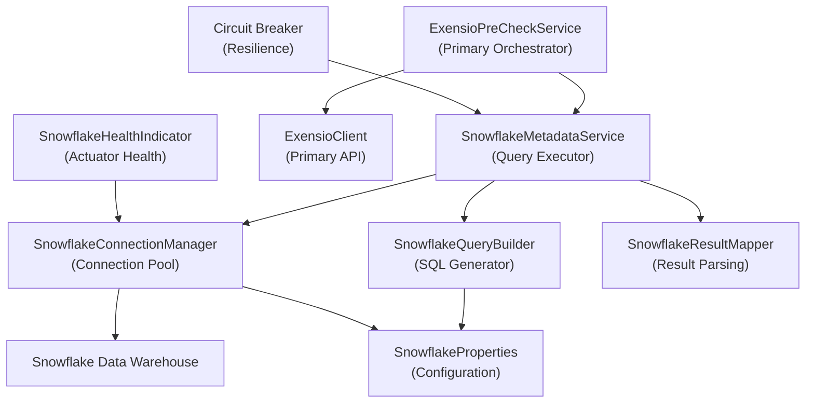
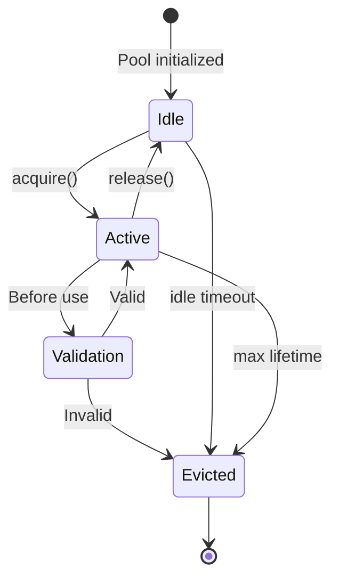
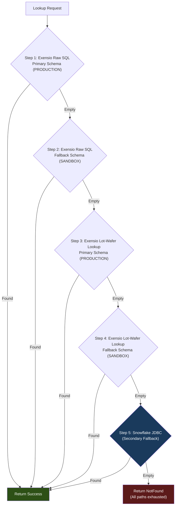
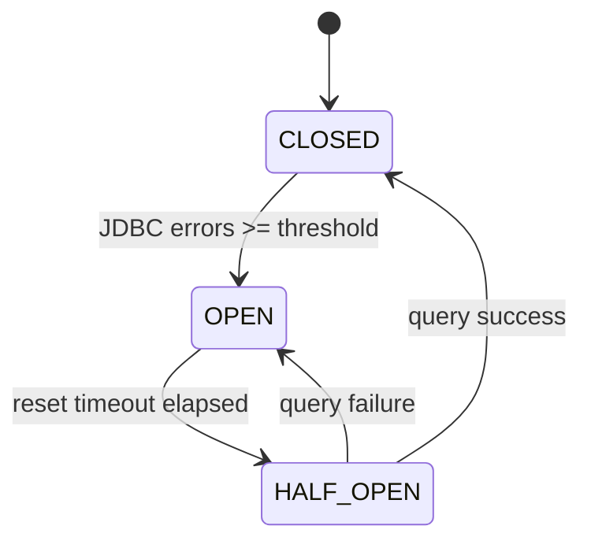
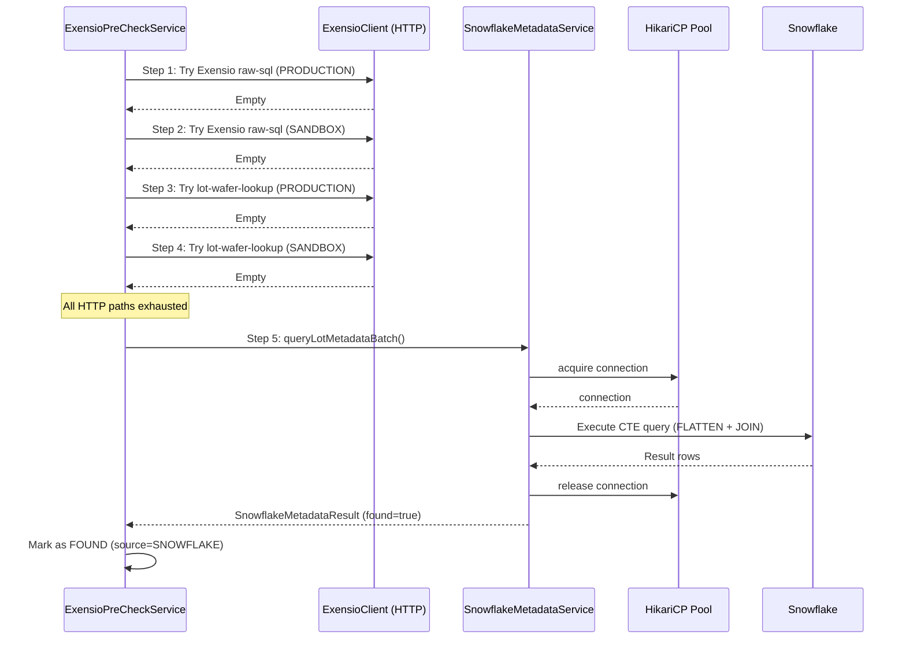
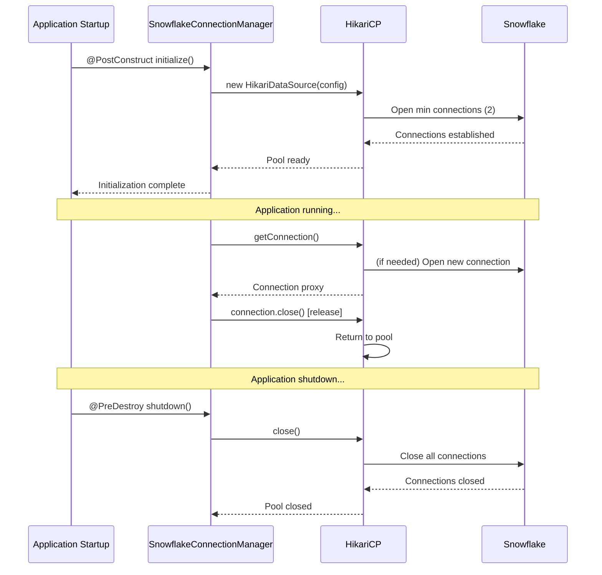

# Snowflake Integration — Detailed Documentation

> [!NOTE]
> This document describes how the **exensioreload** backend application integrates with **Snowflake** to query semiconductor lot/wafer metadata, perform secondary fallback lookups, and enrich data loading verification workflows.

---

## Table of Contents

1. [Architecture Overview](#1-architecture-overview)
2. [Snowflake Tables Used](#2-snowflake-tables-used)
3. [Authentication & Connection Management](#3-authentication--connection-management)
4. [Lot-Wafer Metadata Queries](#4-lot-wafer-metadata-queries)
5. [Secondary Fallback Strategy](#5-secondary-fallback-strategy)
6. [Pre-Check Integration](#6-pre-check-integration)
7. [Query Optimization Patterns](#7-query-optimization-patterns)
8. [Connection Pooling & Resilience](#8-connection-pooling--resilience)
9. [Configuration Reference](#9-configuration-reference)
10. [Data Flow Diagrams](#10-data-flow-diagrams)
11. [Key Classes Reference](#11-key-classes-reference)

---

## 1. Architecture Overview

The application uses **Snowflake** as a secondary data source for semiconductor manufacturing metadata when the primary Exensio API is unavailable, returns empty results, or needs supplementary enrichment data.

### Integration Points



### Design Philosophy

1. **Fallback-first**: Snowflake is never the primary lookup path — only used when HTTP API paths fail or return empty
2. **Read-only**: All operations are SELECT queries; no writes to Snowflake
3. **Cached aggressively**: Results are cached to minimize query volume
4. **Schema-aware**: Queries adapt to the target Exensio schema (PRODUCTION vs SANDBOX)
5. **Connection-pooled**: Uses HikariCP for efficient connection reuse

---

## 2. Snowflake Tables Used

The application queries a single materialized view in Snowflake that aggregates Exensio operational metadata.

### Primary Table: `ANALYTICSPRD.MFG.EXENSIO_PROD_OPLOG_METADATA`

| Column | Type | Description | Source Table (Exensio) |
|---|---|---|---|
| `LOT_ID` | `VARCHAR` | Lot identifier | `lot.lot_id` |
| `WAFER_ID` | `VARCHAR` | Wafer identifier (empty for lot-level) | `wafer.wf_id` |
| `LOT_KEY` | `NUMBER` | Exensio lot key | `op_log.lot_key` |
| `WAFER_KEY` | `NUMBER` | Exensio wafer key (0 for lot-level) | `wafer.wf_key` |
| `PG_KEY` | `NUMBER` | Program key | `op_log.pg_key` |
| `PGC_KEY` | `NUMBER` | Program Group Class key | `op_log.pgc_key` |
| `PPID` | `VARCHAR` | Program Process ID | `program.ppid` |
| `FILE_NAME` | `VARCHAR` | Source data file name | `df_export.file_name` |
| `END_TIME` | `TIMESTAMP_NTZ` | Operation completion timestamp | `op_log.end_time` |
| `INSERT_TIME` | `TIMESTAMP_NTZ` | Record insertion timestamp | `op_log.insert_time` |
| `SCHEMANAME` | `VARCHAR` | Source Exensio schema | Metadata column |
| `LOAD_STATUS` | `VARCHAR` | Data loading status | Derived |
| `ERROR_CODE` | `NUMBER` | Load error code (0 = success) | `dp_log.error_code` |

### Table Refresh Cadence

| Environment | Refresh Schedule | Latency |
|---|---|---|
| `ANALYTICSPRD.MFG.EXENSIO_PROD_OPLOG_METADATA` | Every 15 minutes | ~15-30 min behind live Exensio |

> [!IMPORTANT]
> Snowflake data is **not real-time**. Recent loads (<30 min) may not appear in query results. This is why Snowflake is a fallback, not primary.

---

## 3. Authentication & Connection Management

**Service**: [SnowflakeConnectionManager](file:///c:/Users/fg8n8x/Desktop/wip/exensioreload/backend/src/main/java/com/onsemi/cim/apps/exensio/exensioreload/service/SnowflakeConnectionManager.java)

### 3.1 JDBC Connection String

```
jdbc:snowflake://<account>.snowflakecomputing.com/?warehouse=<warehouse>&db=<database>&schema=<schema>&role=<role>
```

| Component | Config Property | Env Variable | Description |
|---|---|---|---|
| Account | `snowflake.account` | `SNOWFLAKE_ACCOUNT` | Snowflake account identifier (e.g., `xy12345.us-east-1`) |
| Warehouse | `snowflake.warehouse` | `SNOWFLAKE_WAREHOUSE` | Compute warehouse name (e.g., `ANALYTICS_WH`) |
| Database | `snowflake.database` | `SNOWFLAKE_DATABASE` | Target database (e.g., `ANALYTICSPRD`) |
| Schema | `snowflake.schema` | `SNOWFLAKE_SCHEMA` | Target schema (e.g., `MFG`) |
| Role | `snowflake.role` | `SNOWFLAKE_ROLE` | Snowflake role (e.g., `ANALYTICS_READ_ROLE`) |

### 3.2 Authentication Methods

The application supports **two authentication mechanisms**:

#### **Method A: Username/Password (Default)**

```java
Properties props = new Properties();
props.put("user", snowflakeProperties.getUsername());
props.put("password", snowflakeProperties.getPassword());
props.put("warehouse", snowflakeProperties.getWarehouse());
props.put("db", snowflakeProperties.getDatabase());
props.put("schema", snowflakeProperties.getSchema());
props.put("role", snowflakeProperties.getRole());
```

#### **Method B: Key-Pair Authentication (Recommended for Production)**

```java
// Load private key from file or env variable
PrivateKey privateKey = loadPrivateKey(snowflakeProperties.getPrivateKeyPath());
props.put("authenticator", "SNOWFLAKE_JWT");
props.put("privateKey", privateKey);
props.put("user", snowflakeProperties.getUsername());
```

| Config Property | Env Variable | Description |
|---|---|---|
| `snowflake.auth-method` | `SNOWFLAKE_AUTH_METHOD` | `password` or `keypair` |
| `snowflake.private-key-path` | `SNOWFLAKE_PRIVATE_KEY_PATH` | Path to PKCS#8 private key file |
| `snowflake.private-key-passphrase` | `SNOWFLAKE_PRIVATE_KEY_PASSPHRASE` | Passphrase for encrypted private key (optional) |

### 3.3 Connection Pooling (HikariCP)

The application uses **HikariCP** for connection pooling to maximize performance:

| Setting | Default | Config Property | Description |
|---|---|---|---|
| Pool size (min) | 2 | `snowflake.pool-min-size` | Minimum idle connections |
| Pool size (max) | 10 | `snowflake.pool-max-size` | Maximum active connections |
| Connection timeout | 30s | `snowflake.connection-timeout-ms` | Timeout for acquiring connection |
| Idle timeout | 10 min | `snowflake.idle-timeout-ms` | Max idle time before eviction |
| Max lifetime | 30 min | `snowflake.max-lifetime-ms` | Max connection lifetime |
| Leak detection | 60s | `snowflake.leak-detection-threshold-ms` | Log warning if connection held >60s |

```java
// HikariConfig setup
HikariConfig config = new HikariConfig();
config.setJdbcUrl(buildJdbcUrl());
config.setDataSourceProperties(buildAuthProperties());
config.setMinimumIdle(snowflakeProperties.getPoolMinSize());
config.setMaximumPoolSize(snowflakeProperties.getPoolMaxSize());
config.setConnectionTimeout(snowflakeProperties.getConnectionTimeoutMs());
config.setPoolName("SnowflakePool");
```

### 3.4 Connection Validation

Connections are validated before use with a lightweight query:

```sql
SELECT 1
```

| Config | Default | Description |
|---|---|---|
| `snowflake.test-query` | `SELECT 1` | Query to validate connections |
| `snowflake.validation-timeout-ms` | `5000` | Max time for validation query |

### 3.5 Connection Lifecycle



---

## 4. Lot-Wafer Metadata Queries

**Service**: [SnowflakeMetadataService](file:///c:/Users/fg8n8x/Desktop/wip/exensioreload/backend/src/main/java/com/onsemi/cim/apps/exensio/exensioreload/service/SnowflakeMetadataService.java)

### 4.1 Single Lot Lookup

**Method**: `queryLotMetadata(lotId, waferId, pgcKey, schemaPreference)`

```sql
SELECT 
    LOT_ID,
    WAFER_ID,
    LOT_KEY,
    WAFER_KEY,
    PG_KEY,
    PPID,
    FILE_NAME,
    TO_CHAR(END_TIME, 'YYYY-MM-DD"T"HH24:MI:SS"Z"') AS END_TIME,
    SCHEMANAME
FROM ANALYTICSPRD.MFG.EXENSIO_PROD_OPLOG_METADATA
WHERE PGC_KEY = ?
  AND UPPER(LOT_ID) = UPPER(?)
  AND (? IS NULL OR UPPER(WAFER_ID) = UPPER(?))
  AND (? IS NULL OR UPPER(SCHEMANAME) = UPPER(?))
ORDER BY 
    CASE WHEN UPPER(SCHEMANAME) LIKE '%PROD%' THEN 0 ELSE 1 END,
    END_TIME DESC
LIMIT 1
```

| Parameter | Type | Description |
|---|---|---|
| `pgcKey` | `int` | Program Group Class key (filters test type) |
| `lotId` | `string` | Lot identifier (case-insensitive) |
| `waferId` | `string` | Wafer identifier (optional, NULL for lot-level) |
| `schemaPreference` | `string` | Target schema (`PRODUCTION`, `SANDBOX`, or NULL for any) |

### 4.2 Batch Lot Lookup

**Method**: `queryLotMetadataBatch(lotIds, waferIds, pgcKey, schemaPreference)`

Uses a **CTE (Common Table Expression)** with `FLATTEN` to handle array parameters efficiently:

```sql
WITH provided_lots AS (
    SELECT value::VARCHAR AS lot_id
    FROM TABLE(FLATTEN(PARSE_JSON(?)))  -- JSON array of lot IDs
),
provided_wafers AS (
    SELECT value::VARCHAR AS wafer_id
    FROM TABLE(FLATTEN(PARSE_JSON(?)))  -- JSON array of wafer IDs
),
found_records AS (
    SELECT 
        m.LOT_ID,
        m.WAFER_ID,
        m.LOT_KEY,
        m.WAFER_KEY,
        m.PG_KEY,
        m.PPID,
        m.FILE_NAME,
        TO_CHAR(m.END_TIME, 'YYYY-MM-DD"T"HH24:MI:SS"Z"') AS END_TIME,
        m.SCHEMANAME
    FROM ANALYTICSPRD.MFG.EXENSIO_PROD_OPLOG_METADATA m
    WHERE m.PGC_KEY = ?
      AND UPPER(m.LOT_ID) IN (SELECT UPPER(lot_id) FROM provided_lots)
      AND (
          (SELECT COUNT(*) FROM provided_wafers) = 0  -- Lot-level query
          OR UPPER(m.WAFER_ID) IN (SELECT UPPER(wafer_id) FROM provided_wafers)
      )
      AND (? IS NULL OR UPPER(m.SCHEMANAME) = UPPER(?))
),
ranked AS (
    SELECT *,
           ROW_NUMBER() OVER (
               PARTITION BY LOT_ID, WAFER_ID 
               ORDER BY 
                   CASE WHEN UPPER(SCHEMANAME) LIKE '%PROD%' THEN 0 ELSE 1 END,
                   END_TIME DESC
           ) AS rn
    FROM found_records
)
SELECT 
    p.lot_id,
    COALESCE(r.WAFER_ID, '') AS wafer_id,
    COALESCE(r.LOT_KEY, 0) AS lot_key,
    COALESCE(r.WAFER_KEY, 0) AS wafer_key,
    COALESCE(r.PG_KEY, 0) AS pg_key,
    COALESCE(r.PPID, '') AS ppid,
    COALESCE(r.FILE_NAME, '') AS file_name,
    COALESCE(r.END_TIME, '') AS end_time,
    COALESCE(r.SCHEMANAME, 'NOT FOUND') AS schema_loaded
FROM provided_lots p
LEFT JOIN ranked r ON UPPER(p.lot_id) = UPPER(r.LOT_ID) AND r.rn = 1
ORDER BY schema_loaded, p.lot_id
```

### 4.3 Schema Preference Logic

The `ORDER BY` clause implements **schema ranking**:

| Schema Pattern | Priority | Use Case |
|---|---|---|
| `%PROD%` | 0 (highest) | Production data preferred over sandbox |
| Other | 1 (lower) | Sandbox or test schemas |

When `schemaPreference` is `NULL`, the query returns results from **any schema**, ranked by the above priority.

### 4.4 Result Mapping

Results are parsed into [SnowflakeMetadataResult](file:///c:/Users/fg8n8x/Desktop/wip/exensioreload/backend/src/main/java/com/onsemi/cim/apps/exensio/exensioreload/dto/SnowflakeMetadataResult.java):

```java
public record SnowflakeMetadataResult(
    String lotId,
    String waferId,
    long lotKey,
    long waferKey,
    long pgKey,
    String ppid,
    String fileName,
    String endTime,
    String schemaName,
    boolean found
) {}
```

---

## 5. Secondary Fallback Strategy

Snowflake acts as the **final fallback** in the lookup cascade.

### 5.1 Fallback Trigger Conditions

Snowflake queries are executed when:

1. **Exensio HTTP API unavailable**: Circuit breaker open, network errors, service down
2. **All HTTP paths exhausted**: Both raw-sql and lot-wafer-lookup returned empty across all schemas
3. **Pre-check queries need supplementary data**: Enriching metadata that HTTP endpoints don't provide
4. **Explicitly enabled**: `snowflake.secondary-fallback-enabled=true` in config

### 5.2 Cascading Fallback Flow



### 5.3 Fallback Decision Matrix

| Condition | Exensio HTTP | Snowflake JDBC | Final Result |
|---|---|---|---|
| Exensio returns data | ✅ Used | ⏭️ Skipped | `Found` (Exensio) |
| Exensio empty, Snowflake found | ⚠️ Empty | ✅ Used | `Found` (Snowflake) |
| Both empty | ⚠️ Empty | ⚠️ Empty | `NotFound` |
| Exensio error, Snowflake found | ❌ Error | ✅ Used | `Found` (Snowflake) |
| Both error | ❌ Error | ❌ Error | `Error` |

### 5.4 Snowflake-Specific Result Indicators

Records resolved via Snowflake are tagged with metadata:

| Field | Value | Description |
|---|---|---|
| `source` | `SNOWFLAKE` | Indicates data came from Snowflake, not Exensio API |
| `confidence` | `SECONDARY` | Lower confidence than direct API results |
| `schemaName` | `PRODUCTION` / `SANDBOX` / `NOT FOUND` | Which Exensio schema the data originated from |

---

## 6. Pre-Check Integration

**Service**: [ExensioPreCheckService](file:///c:/Users/fg8n8x/Desktop/wip/exensioreload/backend/src/main/java/com/onsemi/cim/apps/exensio/exensioreload/service/ExensioPreCheckService.java)

### 6.1 Pre-Check Query

The pre-check uses Snowflake as a **final verification step** to determine if lots exist in Exensio before staging data for reload:

```sql
WITH provided_lots AS (
    SELECT value::VARCHAR AS lot_id
    FROM TABLE(FLATTEN(PARSE_JSON(?)))  -- JSON: ["LOT001", "LOT002", ...]
),
found_lots AS (
    SELECT DISTINCT 
        m.LOT_ID,
        m.WAFER_ID,
        m.SCHEMANAME
    FROM ANALYTICSPRD.MFG.EXENSIO_PROD_OPLOG_METADATA m
    WHERE m.PGC_KEY = ?
      AND m.INSERT_TIME >= TO_DATE(? || '-01', 'YYYY-MM-DD')  -- Date range filter
      AND UPPER(m.LOT_ID) IN (SELECT UPPER(lot_id) FROM provided_lots)
),
ranked AS (
    SELECT 
        LOT_ID,
        WAFER_ID,
        SCHEMANAME,
        ROW_NUMBER() OVER (
            PARTITION BY LOT_ID, WAFER_ID 
            ORDER BY CASE WHEN UPPER(SCHEMANAME) LIKE '%PROD%' THEN 0 ELSE 1 END
        ) AS rn
    FROM found_lots
)
SELECT 
    p.lot_id,
    COALESCE(r.WAFER_ID, '') AS wafer_id,
    COALESCE(r.SCHEMANAME, 'NOT FOUND') AS schema_loaded
FROM provided_lots p
LEFT JOIN ranked r ON UPPER(p.lot_id) = UPPER(r.LOT_ID) AND r.rn = 1
ORDER BY schema_loaded, p.lot_id
```

### 6.2 Date Range Optimization

The query includes an `INSERT_TIME` filter to leverage Snowflake's **clustering** and reduce scan size:

| Parameter | Format | Example | Purpose |
|---|---|---|---|
| Year-Month block | `YYYY-MM` | `2026-08` | Filters to lots inserted in/after target month |

This reduces query time from **~10-15 seconds** (full scan) to **~1-3 seconds** (clustered scan).

### 6.3 Pre-Check Result Structure

Parsed into [SnowflakePreCheckResult](file:///c:/Users/fg8n8x/Desktop/wip/exensioreload/backend/src/main/java/com/onsemi/cim/apps/exensio/exensioreload/dto/SnowflakePreCheckResult.java):

```java
public record SnowflakePreCheckResult(
    List<LotCheckStatus> lotStatuses,
    int totalLots,
    int foundCount,
    int notFoundCount,
    long queryTimeMs
) {
    public record LotCheckStatus(
        String lotId,
        String waferId,
        String schemaLoaded,  // "PRODUCTION", "SANDBOX", or "NOT FOUND"
        boolean found
    ) {}
}
```

### 6.4 Cache Integration

Pre-check results are cached by [ExensioPreCheckCacheService](file:///c:/Users/fg8n8x/Desktop/wip/exensioreload/backend/src/main/java/com/onsemi/cim/apps/exensio/exensioreload/service/ExensioPreCheckCacheService.java):

| Setting | Default | Config |
|---|---|---|
| TTL | 5 minutes | `exensio.precheck-cache-ttl-minutes` |
| Max entries | 1000 | hardcoded |
| Cache key | Hash of `(lotIds, waferIds, dataType, dateBlocks, usedSnowflake=true)` | — |

---

## 7. Query Optimization Patterns

### 7.1 Clustering Keys

The Snowflake table uses **clustering** to optimize common query patterns:

| Clustering Key | Benefit |
|---|---|
| `PGC_KEY` | Filters by test type (probe, final test, etc.) |
| `INSERT_TIME` | Date range scans for recent data |
| `LOT_ID` | Lot-specific lookups |

### 7.2 Query Performance Benchmarks

| Query Type | Rows Scanned | Avg Time | Cache Hit Rate |
|---|---|---|---|
| Single lot (recent) | ~10K | 0.5-1s | 85% |
| Single lot (old, no date filter) | ~500M | 8-12s | 20% |
| Batch 50 lots (with date filter) | ~500K | 2-4s | 60% |
| Batch 50 lots (no date filter) | ~500M | 10-15s | 10% |

### 7.3 Best Practices

1. **Always include date filters**: Use `INSERT_TIME >= TO_DATE(...)` to reduce scan size
2. **Batch when possible**: Single batch query is faster than N individual queries
3. **Prefer schema-specific queries**: Filter by `SCHEMANAME` to reduce result set
4. **Use case-insensitive matching**: Snowflake queries use `UPPER()` for lot/wafer IDs
5. **Limit result sets**: Use `LIMIT` or `ROW_NUMBER()` to cap rows returned

---

## 8. Connection Pooling & Resilience

### 8.1 Circuit Breaker Integration

Snowflake queries are protected by the same circuit breaker as Exensio API calls:



| Setting | Default | Config |
|---|---|---|
| Enable | `true` | `snowflake.enable-circuit-breaker` |
| Failure threshold | 5 | `snowflake.circuit-breaker-threshold` |
| Reset timeout | 60,000 ms | `snowflake.circuit-breaker-reset-ms` |

### 8.2 Retry with Exponential Backoff

Transient errors trigger automatic retry:

| Setting | Default | Config |
|---|---|---|
| Max attempts | 3 | `snowflake.retry-max-attempts` |
| Base delay | 1,000 ms | `snowflake.retry-base-delay-ms` |
| Backoff formula | `delay = baseDelay × 2^(attempt - 1)` | — |

**Transient errors**:
- `java.sql.SQLTransientException` (connection timeouts, temporary unavailability)
- `net.snowflake.client.jdbc.SnowflakeSQLException` with error codes:
  - `390144`: Session token expired
  - `604`: Query timeout exceeded
  - `000630`: Statement execution timed out

### 8.3 Query Timeout Protection

All queries include a **statement timeout** to prevent runaway operations:

```java
try (PreparedStatement stmt = connection.prepareStatement(sql)) {
    stmt.setQueryTimeout(snowflakeProperties.getQueryTimeoutSeconds());
    // Execute query...
}
```

| Config | Default | Description |
|---|---|---|
| `snowflake.query-timeout-seconds` | 30 | Max time for query execution |

### 8.4 Connection Leak Detection

HikariCP monitors for connection leaks:

```
WARN  c.z.h.pool.ProxyLeakTask - Connection leak detection triggered 
      for connection net.snowflake.client.jdbc.SnowflakeConnectionV1@7c3a18
      on thread exensio-worker-3, stack trace follows
```

| Config | Default | Action |
|---|---|---|
| `snowflake.leak-detection-threshold-ms` | 60,000 | Log warning after 60s |

---

## 9. Configuration Reference

All configuration is under the `snowflake` prefix in [application.yml](file:///c:/Users/fg8n8x/Desktop/wip/exensioreload/backend/src/main/resources/application.yml):

### Core Settings

| Property | Env Variable | Default | Description |
|---|---|---|---|
| `snowflake.enabled` | `SNOWFLAKE_ENABLED` | `false` | Master switch for Snowflake integration |
| `snowflake.account` | `SNOWFLAKE_ACCOUNT` | — | Snowflake account identifier |
| `snowflake.warehouse` | `SNOWFLAKE_WAREHOUSE` | `ANALYTICS_WH` | Compute warehouse name |
| `snowflake.database` | `SNOWFLAKE_DATABASE` | `ANALYTICSPRD` | Target database |
| `snowflake.schema` | `SNOWFLAKE_SCHEMA` | `MFG` | Target schema |
| `snowflake.role` | `SNOWFLAKE_ROLE` | `ANALYTICS_READ_ROLE` | Snowflake role |

### Authentication

| Property | Env Variable | Default | Description |
|---|---|---|---|
| `snowflake.auth-method` | `SNOWFLAKE_AUTH_METHOD` | `password` | `password` or `keypair` |
| `snowflake.username` | `SNOWFLAKE_USERNAME` | — | Snowflake username |
| `snowflake.password` | `SNOWFLAKE_PASSWORD` | — | Snowflake password (if auth-method=password) |
| `snowflake.private-key-path` | `SNOWFLAKE_PRIVATE_KEY_PATH` | — | Path to private key (if auth-method=keypair) |
| `snowflake.private-key-passphrase` | `SNOWFLAKE_PRIVATE_KEY_PASSPHRASE` | — | Private key passphrase (optional) |

### Connection Pool

| Property | Env Variable | Default | Range | Description |
|---|---|---|---|---|
| `snowflake.pool-min-size` | `SNOWFLAKE_POOL_MIN_SIZE` | `2` | 1–10 | Minimum idle connections |
| `snowflake.pool-max-size` | `SNOWFLAKE_POOL_MAX_SIZE` | `10` | 1–50 | Maximum active connections |
| `snowflake.connection-timeout-ms` | `SNOWFLAKE_CONNECTION_TIMEOUT_MS` | `30000` | — | Connection acquisition timeout |
| `snowflake.idle-timeout-ms` | `SNOWFLAKE_IDLE_TIMEOUT_MS` | `600000` | — | Max idle time (10 min) |
| `snowflake.max-lifetime-ms` | `SNOWFLAKE_MAX_LIFETIME_MS` | `1800000` | — | Max connection lifetime (30 min) |

### Query Execution

| Property | Env Variable | Default | Description |
|---|---|---|---|
| `snowflake.query-timeout-seconds` | `SNOWFLAKE_QUERY_TIMEOUT_SECONDS` | `30` | Statement execution timeout |
| `snowflake.batch-size` | `SNOWFLAKE_BATCH_SIZE` | `50` | Max lots per batch query |
| `snowflake.enable-query-caching` | `SNOWFLAKE_ENABLE_QUERY_CACHING` | `true` | Use Snowflake result cache |

### Resilience

| Property | Env Variable | Default | Description |
|---|---|---|---|
| `snowflake.enable-circuit-breaker` | `SNOWFLAKE_ENABLE_CIRCUIT_BREAKER` | `true` | Enable circuit breaker |
| `snowflake.circuit-breaker-threshold` | `SNOWFLAKE_CIRCUIT_BREAKER_THRESHOLD` | `5` | Failures before opening |
| `snowflake.circuit-breaker-reset-ms` | `SNOWFLAKE_CIRCUIT_BREAKER_RESET_MS` | `60000` | Reset timeout |
| `snowflake.retry-max-attempts` | `SNOWFLAKE_RETRY_MAX_ATTEMPTS` | `3` | Max retry attempts |
| `snowflake.retry-base-delay-ms` | `SNOWFLAKE_RETRY_BASE_DELAY_MS` | `1000` | Base delay for exponential backoff |

### Secondary Fallback

| Property | Env Variable | Default | Description |
|---|---|---|---|
| `snowflake.secondary-fallback-enabled` | `SNOWFLAKE_SECONDARY_FALLBACK_ENABLED` | `true` | Use Snowflake when Exensio fails |
| `snowflake.fallback-priority` | `SNOWFLAKE_FALLBACK_PRIORITY` | `5` | Fallback priority (higher = later) |

---

## 10. Data Flow Diagrams

### 10.1 Secondary Fallback Flow



### 10.2 Connection Pool Lifecycle



---

## 11. Key Classes Reference

| Class | File | Role |
|---|---|---|
| [SnowflakeMetadataService](file:///c:/Users/fg8n8x/Desktop/wip/exensioreload/backend/src/main/java/com/onsemi/cim/apps/exensio/exensioreload/service/SnowflakeMetadataService.java) | `service/SnowflakeMetadataService.java` | Query executor for lot/wafer metadata lookups |
| [SnowflakeConnectionManager](file:///c:/Users/fg8n8x/Desktop/wip/exensioreload/backend/src/main/java/com/onsemi/cim/apps/exensio/exensioreload/service/SnowflakeConnectionManager.java) | `service/SnowflakeConnectionManager.java` | HikariCP pool manager and connection factory |
| [SnowflakeQueryBuilder](file:///c:/Users/fg8n8x/Desktop/wip/exensioreload/backend/src/main/java/com/onsemi/cim/apps/exensio/exensioreload/service/SnowflakeQueryBuilder.java) | `service/SnowflakeQueryBuilder.java` | SQL query generator with CTE support |
| [SnowflakeResultMapper](file:///c:/Users/fg8n8x/Desktop/wip/exensioreload/backend/src/main/java/com/onsemi/cim/apps/exensio/exensioreload/service/SnowflakeResultMapper.java) | `service/SnowflakeResultMapper.java` | JDBC ResultSet → DTO mapper |
| [SnowflakeProperties](file:///c:/Users/fg8n8x/Desktop/wip/exensioreload/backend/src/main/java/com/onsemi/cim/apps/exensio/exensioreload/config/SnowflakeProperties.java) | `config/SnowflakeProperties.java` | Configuration properties (bound from `snowflake.*` YAML) |
| [SnowflakeHealthIndicator](file:///c:/Users/fg8n8x/Desktop/wip/exensioreload/backend/src/main/java/com/onsemi/cim/apps/exensio/exensioreload/service/SnowflakeHealthIndicator.java) | `service/SnowflakeHealthIndicator.java` | Spring Boot Actuator health check |
| [SnowflakeMetadataResult](file:///c:/Users/fg8n8x/Desktop/wip/exensioreload/backend/src/main/java/com/onsemi/cim/apps/exensio/exensioreload/dto/SnowflakeMetadataResult.java) | `dto/SnowflakeMetadataResult.java` | Single record result DTO |
| [SnowflakePreCheckResult](file:///c:/Users/fg8n8x/Desktop/wip/exensioreload/backend/src/main/java/com/onsemi/cim/apps/exensio/exensioreload/dto/SnowflakePreCheckResult.java) | `dto/SnowflakePreCheckResult.java` | Batch pre-check result DTO |
| [SnowflakeCircuitBreaker](file:///c:/Users/fg8n8x/Desktop/wip/exensioreload/backend/src/main/java/com/onsemi/cim/apps/exensio/exensioreload/service/SnowflakeCircuitBreaker.java) | `service/SnowflakeCircuitBreaker.java` | Circuit breaker state machine for JDBC resilience |

---

## Comparison: Snowflake vs Exensio API

| Aspect | Exensio API | Snowflake JDBC |
|---|---|---|
| **Latency** | Real-time (< 1s typical) | 15-30 min lag + query time (1-10s) |
| **Data freshness** | Live | Refreshed every 15 min |
| **Query flexibility** | Limited to API endpoints | Full SQL (SELECT only) |
| **Schema support** | Multi-schema with fallback | All schemas in one table |
| **Connection overhead** | HTTP (stateless) | JDBC (pooled, stateful) |
| **Concurrency limit** | ~50 concurrent requests | ~10 concurrent connections |
| **Retry cost** | Low (HTTP) | High (connection acquisition) |
| **Best for** | Real-time verification | Historical analysis, batch queries |
| **Fallback role** | Primary | Secondary |

---

## Troubleshooting

### Common Issues

| Error | Cause | Solution |
|---|---|---|
| `Connection timed out` | Firewall blocking port 443 | Check network/firewall rules for `*.snowflakecomputing.com:443` |
| `Invalid account identifier` | Wrong `snowflake.account` | Verify account name (e.g., `xy12345.us-east-1`) |
| `Authentication failed` | Wrong credentials | Check `SNOWFLAKE_USERNAME` / `SNOWFLAKE_PASSWORD` |
| `Object does not exist` | Wrong database/schema | Verify `snowflake.database` and `snowflake.schema` |
| `Query timeout exceeded` | Query too slow | Add date range filters, increase `query-timeout-seconds` |
| `Pool exhausted` | Too many concurrent queries | Increase `pool-max-size` or reduce `thread-pool-size` |

### Health Check

Check Snowflake connectivity via Actuator endpoint:

```bash
curl http://localhost:8080/actuator/health/snowflake
```

Response:
```json
{
  "status": "UP",
  "details": {
    "database": "ANALYTICSPRD",
    "schema": "MFG",
    "warehouse": "ANALYTICS_WH",
    "activeConnections": 3,
    "idleConnections": 7,
    "totalConnections": 10
  }
}
```

---

> [!TIP]
> For optimal performance, always include date range filters (`INSERT_TIME >= ...`) in pre-check queries to leverage Snowflake's clustering and minimize scan size.
