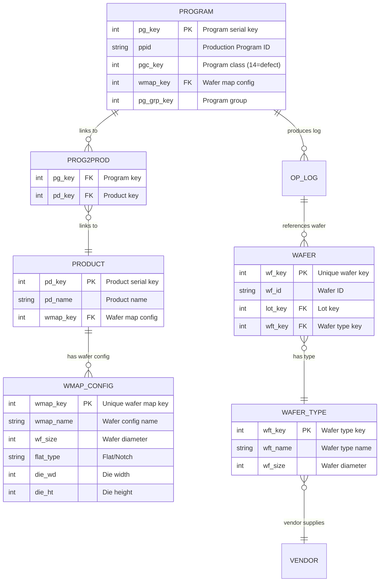
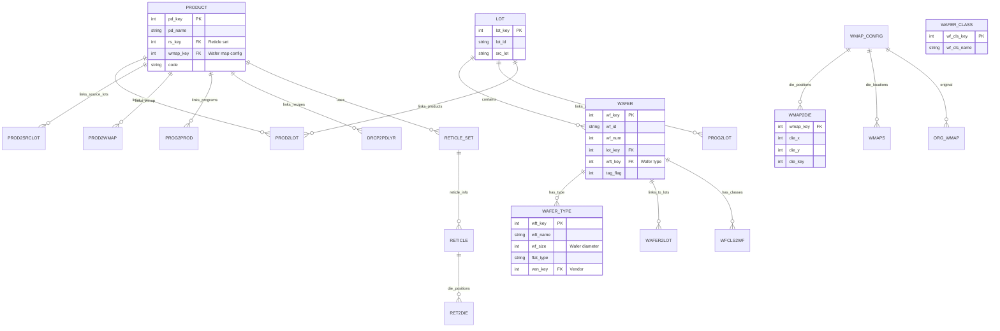
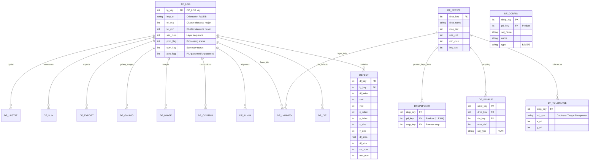

# Exensio dataPOWER Schema — Visual Map

> Generated from Data Dictionary Manual (Release 9.0+)

---

## 1. Core Defect Loading Path (GetSubstrateSize Chain)



### GetSubstrateSize Resolution Order

| Step | Table | Field | Purpose |
|------|-------|-------|---------|
| 1 | **PROGRAM** | pg_key = 1515275 | Identifies the defect program |
| 2 | **PROG2PROD** | pg_key → pd_key | Finds ALL products linked to this program |
| 3 | **PRODUCT** | pd_key → wmap_key | Gets each product's wafer map config |
| 4 | **WMAP_CONFIG** | wf_size | **Wafer diameter — the substrate size** |
| ⚠ | COLLECT | DISTINCT wf_size | If >1 unique value → **fatal error** |

---

## 2. Full Schema — All Tables by Section

### 2a. Log Tables (Section 3.0)

```mermaid
erDiagram
    OP_LOG ||--o{ WF_LOG : "wafer log"
    OP_LOG ||--o{ BIN_LOG : "bin log"
    OP_LOG ||--o{ DEFECT : "defect records"
    OP_LOG ||--o{ DF_LOG : "defect log"
    OP_LOG ||--o{ DF_SUM : "defect summary"
    OP_LOG ||--o{ DF_UPSTAT : "defect upstat"
    OP_LOG ||--o{ ARCHIVE_LOG : "archive"

    OP_LOG {
        int lg_key PK "Log serial key"
        int pg_key FK "Program key"
        int wf_key FK "Wafer key (metrology)"
        int lot_key FK "Lot key"
        int pd_key FK "Product key"
        int step_key FK "Process step"
        int rcp_key FK "Recipe key"
        int em_key FK "Operator (people)"
        int pgc_key FK "Program class"
        int stage_key FK "Tech stage"
        int pr_key FK "Process key"
        int eqkey1..6 FKs "Equipment (6 slots)"
        datetime start_time "Start time"
        datetime end_time "End time"
        int row_cnt "Row count"
        string test_mode "Production/Rework/etc"
        string src_lot "Source lot"
    }

    WF_LOG {
        int lg_key FK "OP_LOG key"
        int wf_key FK "Wafer key"
    }

    BIN_LOG {
        int lg_key FK "OP_LOG key"
        int pgc_key FK "Program class"
    }
```

### 2b. Program & Related Tables (Section 4.0)

```mermaid
erDiagram
    PROGRAM ||--o{ PROG2PROD : links_to_products
    PROGRAM ||--o{ PROG2STEP : links_to_steps
    PROGRAM ||--o{ PROG2EQUIP : links_to_equipment
    PROGRAM ||--o{ PROG2LOT : links_to_lots
    PROGRAM ||--o{ PROG2TECH : links_to_technologies
    PROGRAM ||--o{ PROG2FAM : links_to_families
    PROGRAM ||--o{ PROG2PROC : links_to_processes
    PROGRAM ||--o{ PROG2STAGE : links_to_stages
    PROGRAM ||--o{ PROG2SRCLOT : links_to_source_lots
    PROGRAM ||--o{ PROG2CUST : links_to_customers
    PROGRAM ||--o{ PROG_REV : has_revisions
    PROGRAM ||--o{ DEF_* : "dynamic (per pg_key)"
    PROGRAM ||--o{ LIM_* : "dynamic (per pg_key)"
    PROGRAM ||--o{ RES_* : "dynamic (per pg_key)"
    PROGRAM ||--o{ WAF_* : "dynamic (per pg_key)"
    PROGRAM ||--o{ LOT_* : "dynamic (per pg_key)"

    PROG_CLASS ||--o{ PROGRAM : classifies
    PROGRAM_GROUP ||--o{ PROGRAM : groups
    EQUIP_TYPE ||--o{ PROGRAM : equipment_type
    WMAP_CONFIG ||--o{ PROGRAM : wafer_config

    PROGRAM_GROUP {
        int pg_grp_key PK
        string pg_grp_name
    }

    PROG_CLASS {
        int pgc_key PK "Class key (1-32 reserved)"
        string pgc_name "Class name"
        int pgc_type "0=static,1=semi-dynamic,2=dynamic"
    }

    PROG2STEP { int pg_key FK, int step_key FK }
    PROG2PROD { int pg_key FK, int pd_key FK }
    PROG2EQUIP { int pg_key FK, int eq_key FK }
    PROG2LOT { int pg_key FK, int lot_key FK }
    PROG2TECH { int pg_key FK, int tech_key FK }
    PROG2FAM { int pg_key FK, int fam_key FK }
    PROG2PROC { int pg_key FK, int pr_key FK }

    PROG_REV {
        int prev_key PK
        int pg_key FK
        string revision
        date release_date
    }

    DEF__pg_key_ { int test_index PK, string cond0..n, real hist_mean, real hist_stdev, int hist_count }
```

### 2c. Product, Lot, Wafer Tables (Section 6.0)



### 2d. DefectMAP Tables (Section 10.0)



---

## 3. Complete Table Catalog by Section

### Section 3 — Log Tables
| # | Table | Key | Description |
|---|-------|-----|-------------|
| 3.1 | **OP_LOG** | lg_key (serial) | Primary log — one entry per raw data file processed |
| 3.2 | **WF_LOG** | lg_key + wf_key | Wafer-level log (not used by defect reader) |
| 3.3 | **LEH_LOG** | (composite) | LEH data log |
| 3.4 | **WEH_LOG** | (composite) | WEH data log |
| 3.5 | **META_LOG** | (composite) | Metadata log |

### Section 4 — Program Tables
| # | Table | Key | Description |
|---|-------|-----|-------------|
| 4.3 | **PROGRAM** | pg_key | Central program record — PPID, wmap_key, pgc_key |
| 4.4 | **PROGRAM_GROUP** | pg_grp_key | Program grouping |
| 4.5 | **PROG_DATATYPE** | pg_key + dty_key | Data types per program |
| 4.6 | **PROG2PROC** | pg_key + pr_key | Program → Process |
| 4.7 | **PROG2FAM** | pg_key + fam_key | Program → Family |
| 4.8 | **PROG2LOT** | pg_key + lot_key | Program → Lot |
| 4.9 | **PROG2EQUIP** | pg_key + eq_key | Program → Equipment |
| 4.10 | **PROG2TECH** | pg_key + tech_key | Program → Technology |
| 4.11 | **PROG2STAGE** | pg_key + stage_key | Program → Tech Stage |
| 4.12 | **PROG2SRCLOT** | pg_key + lot_key | Program → Source Lot |
| 4.13 | **PROG2CUST** | pg_key + cust_key | Program → Customer |
| 4.14 | **PROG2PROD** | pg_key + pd_key | **Program → Product** (key for diagnosis) |
| 4.15 | **PROG2STEP** | pg_key + step_key | Program → Process Step |
| 4.16 | **PROG2PKG** | pg_key + pkg_key | Program → Package |
| 4.17 | **PROG_REV** | prev_key | Program revision history |
| 4.18 | **DEF_{pg_key}** | test_index | Dynamic — test definitions per program |
| 4.19 | **LIM_{pg_key}** | test_index + sbin | Dynamic — limits per program |
| 4.20 | **LIM_LOG** | (serial) | Limit change log |
| 4.21 | **RES_{pg_key}** | lg_key + ... | Dynamic — raw results per program |
| 4.22 | **WAF_{pg_key}** | wf_key | Dynamic — wafer summary per program |
| 4.23 | **LOT_{pg_key}** | lot_key | Dynamic — lot summary per program |
| 4.24 | **STYPE** | (serial) | Summary types |
| 4.25 | **BIN_LOG** | lg_key | Bin summary per log entry |
| 4.26-28 | **HIST_BIN** | pg_key | Historical bin summaries |

### Section 5 — Program Class
| # | Table | Key | Description |
|---|-------|-----|-------------|
| 5.1 | **PROG_CLASS** | pgc_key | Program class definitions (14 = defect) |

### Section 6 — Product, Lot, Wafer
| # | Table | Key | Description |
|---|-------|-----|-------------|
| 6.1 | **PRODUCT** | pd_key | Product — die type, links to wmap_config |
| 6.2 | **PROD2LOT** | pd_key + lot_key | Product → Lot |
| 6.3 | **PROD2SRCLOT** | pd_key + lot_key | Product → Source Lot |
| 6.4 | **PROD2WMAP** | pd_key + wmap_key | Product → WMAP |
| 6.5 | **WMAP_CONFIG** | wmap_key | **Wafer map config — wf_size (wafer diameter)** |
| 6.6 | **ORG_WMAP** | wmap_key | Original wafer map |
| 6.7 | **WMAPS** | wmap_key | Die location data |
| 6.18 | **WAFER** | wf_key | Wafer record |
| 6.19 | **WAFER_CLASS** | wf_cls_key | Wafer classification |
| 6.21 | **WAFER_TYPE** | wft_key | Wafer type (also has wf_size) |
| 6.23 | **WAFER2LOT** | wf_key + lot_key | Wafer → Lot |
| 6.24 | **WMAP2DIE** | wmap_key + die | Die positions in wafer map |

### Section 10 — DefectMAP Tables
| # | Table | Key | Description |
|---|-------|-----|-------------|
| 10.1 | **DF_LOG** | lg_key | Defect log — wafer inspection info |
| 10.3 | **DF_TEST** | test_key | Inspection test info |
| 10.4 | **DFL2TEST** | lg_key + test_key | Defect log → Test |
| 10.5 | **DEFECT** | df_key | Individual defect records |
| 10.6 | **DF_TYPES** | (serial) | Defect type definitions |
| 10.7 | **DF_METHOD** | (serial) | Defect method definitions |
| 10.8 | **DF_CLASS** | dfc_key | Defect class definitions |
| 10.9 | **DEF2CLASS** | df_key + dfc_key | Defect → Class mapping |
| 10.10 | **DF_DIE** | lg_key | Die-level defect info |
| 10.15 | **DF_RECIPE** | drcp_key | **Defect recipe** (drcp_name, max_def) |
| 10.16 | **DF_SAMPLE** | smpl_key | Sampling rules per recipe |
| 10.17 | **DF_TOLERANCE** | drcp_key + tol_type | Clustering tolerances |
| 10.18 | **DRCP2PDLYR** | drcp_key + pd_key + step_key | Recipe → Product/Layer |
| 10.19 | **DF_CONTRIB** | lg_key + step_key | Adder defect contributions |
| 10.20 | **DF_EXCLUDE** | pd_key | Defect exclusion rules |
| 10.21 | **DF_LYRINFO** | drcp_key | Layer defect info |
| 10.22 | **DF_LOCK** | (serial) | Defect data locks |
| 10.23 | **DF_BIN** | pg_key | Defect size bin definitions |
| 10.24 | **DF_CONFIG** | dfcfg_key | Block/size bin config (per product) |
| 10.25 | **DF_EXPORT** | dfexp_key | Defect export records |

### Section 12 — Various Tables
| # | Table | Key | Description |
|---|-------|-----|-------------|
| 12.1 | **EQUIPMENT** | eq_key | Equipment records |
| 12.2 | **EQUIP_TYPE** | eqt_key | Equipment types |
| 12.7 | **QUERIES** | (serial) | Saved queries |
| 12.8 | **DBINFO** | (serial) | Database metadata |
| 12.15 | **RFX** | (serial) | Reference index |
| 12.32 | **RAW_PATH** | (serial) | Raw data file paths |
| 12.33 | **RAW_FILE** | (serial) | Raw data file info |

---

## 4. Data Dictionary Schema Diagram — All Table Relationships

```mermaid
graph TB
    subgraph "Section 3 - Log Tables"
        OP_LOG[OP_LOG<br/>lg_key, pg_key, wf_key,<br/>lot_key, pd_key, step_key]
        WF_LOG[WF_LOG<br/>lg_key, wf_key]
        BIN_LOG[BIN_LOG<br/>lg_key, pgc_key]
    end

    subgraph "Section 4 - Program Tables"
        PROGRAM[PROGRAM<br/>pg_key, ppid, pgc_key,<br/>wmap_key, eqt_key]
        PROG_CLASS[PROG_CLASS<br/>pgc_key, pgc_name]
        PROG_GROUP[PROGRAM_GROUP<br/>pg_grp_key, pg_grp_name]
        PROG2PROD[PROG2PROD<br/>pg_key, pd_key]
        PROG2STEP[PROG2STEP<br/>pg_key, step_key]
        PROG2EQUIP[PROG2EQUIP<br/>pg_key, eq_key]
        PROG2LOT[PROG2LOT<br/>pg_key, lot_key]
        PROG2TECH[PROG2TECH<br/>pg_key, tech_key]
        PROG2FAM[PROG2FAM<br/>pg_key, fam_key]
        PROG2PROC[PROG2PROC<br/>pg_key, pr_key]
        DEF_[DEF_{pg_key}<br/>test_index]
        LIM_[LIM_{pg_key}<br/>test_index]
        RES_[RES_{pg_key}<br/>lg_key]
        WAF_[WAF_{pg_key}<br/>wf_key]
        LOT_[LOT_{pg_key}<br/>lot_key]
        PROG_REV[PROG_REV<br/>prev_key, pg_key]
    end

    subgraph "Section 5 - Class"
        PROG_CLASS
    end

    subgraph "Section 6 - Product/Lot/Wafer"
        PRODUCT[PRODUCT<br/>pd_key, pd_name, wmap_key]
        WMAP_CONFIG[WMAP_CONFIG<br/>wmap_key, wf_size, wmap_name]
        LOT[LOT<br/>lot_key, lot_id]
        WAFER[WAFER<br/>wf_key, wf_id, wft_key]
        WAFER_TYPE[WAFER_TYPE<br/>wft_key, wf_size]
        WMAPS[WMAPS<br/>wmap_key, die_x, die_y]
        ORG_WMAP[ORG_WMAP<br/>wmap_key]
        WMAP2DIE[WMAP2DIE<br/>wmap_key, die_x, die_y]
        PROD2LOT[PROD2LOT<br/>pd_key, lot_key]
    end

    subgraph "Section 7 - Process"
        PROC_STEP[PROC_STEP<br/>step_key, step_name]
        RECIPE[RECIPE<br/>rcp_key, rcp_name]
        TECHNOLOGY[TECHNOLOGY<br/>tech_key]
        PROCESS[PROCESS<br/>pr_key]
    end

    subgraph "Section 10 - DefectMAP"
        DF_LOG[DF_LOG<br/>lg_key, insp_or, ptrn_flag]
        DEFECT[DEFECT<br/>df_key, lg_key]
        DF_RECIPE[DF_RECIPE<br/>drcp_key, drcp_name]
        DF_TOLERANCE[DF_TOLERANCE<br/>drcp_key, tol_type]
        DF_SAMPLE[DF_SAMPLE<br/>smpl_key, drcp_key]
        DRCP2PDLYR[DRCP2PDLYR<br/>drcp_key, pd_key, step_key]
        DF_DIE[DF_DIE<br/>lg_key]
        DF_SUM[DF_SUM<br/>lg_key]
        DF_UPSTAT[DF_UPSTAT<br/>lg_key]
        DF_CONFIG[DF_CONFIG<br/>dfcfg_key, pd_key]
        DF_EXPORT[DF_EXPORT<br/>dfexp_key, lg_key, wmap_key]
        DF_LYRINFO[DF_LYRINFO<br/>drcp_key]
        DF_CONTRIB[DF_CONTRIB<br/>lg_key, wf_key]
    end

    subgraph "Section 12 - Equipment & Misc"
        EQUIPMENT[EQUIPMENT<br/>eq_key, eq_name]
        EQUIP_TYPE[EQUIP_TYPE<br/>eqt_key]
        PEOPLE[PEOPLE<br/>em_key]
        FAB[FAB<br/>fab_key]
    end

    %% Relationships
    PROGRAM --> PROG_CLASS
    PROGRAM --> WMAP_CONFIG
    PROGRAM --> PROG_GROUP
    PROGRAM --> PROG2PROD
    PROGRAM --> PROG2STEP
    PROGRAM --> PROG2EQUIP
    PROGRAM --> PROG2LOT
    PROGRAM --> PROG2TECH
    PROGRAM --> PROG2FAM
    PROGRAM --> PROG2PROC
    PROGRAM --> PROG_REV

    PROG2PROD --> PRODUCT
    PRODUCT --> WMAP_CONFIG
    PRODUCT --> PROD2LOT
    PROD2LOT --> LOT
    LOT --> WAFER
    WAFER --> WAFER_TYPE
    WAFER_TYPE --> VENDOR[VENDOR]

    OP_LOG --> PROGRAM
    OP_LOG --> LOT
    OP_LOG --> WAFER
    OP_LOG --> PRODUCT
    OP_LOG --> PROC_STEP
    OP_LOG --> RECIPE
    OP_LOG --> PEOPLE
    OP_LOG --> EQUIPMENT
    OP_LOG --> DF_LOG
    OP_LOG --> BIN_LOG

    DF_LOG --> DEFECT
    DF_LOG --> DF_DIE
    DF_LOG --> DF_SUM
    DF_LOG --> DF_UPSTAT
    DF_LOG --> DF_CONTRIB

    DF_RECIPE --> DF_TOLERANCE
    DF_RECIPE --> DF_SAMPLE
    DF_RECIPE --> DRCP2PDLYR
    DF_RECIPE --> DF_LYRINFO
    DRCP2PDLYR --> PRODUCT
    DRCP2PDLYR --> PROC_STEP

    DF_CONFIG --> PRODUCT
    DF_EXPORT --> WMAP_CONFIG
    DF_EXPORT --> PROGRAM
    DF_EXPORT --> WAFER

    %% Styling for diagnosis-critical path
    style PROGRAM fill:#ff9900,stroke:#333,stroke-width:3px
    style PROG2PROD fill:#ff6600,stroke:#333,stroke-width:3px
    style PRODUCT fill:#ff6600,stroke:#333,stroke-width:3px
    style WMAP_CONFIG fill:#ff0000,stroke:#333,stroke-width:3px
    style PROG_CLASS fill:#ccffcc,stroke:#333
    style DF_RECIPE fill:#ccffff,stroke:#333
    style DRCP2PDLYR fill:#ccffff,stroke:#333
```

---

## 5. Diagnosis Summary — Why GetSubstrateSize Fails

The compiled `dbdefect.pc` defect reader's `GetSubstrateSize` function at line 2553 checks **all products** linked to the defect program via `PROG2PROD`. For each product, it reads `PRODUCT.wmap_key → WMAP_CONFIG.wf_size`. If it finds more than one unique `wf_size` value, it aborts.

For program `DEF_CZ2_200_UNPTRN::K18` (pg_key=1515275):

```
PROGRAM.pg_key=1515275
    → PROG2PROD.pg_key=1515275
        → PRODUCT.pd_key=1205109 (EPI405)
            → WMAP_CONFIG.wf_size=150000  ← 150mm
        → PRODUCT.pd_key=1206251 (PWNL16725PB8S)
            → WMAP_CONFIG.wf_size=200000  ← 200mm
    → DISTINCT(wf_size) = {150000, 200000}  →  2 unique sizes → FATAL
```

No data was ever loaded into this program because every file fails at this pre-insertion check. The fix requires either removing the incorrect `prog2prod` link or making the PPID unique per product/wafer-size combination.
